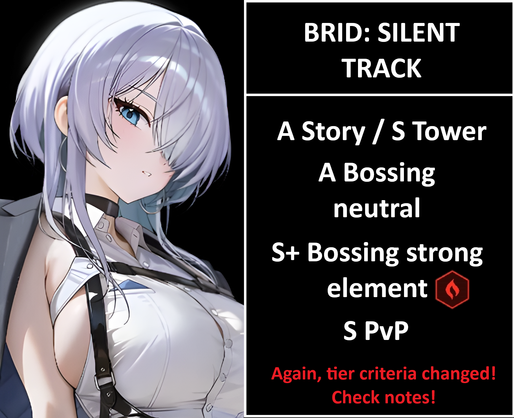
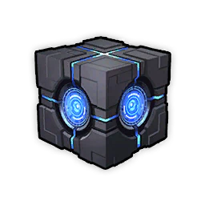

# BRID: Silent Track review 

Just to reiterate, tier criteria changed: __**at worse C and at the very best S(+)**__

**TL/DR** 1 copy won't hurt, but you can skip. She is not that great outside strong element fire, and buff wise burst 2 is very bloated atm.
**LB2/MLB** Lobby is great. Caster atk and self dmg is good too. If you wish to have her or is a fire player, go for it.

A Story / S Tower
A Bossing Neutral
S+ Bossing strong ele: { width="25" }
S PvP

**Should I pull?** She is not a must pull. She is amazing for fire raids? Yes absolutely. SR and UR usage is certain, but it isn't that big of an increase in damage compared to what we already have as neutral options, and more on that we just got nayuta as an addition to the ever so increasing burst 2 repertoire.
If you hit fire in UR, it's a non brainer pull however. If you are a fire specialist, even LB2 is needed for the atk buffs and also self dmg.

Ultimately depends on how many pulls you have. Anis2 will be the new year unit. She will 100% be MLB material if not more. If you need to ticket xbrid (a 2% banner) just means you should just skip. 

## Tiers + Explanation
A Story / S Tower
Story is pretty simple, she has a somewhat strong AoE every full burst, and a okay caster atk buff if used as main burst 2. She doesn't provide any defensive buffs, thus why the somewhat lower rating. The caster atk is good, but not enough to really push high deficit (37%+) if not on fire weak. A good addition, if you perhaps miss crown and nayuta, she can be used with maid mast as primary burst 2 and work pretty well.
Elysion tower is about having maids for burst 2 or being miserable. Xbrid solves that, problem is that she is limited to xmas banner.

A Bossing Neutral
For neutral she only works for SG team when grave needs to go somewhere else. On neutral, sdoro is much better with grave or bunny ade. If you don't have the 2 mentioned, she can be used. If you turbo invest in xbrid and get her a lot of atk and also some dupes, her self dmg may increase the final dmg compared to those 2, but that's something few will do.

S+ Bossing strong ele: { width="25" }
Absolute beast in where she should shine, fire weak bosses. She can work is almost any team as main b2 or off burst b2, do quite some damage and the dmg taken from her skills 1 and 2 are the cherry on top. As said before, fire specialist or fire oriented players will need to pull and invest.

S PvP
Even if she is not a clip SG, her dmg and little nuke from S2 make her a really good choice for pvp. Noah, blanc, liberalio, or any wind nikke will have a real hard time vs her. Even if her AoE is tied to full burst, the dmg taken vs wind code can hard counter noah teams what don't have biscuit, or even if paired with biscuit, do enough dmg to simply hit kill noah without triggering biscuit passive due to taunt.
She has quite a few teams that she can fit into, and all in all a nice addition to not so PvP oriented players, as she will have quite some ele from PvE builds.
Which means, "cheap" pvp wipe. If you are a die hard PvPier, then she is just a noah/blanc/siren/lib counter. Nayuta can also be killed if rosanna is present and the cleanse targets her. 

**SKILLS** 7/7/7 -> 10/10/8(10)
Skill 1 >= Skill 2 > Burst

Skill 1 and 2 have more or less the same value, burst being the less important. Only go past level 8 if you wish, supporter caster atk is alright, and if only a single copy no dupes, level 8 is more than fine with how much it costs to go to 10.

**OL Attributes**
4 ele >= 1 ammo >= x atk > crit

Priority for raids, if pvp then atk is the same priority as element.

**CUBES** { width="25" } Resilence cube is simple and strong. Bastion can be an option if 2 or more lines of ammo on SG team.

**DOLL** SR5 -> SR15 Doll attack counts as caster.

**Auto friendly?** As auto as it gets.

**Final thoughts** Good unit, great for fire weak. Sadly limited.