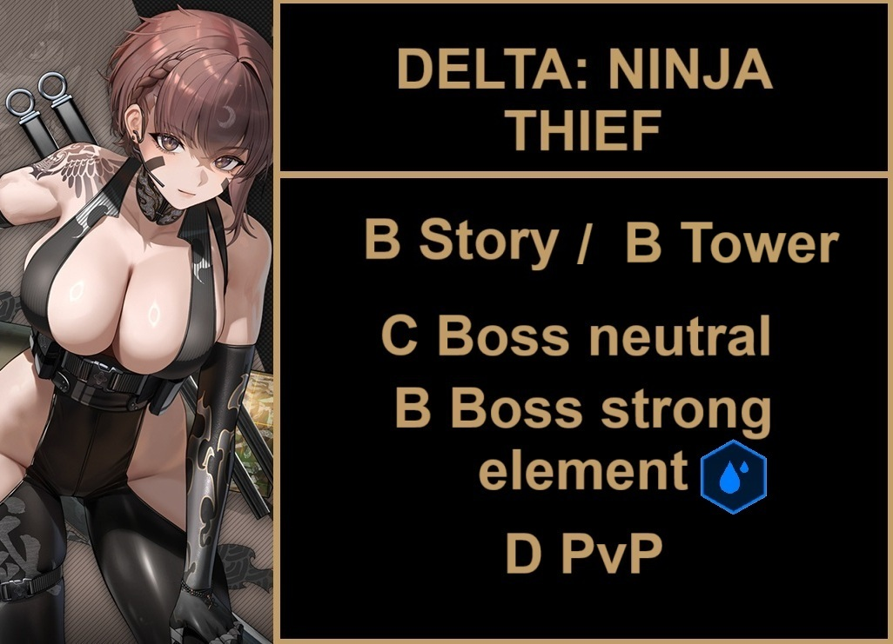
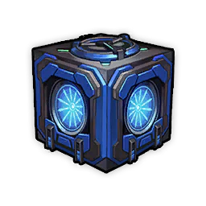

# DELTA: NINJA THIEF REVIEW

**TL/DR** Skip/filler unit. DeltaNT skill value is too low to warrant a 40 sec cooldown, much less abysmal buffs. dmg taken is not enough to make her even slightly usable.
**MLB** On a side note, she is absolutely breathtaking. And unlike jill and ada, the burst animation is realy good. Waifu pull!

B Story / B Tower
C Bossing neutral
B Bossing strong element { width="25" }
D PvP

**Should I pull?** Third anniversary will start in less than 3 weeks. If you need a more compelling reason, she is really weak, and unlike other units, she is not a "give time and she will work", her value is really low, and other units (such as crust!) have better buffs. There is no reason, at all, to pull her besides collection or waifu.

Tiers + Explanation
**B Story / B Tower**
Her heal and shield is almost unimportant. The only redeemable thing about her is the really low dmg taken she has. The IFAK skill is somewhat easy to keep up, but all in all it is too little of a buff to really matter.
Elysion tower without key units sucks. Problem is, her burst cooldown is 40 seconds. If you miss maids or marciana, she could be paired with any other elysion burst 2 and be a good option for a really budget team.

**C Bossing Neutral**
She deserves a lower tier, but I'll keep it at C for the sake of "If I miss x nikke, is she usable?" The answer is yes, if you miss almost all burst 2 in the game, she is indeed an option.

**B Bossing Strong element { width="25" }**
I don't she will ever be used in any raid to come. But if somehow next SR is water, she might get used one, on the only possiblity that is: to use her in a team that needs a water nikke to break element QTE and you miss other units. Isn't B too high? I agree, but ill keep it because she is Cutie.

**D PvP**
Machine gun.

**SKILLS** 7/4/4
Skill 1 first, other 2 can even stay at 1 if you want.

**OL Attributes**
Element dmg/ammo > atk > anything
Her value is too low, but if you really want to OL her, ammo/ele is the way to go. If anything, my advice is 4 rocks at best for her.

**CUBES** { width="25" } Bastion >> Vigor -> Bastion 99% of the time. Vigor is just a tiny little bit of survival to maybe not get oneshot.

**DOLL** SR0 (purple level 0) She is not worth the materials. Slap a purple mg doll and call it a day.

**Auto Friendly?** No gimmicks, just let the AI shoot.

**Final thoughts** Certified filler unit before anniversary. I really despise SHIFTUP for always wasting designs like these on absolutely trash kits. Delta deserved better.