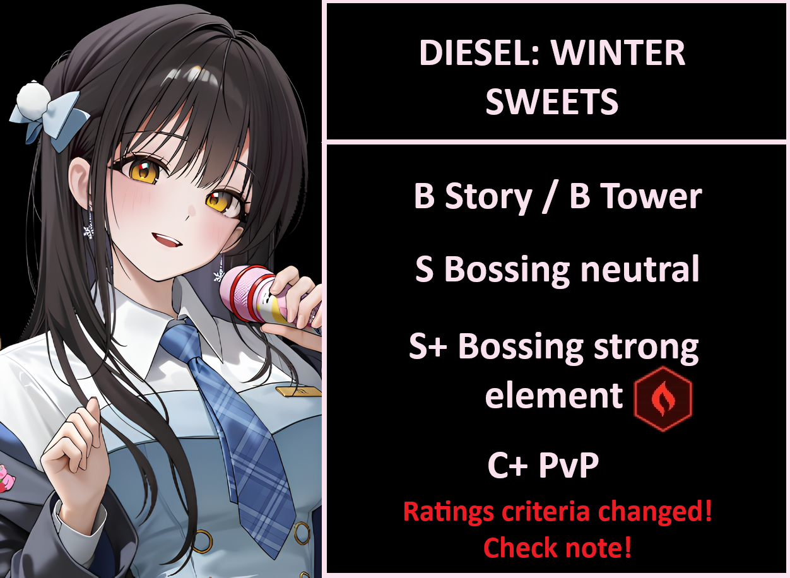

# Diesel: Winter Sweets review (TIER CRITERIA CHANGED!)

Before we dive into Xdiesel tiers, the change is pretty simple. E to SSS+ is very broad range of tiers, so I will be cutting it down to:
### __**at worse C and at the very best S(+)**__ 
All tiers will have a little + when they are in the middle ground of said tiers, and specifically for S+ when they amidst the absolute best in that category. This will go on for all tiers to come. Enjoy your reading!

**TL/DR** 1 copy is more than enough. 
**MLB** Fire specialists, solo Fire raiders, top UR fire hitters will need to MLB or even C7 her. Is the lobby good? Not as good as xbrid.

B Story / B Tower
S Bossing Neutral
S+ Bossing strong ele: Fire Code { width="25" }
C+ PvP

**Should I pull?** Is she a must pull before new years? I wouldn't say she is ticket material as it is 2% banner, but she is of course better than xbrid, but realistically both are raid only. If you don't think pulling anis2 in new years will be easy if you spend in xdiesel now, you can skip, but try to get her with pulls if possible, she is good in neutral too.

## Tiers + Explanation

B Story / B Tower
Her achilles ankle is that her area damage is damage over time, and for better or worse, it is very weak vs mobs. Yeah she does dmg albeit very little, and also provides dmg taken%. But the problem is... there are several better units for mobbing. Is she worthless? No, but the DoT is insufficient to clear waves outside fire weak, and it doesn't reapply so it is every so often.
Elysion tower is easy enough that even privaty works better than her in mobbing. If you miss vesti:TU, rapiRH, privaty, mpriv, phantom(yeah her) then she might work, but yeah, just use someone better when possible.

S Bossing Neutral
Xdiesel loves bosses. Neutral is no exception, and she will work as a great second burst 3. Is she permanent team 4/5? On all raids? If you miss some units or they are not invested, Xdiesel fill any spot gracefully. 
(Her supporting singing will boost your damage ratio by 1000%!)

S+ Bossing strong ele: Fire Code { width="25" }
Contender for team 2 or 3. Fire is bloated but she is great in strong ele, and third best fire dps after rapi:rh and mihara. She scales very well with attack buffs, and can also debuff the boss to help your team to do even more damage. All in all the best singer in the ark.

C+ PvP
Non clip RL, low damage on burst (18% final atk as DoT barely scrapes 5% of enemy health/sec) even when overbuffed she cannot deal any damage. Her targeting is horrid for pvp. Only use her for cp padding and maybe battery? I would just use someone else really.

**SKILLS** 10/10/10
Skill 2 >> Burst > Skill 1

Skill 2 has the highest sustained dmg self buff - 318.14% can stack twice, and also be kept almost permanently. Burst is damage and skill 1 is some buffs. Worth to max her out.

**OL Attributes**
4 ele >= 4 atk > 3 crit rate>=crit dmg > 1 ammo
atk and ele are the cookie cutter build for any dps, both will scale perfectly. In a pinch between ele or atk in line 2/3, pick element. 
Crit rate or damage are there because she cannot be used with mirandaT, due to the skill 2 massive buff being tied to a full charged shot. It is fine to mix and match crit rate over crit damage.
1 ammo is just for comfort. 
Final lines would be 4atk/4ele/2crit rate/1crit dmg/1 ammo

**CUBES** { width="25" } Resilience every time. She needs the reload to keep S2 up at all times. Bastion is bad due to low ammo.

**DOLL** SR15 (purple level 15) More base atk = more dmg. She scales very well with it.

**Auto friendly?** If the boss disappear/teleport or go out of sight, be sure to charge a shot to keep the S2 running.

**Final thoughts** A 2% unit that has the strength of 1%. Also the best singer you will never ever forget! No one compare to her!