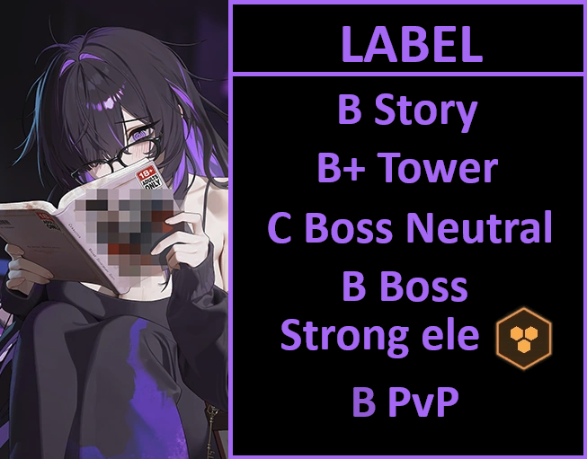

# Label review

**TL/DR** She is a skip pve meta wise. PvP she has good burst gen and also is a direct counter to scarlet, but no need to get her if you are into pvp, as Rosanna can still dispel it the skill that make her a counter.
**MLB** For lobby or don't, you choose. She is a defender, so do not be fooled by the "caster attack", it is not as good as it looks.

B story / B+ Tower
C bossing neutral
B bossing strong ele
B pvp

**Should I pull?** For raids and non pvp content she is only a replacement when you miss units. The caster attack for a defender is pretty underwhelming even at high copies and gear tier 10 level 5 (helmet>gloves>chest). 
PvP wise she is good answer for fast electric burst of damage such as scarlet (not rosanna!). Her burst gen is almost equal to mana, so that's a bonus if you like her.

## Tiers + Explanation
B story
Lackluster buffs tied to her own burst, no CDR, her shield is only to herself, if the shield gets destroyed she stuns... herself! Not the enemy! When she gets stunned, as she easily will in any story or tower stage, you have a nikke less for the next full burst as she bring nothing when not using her burst.

B+ Tower
Not the best option, but an option nonetheless. Elysion tower does not have a lot of burst 1 options, and even less CDR options, but don't pull her because of that. You will get much more value from using rapi:red hood (that should still be on banner for a while) as your burst 1

C bossing neutral
Same reason as story, lackluster buffs. Caster attack on a defender is too little to warrant you to build her all the way.

B bossing strong ele
Current raid teams are really stacked. And as a fifth neutral team she also does not see the light of day. You could maybe argue "maybe she is like delta ninja?" not really, because she does not have any synergy with current neutral or iron options .

B pvp
As said at the start, perfect scarlet counter. The skill 2 reduce all the team dmg taken from electric enemy units by 41% to 70% based on skill level, only on the first 5 seconds of the fight however. 
**UPDATE!** Rosanna can dispel this buff. Maybe it has been overlooked by SU or for whatever reason they do not care to test, it works like jackal link.
That means, in a thigh window between 2RL and 2.5RL~. Cindy burst even at 2RL  might still hit some of the burst hits after 5 seconds, at 2.5RL or slower she is sure to hit all burst hits without the debuff.

**SKILLS  1/4/1 -> 3/7/3**
Skill 2 is the only good skill. You shall go to level 7 or higher if you still find it difficult to survive against scarlet, or plan to use her in PvE for whatever reason you may think.

**OL Attributes**
4 rocks, she does not need anything and also does not deal any damage as her skill 2 caster attack does not apply to herself.

**CUBES** Vigor cube for PvP or { width="25" } Resilience for PvE

**DOLL** SR5 to SR15 -> Caster attack means doll level matters. Should you go all the way? Depends on your wants and needs. 

**Auto friendly?** Yes

**Final thoughts** After anniversary and new years banners, we have time to breath and skip an unit. Too bad it is a wasted design into a very niche kit. Not the first nor the last time, thanks to SU.

I didn't get to test her in arena because I can't pull label for the moment (lack of gems) so I used the data and tests of other people to assess her value.

The part in pvp about her being a "rosanna counter" is actually false because SU is either clueless or because they didn't code the dmg taken down correctly.

__**Rosanna can and will dispell the skill 2 effect of dmg taken down**__

I will shortly change it on the guide. Thanks ShiftUP! She might drop a tier in pvp...
