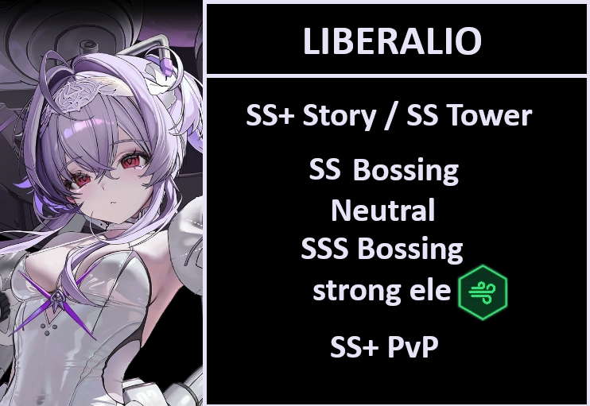

# LIBERALIO REVIEW

**TL/DR** GET. A. COPY. NOW!
**MLB** If you can spare it, go for it. It also depends on how many cores your sbs has. If your sbs has too many dupes, lib might steal her buff due to being a lower attack, so go check it. Crown can mitigate this problem entirely, but you can't always sortie them together. 

SS+ Story / SS Tower
SS Bossing Neutral
SSS Bossing Strong ele: wind code { width="25" }
SS+ PvP (CAN BE BUGGED! READ EXPLANATION!)

**Should I pull?** Yes.

### Tiers + explanation

**SS+ Story / SS Tower**
Great for mobbing and very powerful wipe. She has really good burst generation, the full package. The only reason why she isn't SSS is because compared to vestiTU, RH and rapi:rh she either do not have strong continuous AoE damage or more flexibility. She is excellent either way.
Pilgrim tower is easy or impossible due to lack of units. Good addition nonetheless.

**SS Bossing Neutral**
Really good damage, and in solo raid environment, she can and will be a good team 4 or 5 depending on who you miss, or even as a charge speed buffer to certain units, such as:
Bready in water weak; budget alice in fire weak; and maybe even bmilk in iron. 
Not an absolute best neutral option like cindy, but almost there, with more flexibility since she can also buff.

**SSS Bossing Strong ele: wind code { width="25" }**
Scarlet black shadow still hold a higher damage ceiling than liberalio, but the thing is, liberalio can buff sbs. Personal damage is extremely high, she is the second best wind dps ingame. You can't go wrong with her in wind weak.

**SS+ PvP**
BEWARE BUG!!!! If liberalio receives her charge speed buff, being the burst 3 with lowest attack, her burst will do little to no damage. If she doesn't get her own buff, then it works fine and she wipes as intended. The best way to prevent this, is to sortie her with cinderella, xmaiden, ada etc, nikkes that are either defenders or supporters, due to lower class base attack.
Aside from that, liberalio is really good in pvp. Her wipe can literally wipe, without any team buffs. Her alone is enough. 
If that wasn't good enough, her burst gen is more or less in range of a clip shotgun. With 13%~ cs or more from OLs, she can generate more than clip RL. She can be somewhat easy to kill, make teams that protect her for enough time to burst.

**SKILLS 10/10/10**
Both skills hold more or less the same value, upgrade them equaly. Burst books might be on the lower end since nayuta is also 3x 10, but all in all she is worth the mats.

**OL Attributes**
Elemental dmg/atk > charge speed/ 1 ammo > crit dmg 
"But she is immune to charge speed buffs!" **The tooltip on her skill say that stats from OL specifically will apply normally** Why make it so convoluted? Ask ShiftUp.
You will need to get atk lines on her, otherwise she might be the one to steal the charge speed buff. 4 ele lines, 2 to 3 atk lines and 1 ammo is what I would aim. The single ammo line can be 40%+, no need to stress over it. Any charge speed line is a bonus, and crit damage can also be good.
The best 12/12 would be 4 ele 4 atk 3 cs 1 ammo

**CUBES** Resilience { width="25" } -> She can't use bastion due to low ammo. 
But you will always use her with maid mast and/or crown, so it is fine.

**DOLL** SR15 (purple level 15) all increase in base attack is amazing for her. 

**Auto Friendly?** She is and isn't. For her to achieve the SS+ in story mode, you need to hit a full charge once at the stage boss before using her burst, so that she gain the maximum amount of buffs and wipe everything. 
On the other hand, in bossing she is completely autoable. 
**Just make sure she will not steal the charge speed buff!** Easiest way is to do it is use crown and liberalio burst first in the battle. **Rapi red hood as burst 1 will always steal it.**

**Final thoughts** Our beloved jellyfish is a monster. Pull and build her asap.