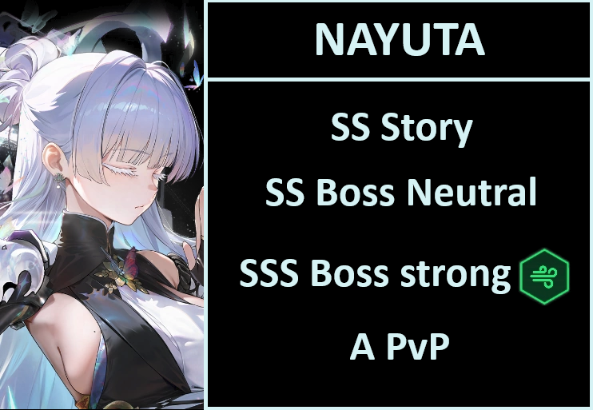

# NAYUTA REVIEW

**TL/DR** Are you rerolling? She is the banner to pull. 1 copy is mandatory. 
**MLB** Supporter is okay for caster attack buffs. Cp padding for lower deficit in story is also compelling, her damage is big too. All in all, if you can spare to MLB her with less than 400 tickets, I would say it's a good move.

SS Story / SS Tower
SS Bossing Neutral
SSS Bossing strong element { width="25" }
A PvP

**Should I pull?** If a quick glance at the ratings aren't enough, she is the second best burst 2 ingame in usefulness. She still loses to crown in most cases due to crown shield being absolutely broken, but regarding final dmg... she might hold a higher ceiling.

### Tiers + Explanation

SS Story / SS Tower
Early to mid game she goes up a tier. I might even argue that she is SSS even in high deficit, but crown is still better in that case. Healing is nice and all, but being able to negate a single instance of damage is still more useful. But on the flip side, if you miss damage, she will top crown easily. Nayuta is a fake b3 with how much dmg she does.
Tower, well... she is a superb option. You can't really go wrong with anything since pilgrim tower is either impossible because you miss units to form a team with 4+ nikkes, or it's permanently blue cp.

SS Bossing neutral
The only reason why nayuta isn't SSS is again, because of crown shield. If you use nayuta over crown, you will notice that the content is somehow more manual intensive, which is indeed the case. Crown can outright ignore mechanics such as stuns, poison, wipe etc. Nayuta will keep you alive with heals and do significant more damage, so depends on the situation. 
However, keep in mind this is on neutral element, so due to lower value teamwide buffs compared to the king, she will drop to SS.

SSS Bossing Strong element { width="25" }
Absolute best option for burst 2 on wind weak. Deals so much damage it's almost a joke. You can't go wrong with her.

A PvP
Only place where nayuta is not great. She does have a good 9 sec indom right off the start, but problem is, you can't really use her on defense. SMG has no burst gen, and feeds jackal and scarlet like it's nothing...
If that wasn't that disheartening enough, rosanna can dispel her indom before 2RL if nayuta is one of the 2 highest atk nikkes, so you are forced to run 2 attackers alongside her that don't care about being dispelled.

**SKILLS 7/4(7)/7 -> 10/7(10)/10**
Skill 1 > Burst > Skill 2
skill 2 can be left at 7 no problem, but consider going all the way.

**OL Attributes**
Element dmg/atk > crit chance/crit damage > ammo 
4 element dmg, 4 atk, 4 crits(any combination). 
Yeah she is expensive. It will pay off! Ammo is not that important, but it's not bad either.

**CUBES** Resilience { width="25" } -> Highest level cube to maximum damage.

**DOLL** SR15 (purple level 15) Max it out.

**Auto Friendly?** Make sure to hit core when possible. Use aim assist on the game settings if necessary.

**Final thoughts** Nayuta is an amazing unit. She might not have powercrept crown in most cases (well... aside from self dmg) she is a cutie. The only downside is the voice actress, and god, is it unberable.