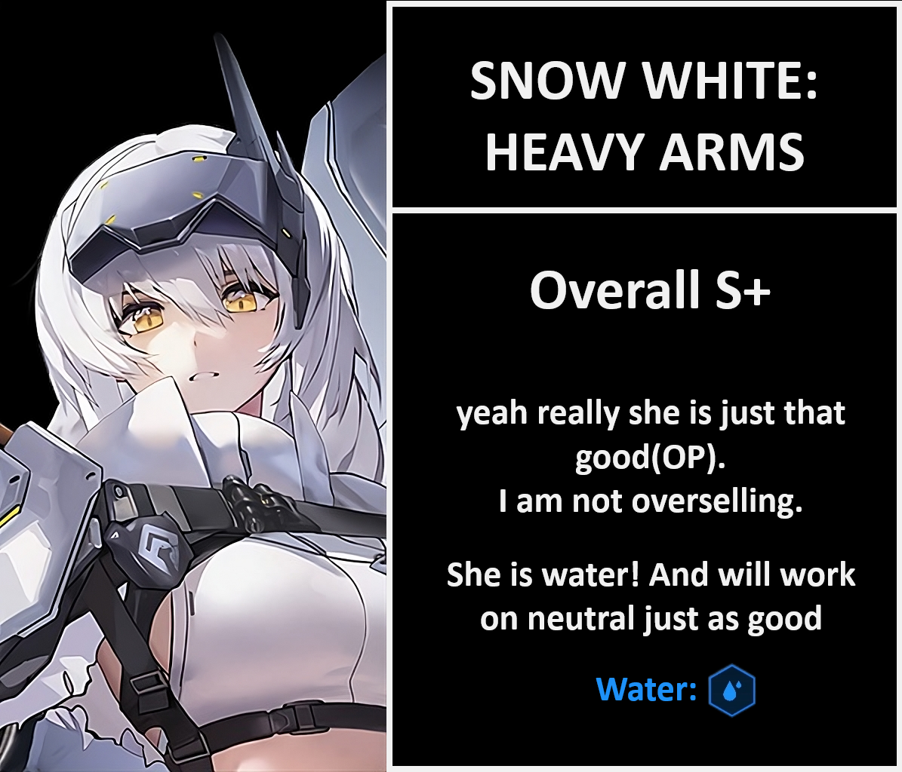

# SNOW WHITE: HEAVY ARMS REVIEW

Last time I will add this to the review: tier criteria changed: __**at worse C and at the very best S(+)**__

**TL/DR** 1 copy, if you skip for any reason, you will brick your account until her rerun or a spook. F2P should just get 1 copy with tickets and save gems, or use the vouchers we got from codes, mail, events, etc to save gems. It is a 1% banner.
**MLB/C7** If you MLB or c7 rapi:rh already, she is next in line. Quite literally she is the second best unit in game atm. Go all out if you are spender, competitive ranker, pvpier, the works, she is the best we can get.

S+ Story / S+ Tower
S+ Bossing neutral
S+ Bossing strong ele: { width="25" }
S+ PvP

**Should I pull?** 1% banner, so if need be, just use vouchers to save gems and build enough tickets for an exchange. F2P shouldn't use too many gems on this banner.

## Tiers + Explanation
She is overall S+, maximum rating possible. To keep it short, as most people are questioning if they should or shouldn't get her or where to use: **She works anywhere, with anyone, whenever needed.**

S+ Story
Little AoE/wipe on every full charged shot. Keep in mind snow white has a FIXED charge time of 1.2 seconds, and NOTHING can alter it. Not even OL.
That said, she will deal with mobs and waves like its candy, and possibly nuke the boss when it spawns too.

S+ Tower
Pilgrim tower is stacked if you own a lot of pilgrims, and nothing better to have one more heavy hitter. You can also leave rapi:rh as burst 1 if you miss siren for a really nice duo.

S+ Bossing neutral
She does a LOT of damage even on neutral. Also comes with dmg taken baked into her kit, so she will indirectly buff any strong ele dps on the team too.

S+ Bossing strong ele: { width="25" }
Water finally has a real burst 3 dps that isn't limited or locked behind a fav item. She will do ungodly amounts of damage vs any water weak boss. It doesn't even need to have core or parts. 
And more, she works with mirandaT, so prepare yourself to the "highest atk shenanigans" when teambuilding for SR/UR!

S+ PvP
Her burst gen is lower than helmT for 2RL (helmT 39.8%~ and SWHA 33.6%~) but for 2.5RL+ SW is the highest when not considering charge speed for helmT. 
She can also wipe the enemy team, or two/three tap without any buffs. She is an attacker so she is quite frail, be sure to use her with jackal or any other protective supporters to get the most of her in arena. 
Her being water code is also really good because electric dps units are few these days in Champion Arena.

**SKILLS** 10/10/10
Skill 2 = Burst > Skill 1
All need to be maxed eventually.

**OL Attributes**
4 ele >= 4 atk > crit dmg > crit rate/ammo
Again, CHARGE SPEED DOES NOT WORK on snow white. Crit damage is for mirandaT comp. She can be fine with no ammo, but 1 line without min maxxing crit dmg to oblivion is fine. crit rate and charge dmg are replacements.

**CUBES** { width="25" } Resilience is the best cube. Destruction cube can also be an option if the boss has a lot of parts.

**DOLL** SR15 doll (purple level 15) pretty much what you expect, max it out.

**Auto friendly?** The only cases where she might be "bad" to leave alone is vs silencers and volleyballs. She can and will do dmg to them and trigger their mechanics, be it to launch silencers or force the volleyball  to spin around. Aside from those cases, she can also miss the pierce shot and or core if the boss moves too much.

**Final thoughts** Second best unit ingame, only loses to rapi:rh due to her being literally 2 strong elements and also b1. Build her asap, she is that great.