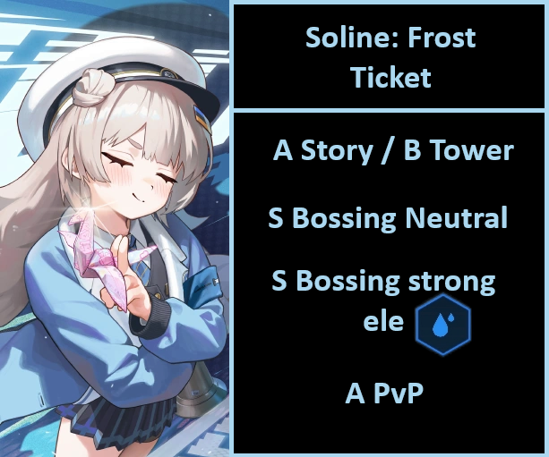

# Soline: Frost Ticket Review

**TL/DR** There is no reason to pull her at this point in time, she will be added to wishlist later.
**MLB?** No

A Story / B Tower
S Bossing Neutral 
S Bossing Strong ele: water code { width="25" }
A PvP

**Should I pull?** The only reason, if ever, is you are water specialist or super competitive solo raid player. Xmas is the immediate next event after her banner ends.

## Tiers + Explanation

A Story / B Tower
All tiers will be more or less the same explanation. She is a better cdr than D: wife but has no offensive buffs (bursting or not) but has defensive buffs and a heal. Problem is, her burst cooldown is 40 sec. She needs to paired with another burst 1.
CDR for story is a must, if for whatever reason you need your team to be a little tanky and can spare to lose a offensive buffer slot or an offburst dps, she is your girl.

Elysion tower had 1 true CDR and 1 fake CDR. Dwife is a windup cdr, closely tied to her full charged shots, or rapi:rh as burst 1. Due to soline being burst 1, if you use her with the intention of using rapi as the other b1, it will not happen. If you miss dwife, then soline is a pretty good alternative, as you can just use a non cdr burst 1 alongside her, like miranda, emmaTU, emma, zwei... and make it work. Problem is, you also will not be able to use the maids. Soline is very niche in elysion tower.

S Bossing neutral
off burst cdr can be good in miranda team and sg team. That is pretty much it. Also if you miss other CDRs for 5 teams.

S Bossing strong ele { width="25" }
Same explanation as neutral. She is pretty limited, but can work wonders in where she fits.

A PvP
The budget "biscuit" can work very well in a couple of teams. Moran and noise are possibly the ones that benefit from her the most, as they are 40 second burst 1, but most of time will be at p1. The little extra help from soline should prevent them an early death or keep them alive for the next cycle as soline brings CDR.
Unfortunately soline is not a clip SG. If she was, she would be S+.

**SKILLS 4/4/3**
Cheap as she gets, only go over that if in extreme need of cp padding.

**OL Attributes**
No OL needed, or if you want to, just 1 ammo.

**CUBES** { width="25" } Resilience or Vigor (pvp)

**DOLL** SR0 (purple level 0) No need to use mats on her, a single purple doll is enough.

**Auto friendly?** Yes

**Final thoughts** Not exactly filler unit, but almost. Xmas in next patch. Don't summon.