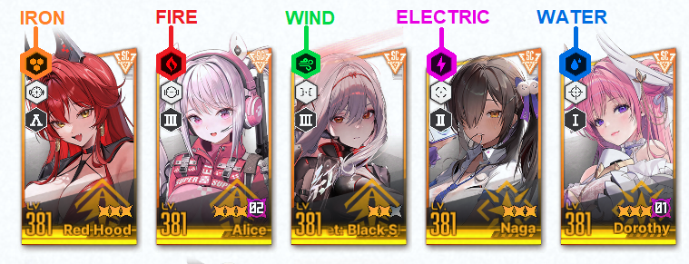
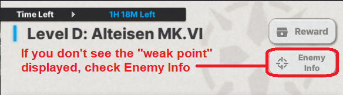
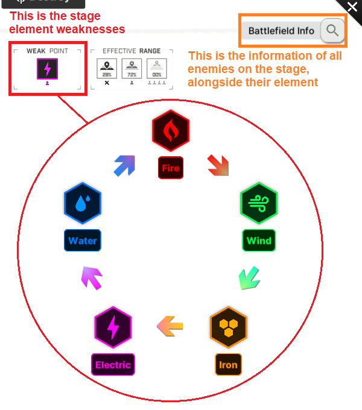
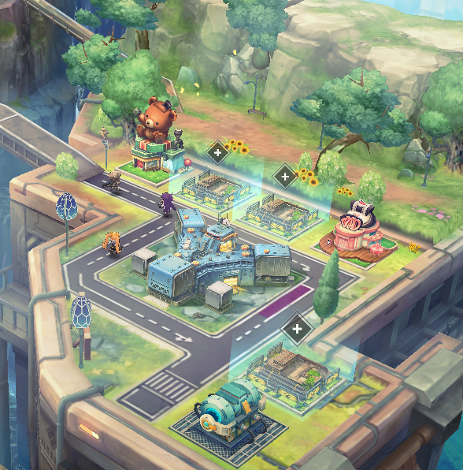

# **Early game**

This section will cover **all content** you will unlock from the start of your journey through NIKKE **until you clear chapter 16 BOSS stage 16-28**.
All this might be a little overwhelming, but I am sure you will do fine.
To have the best experience, I really advise you to just play at a slow pace and take your time to read the story. NIKKE's story is probably one of the best out there in the gacha genre.

## **Oversimplified Team Building**

I will briefly explain how a basic team composition \-**squad**\- works. This will apply to almost all content to some degree, however, **this is extremely subjective and individual**, as each player should have completely different NIKKEs on the start.

### **Element Codes**

As almost all gacha games, NIKKE also has an element system. **The premise is pretty simple: if a stronger element NIKKE attacks, she will do more damage. Aside from a very specific case in [Anomaly interception](lategame.md#anomaly-interception-ai)), there isn’t any sort of penalty for being a “weaker” element, so don’t worry about it when building a team.**

**All NIKKEs and enemies in the game have an element code**.  
To verify what element your NIKKE is, **check the icon on the top left of the NIKKE portrait.**  

You can check what element will have advantage in the **Enemy info** and / or **“weak point”**, displayed in all combat contents UI.  
**Battlefield Info** will display all enemies that will appear on the stage, alongside their element.  

**Burst phase 1 NIKKES **

You may use **N102.** She is a purple (SR) rarity Nikke that buffs your whole team attack, and you will probably acquire her when you do your tutorial pull.

Only use SSR burst 1 Nikkes that have burst reduction skills over her, in order:
Liter \> D: Killer Wife \> Rouge \> Dorothy \> Volume

Tia is a special case, as she **needs** to be paired with Naga, a burst 2 nikke, as most of her skills need naga to be activated, along with another **burst 1 nikke,** because her burst skill re-enters burst phase 1\. If you use Tia as the only burst 1 in your team, you will not be able to do a full burst. **The same applies to Alice: wonderland bunny and Rupee: Winter Shopper;** they cannot be used as the only burst 1 either.

**Burst phase 2 NIKKES **

**Anis** is the standard pick. Very few burst 2 Nikkes are as good as her in the early game. Only swap her for Nikkes of tier A or higher, with a 20 second cooldown burst skill.
With the exception of **Blanc,** which **needs** to be paired with **Noir or Rouge,** if not paired, she will have a 60 second cooldown, making her rather unusable**.**

**Burst phase 3 NIKKEs and Full Burst **

Your burst 3 Nikkes will be **Rapi and Mihara,** later being replaced by **Privaty** and **Alice** or any other burst 3 you may get from pulls**.**  
Ideally, you want to use a team with **one Burst 1 , one Burst 2  and three Burst 3 ,** short for **1-1-3.** Most of the early game is skippable without a healer, but it’s a good addition if you happen to get it nonetheless.

**Burst cooldown and rotations**

Your squad **must have** a cooldown of 20 seconds, or to say, a burst rotation of 20 seconds. Burst 1 and burst 2 NIKKEs on your team must have a 20 second cooldown.

**Another thing to notice: When in auto-burst, the burst order starts from the <u>leftmost</u> burst 1 NIKKE, then goes to the right in order, leftmost burst 2 NIKKE then leftmost burst 3 NIKKE, which then your team enters full burst state for 10 seconds, increasing you damage output by 50%.**

Some NIKKEs skills reduce or increase the full burst time, examples being: **Mihara** that decreases the full burst time by 5 seconds and **Modernia,** that increases full burst time by 5 seconds.

**Full Burst**

**The acronyms used for squad positioning:**  
**P1 \= position 1, the leftmost slot**  
**P5 \= position 5, the rightmost slot**  
If you have 2 burst 2 NIKKEs in your squad, for example, **Anis(P1) and Centi(P2)**, **Anis will always burst before Centi** in auto-burst, unless she is on cooldown.
What you want to do, is make the burst order of your squad at least auto proof:
**burst 1 in p1, burst 2 in p2, main dps burst 3 in p3, sub dps in p4, p5 can be anything.**
**N102 \- Anis \- Rapi \- Mihara \- Ether** is the non SSR squad I will use in the walkthrough.

**We advise you to seek help from the [discord servers](README.md#useful-links) for a better composition based on the NIKKEs you currently own. This is just the tip of the iceberg about team building.**

## **Game Walkthrough**

The game tutorials are pretty good, so try to progress by yourself while using them, I'm sure you will do fine\! Only come here to learn something about content you unlock, so as to not make any mistakes.

\*Edit**\*:** _There was a complicated explanation about min maxing the early game here, but they added “free” level 200 NIKKEs to your campaign roster._ Even if it is **\*just 9 uses per day\*\*\***,** just that makes progression a joke. Early game “walls” are no more, and thus I had to create another account to see how it would impact progression… \**Long story short, you can reach chapter 16 in 12 days if you try hard, instead of previously 25+ days, and that can be achieved even with a non rerolled account.\**

But not everything is roses, **interception and simulation room, where the temporary NIKKEs are not available, might be hard to clear compared to everything else, but then again, unlocking content will make your progression a lot easier anyway.**

**Chapter 0 and 1**

Tutorial and the game introduction. Follow the instructions, get used to the game.

**Chapter 2**

**The main objective now is to unlock the Interception,** the content that rewards gear.

That being said, **DO NOT LEVEL SKILLS YET\!** You **CANNOT** reset skill levels by normal means. **Until chapter 6 you can go with level 1 skills with no problem**. You will only level skill if you rerolled accounts, and your NIKKE is a damage dealer tier SS+.

In stage 2-1, you will unlock auto shot, and auto burst. **Activate both by pressing the keys “Shift” for auto shot and “Tab” for auto burst**. While playing a stage you can check if they are activated **on the top left of your screen**. **They will turn orange if you activate them**.

Once you clear 2-4, a pop-up message will warn you an EX stage appeared. **Ignore it for the time being**, it is a permanent stage, won’t go away. You won’t be able to beat it for now, you need better gear to do it.

Next step is to unlock the [**Shop**](gamecontent.md#shopping-guides). Clearing stage 2-6 will do so, go to the main screen and claim the free goodie.

Return to the main screen, go to your “Nikke” tab and **level your SSR or Rapi to lv 7, “quick equip” gear on her**. After gearing all the NIKKEs in your squad, you can go back to clearing stages.

**Boss Stage 2-12**

The first boss is Gravedigger. With the gear equipped and your main NIKKE at lv 11 it's an easy fight. **Prioritize breaking the QTEs (circles)** and shoot it down.

Once you’re done, you want to collect the chapter [**Lost Relics**](https://nikke.gg/lost-relics/). **It’s strongly recommended to collect** all the lost relics of any chapter you clear.

By now, you will have unlocked the **Outpost**. **Do not wipe out** yet. The reward is based on your outpost level, **which scales with how many campaign stages you have cleared in total**. **Wipe out only when you’ve finished pushing the main story on your first day**.

The [**Simulation Room**](gamecontent.md#simulation-room) is also open, do the tutorial, but don’t enter 1-A yet, we will do that later today.

You also should have unlocked the [**BlaBla menu**](gamecontent.md#blabla-menu) and field missions already, you can skip them today, they are permanently available.

**Chapter 3**

A popup about temporary Nikkes will flashbang you, however **do NOT use them while pushing story or tribe tower yet.** Each NIKKE has a usage limit of 3 stages per day, in other words, a total of 9 stages with borrowed NIKKEs per day\! **Use just one when you can’t progress further for the day, to maximize your progression.**
There is no usage limit of them on **event stages, always use them there**.  
The only sad thing… they are **not available** for Interception or Simulation Room.

**3-3 unlocks the [Tribe Tower](gamecontent.md#towers),** come back to it when you clear 3-9.

When you clear 3-6 you will unlock the [**Tactics academy**](gamecontent.md#tactics-academy)**. Ignore it for now,** but make sure to upgrade it **when you finish your day**, each level unlocks really good stuff, for example: **increase afk rewards from outpost defense, free synchro device slots, and lots more\!**

To progress further you will need to collect all rewards available, your daily, weekly, day by day event… If there is an [**event ongoing**](gamecontent.md#events), do it too. You will see a lot of red dots in the main screen, collect everything, level your Nikkes and push again.

**3-9 unlocks [Interception level D](gamecontent.md#interception-level-d-alteisen)**, you can also ignore it right now.

After that, [**Simulation Room**](gamecontent.md#simulation-room) should be already unlocked, clear **1-A and try 1-B**. This is where you get **skill manuals**, commonly called skill books, and battle data boxes.  
You can open these boxes in your [**inventory**](gamecontent.md#inventory-hoarding-101).

Once you clear 1-A and 1-B, level up your nikkes, equip them with any gear you have and go push story stages until you reach the boss.

**Boss stage 3-16**

If you have collected all the rewards available, you should be around level 21 with all your nikkes. Pretty easy boss with that.

You unlock the [**Arena**](gamecontent.md#pvp-arenas) here, do your daily attacks with the same team you’re using to push story, it does not matter if you win or not.
PVP is not something you can actually play yet, no need to go crazy about it until much later on when you have more NIKKEs and resources to spare.

**If you don’t plan to play for more than 1 hour on your first day, this is the time to do your Interception attacks and 5 event stages if there is one ongoing, then you can exit the game**.
**If you plan on finishing the first part of this guide, use just one attempt, stage 2 is guaranteed, save the other 2 interception entries, we will use the attacks later.**

**Chapter 4**

Chapter 4 is a breeze, aside from 4-6, it’s one of the easiest. Remember to equip gear, level up your Nikkes and you will be fine.

**4-6, a “mini” Boss stage.**
**Meet Chatterbox, the Boss of chapter 6, yet a little nerfed here. Although nerfed, this Boss is still a tricky one.**

**At the start of the battle he will jump and target your NIKKE in the P3, you can press space/cover to avoid taking damage directly. After that he will jump back and stay still for a moment, this is the time when you need to deal as much damage as possible to the parts circled in red on the image below. Guided missiles will come from it, targeting the NIKKE he jumped to, the first time will be the one in P3, then it's random. You can cover or destroy the missiles, even if they don’t do much damage, if the same NIKKE gets hit 10 times by them, she will be instantly killed. Never destroy the head\! If you do, he will enter a “rage” mode and damage all your NIKKEs per jump, and in rage mode he deals a lot more damage. Only destroy the head if he has only a single health bar left, ensuring you will kill quickly enough.**  
**After you destroy the parts on his back, they will regenerate after a short while.**

**When you defeat him, Shifty  will bait you with [equipment upgrade](gamecontent.md#gears-and-collection-items). Skip the tutorial and equip the head piece you got, without upgrading it.**

**Now we need to use temporary NIKKEs. Just slot in one borrowed NIKKE at a time, from 4-10 onwards. Use Marciana** over your burst 2**, then Liter** over your burst 1**, then Alice** over Mihara or any other burst 3**. This is a cheese, without borrowed NIKKEs this much progression would be almost impossible on the first day.**

4-15 Unlock the [**Synchro Device**](gamecontent.md#synchro-device)**,** you can skip it until you unlock the **manufacturer towers on chapter 7, stage 7-13**.

**Boss stage 4-18**

Easy boss with an average level of 21 and borrowed Alice. Collect all the Lost Relics, as you will need blueprints shortly, and then proceed to **clear some hard stages to level your outpost just once**. After you’re done, **upgrade your nikkes, clear simulation room 1-C** if you couldn’t before, **Interception D to the highest stage possible** with the remaining attacks, and **5** **event stages,** if there is one going on.

Now, go back to your outpost, and zoom out. You will see a couple of **\+** signs like the ones in the image below.

Click on one of the **\+** signs, choose any blueprint you own, and start building. Each building has a 5 seconds build time, and once it’s **finished, click on the building again** and it’s done. You will need to collect and use all the blueprints to upgrade your [**Tactics Academy**](gamecontent.md#tactics-academy) to its maximum level. If you cannot build more,

This is a reasonable time to finally stop on day 1\. Reaching this long probably takes **up to three whole hours.** I sincerely don’t recommend going further.

**Day 2**

**The main objective is to clear Interception level D to at least stage 5, clear chapter 6, hard stage 1-2, tribe tower to at least floor 39, and simulation room 2-B. Collect your outpost afk rewards, upgrade your NIKKEs and let’s get to it.**

**Chapter 5**
Uneventful chapter. **You will use borrowed NIKKEs at the end of chapter 6 today, so save the uses\!**

5-3 unlocks the [Lost Sector](gamecontent.md#lost-sector). Clear the first sector to receive a cube. Give the cube to your best burst 3 NIKKE.

5-10 unlock the [Recycling Room](gamecontent.md#recycling-room), you can read the section later, keep pushing

5-15 is a dps check against healers and a shield boss, if you struggle, use **borrowed marciana here**

**Boss stage 5-20 Land Eater use borrowed Alice here**. Alice makes the boss go down in less than 15 seconds, you can ignore the mechanics…

5-20 unlocks [Liberation](gamecontent.md#elevator-liberation), time gated free SSR NIKKEs\!

**Chapter 6**
Boring chapter, even story wise. This one might get hard, if you can’t clear it on the second day just wait for the next day
6-4 unlocks [**Solo Raid**](raids.md#solo-raid) and [**Collection items**](gamecontent.md#collection-and-favorite-items)**.** This is a limited monthly event, if you can’t find the  icon on your main screen, means that a solo raid isn’t active.

**6-6A-2 is a defense battle that has tanky healers and Tiaras. [This is a video on how to cheese it](https://youtu.be/EUfgkArT9lA) without borrowing a NIKKE.**

From **6-18,** you can choose to use **borrowed units** or not. Each stage you do not use, is another chapter 7 clear today. Only use them if you struggle.

**Boss Stage 6-24 Chatterbox, same mechanics as 4-6, use Alice**

**Day 3**

**Objectives: Finish chapter 8, hard 1-3, reach tribe tower 50 and the highest floor possible of any manufacturer tower available, as well as clear simulation room 2-C.**

**Chapter 7**

**7-13 unlocks the Manufacturer Tower. This is the time when you want to visit the [synchro device](gamecontent.md#synchro-device) section that was previously ignored.**

**The BOSS stage at 7-24 is Modernia, which _was_ realistically impossible to be cleared on day 3\.**
**Luckily, now you can use borrowed NIKKEs\! Use any of the 3 and clear it.**

**Day 4**
**Objectives: Finish chapter 9, and unlock interception S. Simulation room 3-A, tribe tower to 60 and manufacturer towers to the highest floor possible.**

**Chapter 8**

**8-27 BOSS Stage Bow Tie Use Marciana or Alice**

**Chapter 9**

9-12 is somewhat hard because of the amount of kamikaze raptures. **Use Marciana**.

**9-15 Unlocks [interception level S](gamecontent.md#interception-level-s-gravedigger)**

**Day 5 to Day 14 and beyond**

**Your objective from now on is to push story until you finish chapter 16 and unlock Special interception or interception EX.**  
**Remember to use borrowed NIKKEs if you struggle, it’s a piece of cake.**

**9-27 BOSS STAGE** **Doctor**

**10-25 BOSS STAGE Mace**

**11-13 [SP ARENA](gamecontent.md#sp-arena)**

**11-27 BOSS STAGE Harvester.**

**12-24 BOSS STAGE Material H.**

In Chapter 13, we will encounter 3 Tyrant bosses, as this story we will rematch against Modernia. **You will need to use borrowed NIKKEs on all.**  
**13-15 mini Boss stage Alteisen**
**13-18 mini Boss stage Chatterbox**
**13-24 Boss stage Modernia**

**And this is the end of the 14th day for me. If you used borrowed NIKKEs, you probably are way past this chapter already. Have you unlocked [Interception EX](gamecontent.md#interception-ex-or-special-interception-si))? Check the guide for it\!**

**And from here, you will face [progression walls](progressionwalls.md#progression-walls) and ho ho, there are a lot\!**
