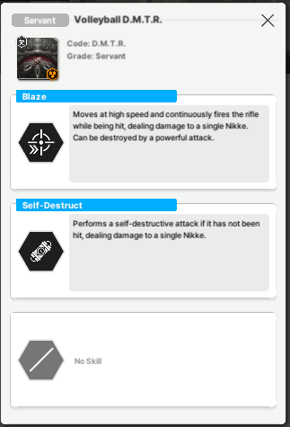
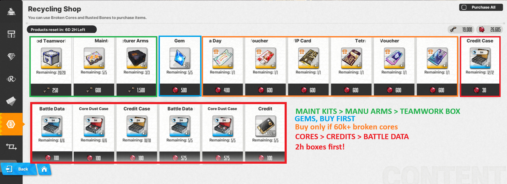

# **Endless End Game**  

Tired? We’re sure you are! 
After all we’ve covered, there’s only one thing left to do!!!

## **Hard-Stages!** 

Normal stages, with “hard” on their name!
They are the same stages as their normal counterparts, the only difference is the increased combat power requirement. 
As of November 2024, Hard Stage 34-38 Boss is the highest stage available, cleared at synchro 521 by some amazing players.
Most hard stage clears are posted on youtube, put in Hard stage X-X and you should probably find a few clear videos on it.

The MegaGuide [Youtube Channel](https://www.youtube.com/@nikkemegaguide) also has some hard stage clears, go check it out!

**Volleyball**

After the November 2024 update, they introduced a new rapture named Volleyball. This pesky ball will hinder your progress in chapter 33 and 34, as we said in Progression Wall.

On taking a hit - any hit, from one bullet, they will stop prepping kamikaze attacks and start zig-zagging while pulverizing someone on your team. While they're in motion for any reason, they will take only 1 damage. This includes the zig-zag and when they're not yet setting up the kamikaze attack (red lights is their prep).  (Juratus:2024)

To counter them, there’s 3 way to go about it:

- Distribute Damage / AoE attack. 
    They will attack you after you touch them, then you have to attack without touching them directly. Distribute damage has a mechanic that ignores the hitcount mechanic. Chapter 33-34 are wind weak, so Scarlet Black Shadow is the best Nikke to counter them.
- Strong sniper to kill them in 1 shot.
    They will receive damage from only 1 shot from any pellets. The problem is when you full burst, you would have to command other Nikke to take cover.
- Ignore them and let them jump. 
    This method needs you to dodge when they start jumping. You can put all the Nikke to take cover or just build a shield to block it.

This is an example change.

This is an example image. 