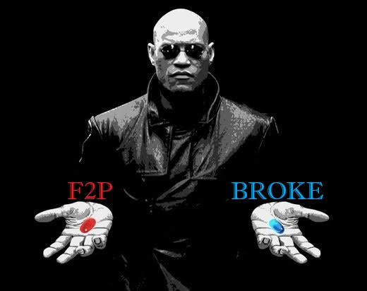
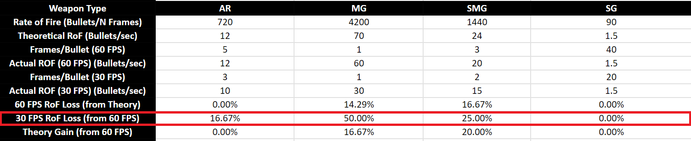

# **FAQ:**

## **Goddess of Victory: NIKKE**

NIKKE is a third person shooter role playing game. You are the commander of a squad of NIKKES \-biocybernetic girls with guns- and you command them in actual combat, fighting an endless invasion of aliens called raptures.

**But it’s a gacha, so let’s talk about rates, pity and Free to Play / Spender experience**.

SSR NIKKES rates in all banners are a solid **4%**. If you play other gacha games, just by that you will be blown away, 1 SSR character every 25\~ pulls is really generous.

If this is your first gacha game, 4% may seem low, it is in fact a quite high rate, compared to other gacha games. 

Along with a high rate, the mileage, a “pity system” of sorts, is amazing. For each pull you make, you receive a **ticket** that varies in colors: **Silver** from standard banner, and **Golden**  from special banners. Both types of tickets are **permanent** and are not tied to a specific event banner either.
After you gather a total of 200 **Silver** or **Golden** tickets, you can use them to buy a copy or duplicate of the Nikke of your choosing in the **mileage shop**.

On top of that, the currency you use to pull in event banners, **Rainbow Vouchers** are really easy to get, and you can buy them at any time, each at 300 gems… it may look expensive, but daily gem income is to the very least 200 gems! 

**However, I won’t sugar coat it. A gacha is a gacha at the end of the day. Will your morals crumble, and you will spend your hard worked money, or stay true to yourself as a F2P and suffer? Choose wisely.**

## **Rerolling accounts**

**Do you want to reroll? Or rather, does NIKKE require you to?** 

In my opinion? **Yes, it somewhat requires you to.** It is an endurance and mental battle. You will either burn out from rerolling or succeed before you do.   
If you choose to not reroll, keep in mind that after the first few months will be pretty rough compared to rerollers. Of course, you might not reroll and get lucky, who knows?

**If you plan to spend, you NEED to reroll.**

I will not make a reroll guide, you can follow [**NIKKEgg**](https://nikke.gg/reroll-guide/) or [**Prydwen**](https://www.prydwen.gg/nikke/guides/reroll/) reroll guides. Both should be up to date.

## **Duplicates matter in NIKKE?** 

To answer this, I need you to answer a question. **Are you past the 160 wall?**

If your answer is: **No, I have yet to pass it,** or even, **what is the 160 wall**? 

It is a time gated wall to block your progress. You need 5 NIKKEs that are max limit broken, meaning, 1 copy \+ 3 duplicates, at level 200, to pass the 160 synchro level.  
Read the [**160 Wall**](gamecontent.md#_160-Wall) section if you need more information.

If your answer is: **Yes, I am past it.**   
The answer is… **NO!** You do not need duplicates anymore. **Each extra copy is merely less than a 3% final dmg increase of that NIKKE.** Duplicates add very little combat power, and aside from min/maxing ranking, regular players shouldn’t pull for more than 1 copy in any scenario past the 160 wall.  
**However, getting 3 stars on any Nikke will reward you with her skill cutscene as a lobby screen, so if the waifu factor kicks in, follow your heart!** *Who am I to say something about your tastes, right?*

## **When should I pull/skip NIKKEs? When is it worth it to use tickets?**

Most of the time it will be as simple as: What tier is it? A / S- tier or below, skip; S+ / SS or above, pull. Anyhow, you can check the mega guide Discord for an early kit analysis written by us.

**But when should you ticket?**   
That's quite hard to answer. How many gems you have to spare, and on the same note, how many tickets can you afford to burn?

This is my opinion as a long time F2P: NIKKE “pity” is equal to **60.000 gems**. The time you need to hoard 60k gems is not small. I would only use tickets on **Limited (collab, summer and christmas) and Pilgrims.**   
The only case I would use tickets on non-limited NIKKEs is when you fail to get them with pulls, and they are **SS+**.

## **Do I need to change settings? Is there an optimal configuration?**

**Make sure your game is running at 60 fps**. The GIF below shows where to change it.   

**Why should you run the game at 60 fps?**  
**Machine guns(MG)**, **assault rifles(AR)**, **submachine guns(SMG)** **are affected by your frame rate**. Shotguns(SG) are also affected, but it's negligible. Sniper rifles (SR) and rocket launchers (RL) are not affected.  
**The issue is, less fps, less shots per second**. It’s not really a major issue for desktops, but on the other hand, mobile players  might suffer from a not so strong cell phone. But fret not, **even if you** **can’t run the game at consistent 60 fps, the final dmg will not change that much unless it is locked to 30 fps**.   
Machine guns(MG) lose more or less 30% damage at 30 fps compared to 60 fps.   
Submachine guns(SMG) NIKKEs damage don’t come from their normal attacks most of the time, so it’s a negligible overall loss.   
*Update on SMG. With the release of quency2, that on top of being and SMG is a double/akimbo SMG,*   
Assault rifles(AR) damage loss is minimal, 8% or less.

This is the sheet if you are interested. Actual important value in RED.   
**Actual DPS loss** depends on the context, but it will be a lower percentage than the RoF in any case.  
**RoF \= Rate of Fire does not mean** **DPS \= Damage per Second**  

**Battle Tab** will have several settings to mess with, **I advise you to tinker with it yourself and see what fits you better.**   
The only thing I would do is **deactivate the screen shaking**. It will probably give you motion sickness and make aiming a nightmare if activated.

All in all, these are my battle settings, feel free to copy.  

**Aim assist can be a curse and a blessing. Certain stages require it, some stages do not. You will learn more about manual play later.**

# **How Deficit Works?**

**What is stage deficit?** 
**It’s a way for the game to artificially block your progress.**  
Each NIKKE has a certain **combat power (CP)**, based on their: **Base stats, level, limit break, affection rank, recycling room bonuses, gear and overload attributes, doll or favorite item level, cube equipped and skill levels.** 

Almost every content has a CP requirement:  
**Story stages, hard mode stages, simulation room, lost sector, towers and PVP.**   
**Interception, Solo Raid and Union Raid** don’t have the requirement on display, but you need fairly good gear and synchro levels to clear them, so let’s say it also has a “requirement”. 

**But, why is that important?** Your squad total CP vs the stage CP requirement will dictate how much your team **stats will** get reduced.   
Thanks to [Kusanagi](https://www.twitch.tv/whykusanagi), you can use this deficit [calculator](https://lootandwaifus.com/guides/nikke-cp-deficit-calculator/).   
It shows not only how much deficit you are at, but also the **percentage of the reduced stats**.

**CP update TL/DR**

The CP deficit impact before was way less than now. Rapture’s HP / ATK / DEF remained the same, but how much our stats got reduced changed. The calculation goes as: Before, we had a bigger raw atk number being reduced heavily by the deficit, without OL atk being factored in. This means that at higher deficits we had **almost the same final atk or less**, but a way **higher base atk**, since synchro level was way higher. Now, since OL lines change the cp, we have a **way lower base atk**, but the **final atk** doesn't get as reduced as before, unless at a super high deficit.

The 48% deficit before, is 39% now.   
It's somewhat harder, and easier to push now. 

This is a example comparison of the same stage requirement before/after  
before the update: **10.000 base atk, at 43%\~ deficit \-72% stat penalty \=** **final atk 2.750\~**   
after the update: **7.000 base atk, at 32%\~ deficit \-62% stat penalty \=** **final atk 2.750\~**
