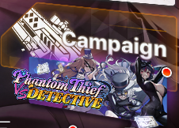
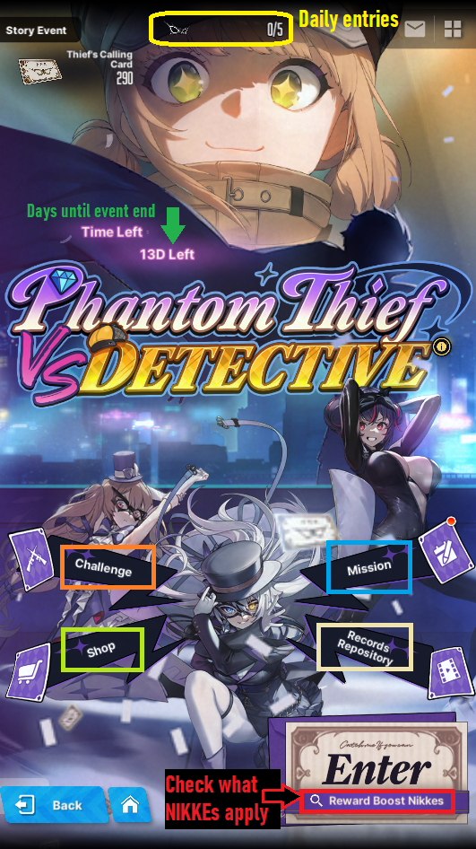
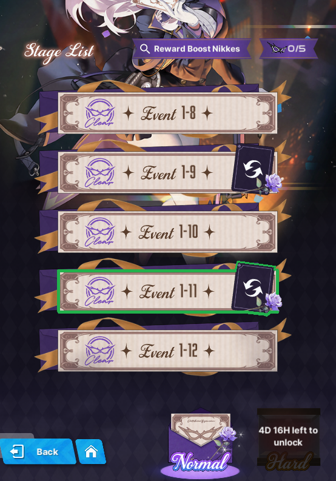
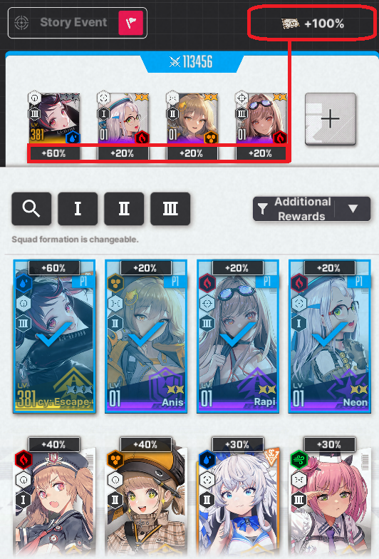
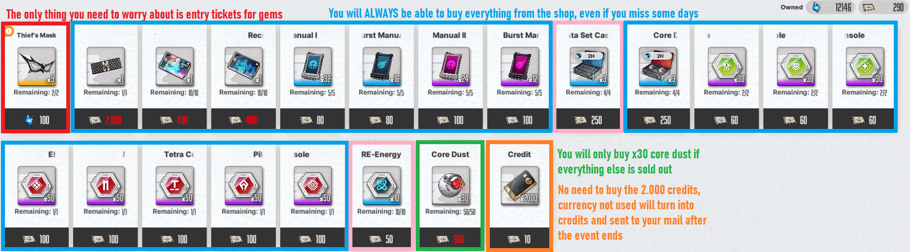

# **Events**

If there is an event ongoing, it will always appear below the Campaign button.

**Event is a limited time story featuring the NIKKE of the current banner.** There are 3 types of events, and you can differentiate them by length:

**Regular/Filler events last for 14 days, and do not feature a special skin pass or map.**  
**Special events last for 21 days, feature a special skin pass, sometimes feature a gacha skin, mini game(s) and a map.**  
**Collab events last for 28 days, feature a special skin, always feature a gacha skin, mini game(s) and a map.**

**Regardless of what length the event is, all events have:**

**5 event stage entries, that refresh daily**  
**Boss challenge, one entry per day. Pretty simple: You fight a boss in different difficulties, and receive rewards. Borrowed NIKKEs can be used here with no restrictions.**  
**Mission tab, missions completion tied to event stages clears. Rewards include: Event lobby, a battery used in the event archive, and event currency.**  
**Event Shop, with really good resources**  
**Record repository, to replay the event story and/or cutscenes**   
**Reward boost. When using NIKKEs that have the reward boost, you can get up to 100% increased event currency chance when clearing an event stage.**

**Example of a 14 days event UI**

**The maximum reward boost chance you can get is 100%, minimum is 60% if you only own SR NIKKEs.**   
**That means, when you clear a stage, you have at least 60% to a 100% chance of receiving double the amount of event currency and crates. The bonus doesn't apply to first time rewards.**

Just like the campaign, the events are also divided in **Normal and Hard stages.** Total of 12 stages per difficulty.   
**Clear all stages, and after that you will quick battle the stage 1-11, 2-11, or H2-11, depending on the highest hard difficulty available.**   
**Stage x-11 gives the most core boxes,** while the other repeatable stages give less core boxes, credit or battle data.  

## **Event shop**

**First and foremost, don't buy entries for gems until the highest difficulty is available, you will notice that there will be more entries available for purchase. Only then, buy all entries, and use them on the highest x-11 stage, that rewards 4 { width="25" } core dust crates per clear.**

**You will always be able to buy all the goodies in the shop after you use the extra entries bought with gems, so don't worry and buy everything in blue.**

**With the addition of Exchange Shop, Battle Data Sets and RE-Energy are a must buy. You can trade Battle data for dust cores and RE-Energy for random consoles**

**x30 core dust is good only in the early game, when you use very little core dust to level. After the 160 wall, you might only buy credits.**

**After the event's end the currency is converted into credits and sent to your mail, so do not worry if you didn't use all event currency after everything is sold out.**

