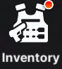

# **Inventory, Hoarding 101**

**Rule of thumb for all players at any point in time: Always pick Core Dust { width="25" } over Credits { width="25" } or Battle Data Sets { width="25" }**

**For skill manuals, pick the one you miss the most, but never skill 2 { width="25" } or burst 2 { width="25" } as you get a lot of them from event shops, you will have thousands of them in no time.**  
**Most of the time, you will pick skill 1 { width="25" } or skill 3 { width="25" } and burst 3 { width="25" }**   
**Burst 1 manuals { width="25" } can also be an option.** 

**When should you open supply crates?** When you can reach the next 20 level bracket. You can keep track of that with this [**progression calculator**](https://docs.google.com/spreadsheets/d/1I5X8FkBDPCTyrLNrgE-09sS91xSrMDMcAO9Y0vwXotU/edit?usp=sharing)
