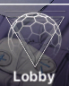
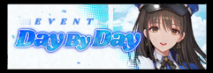
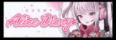
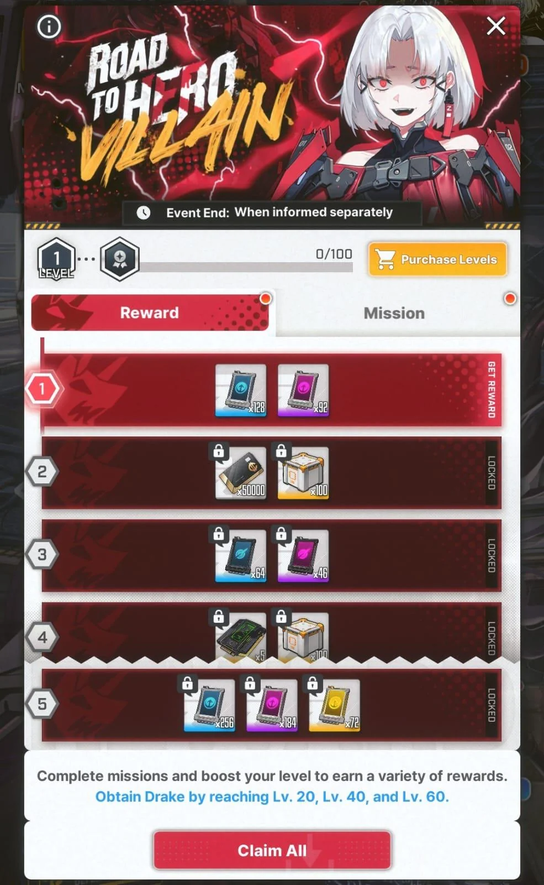
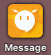
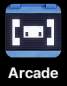
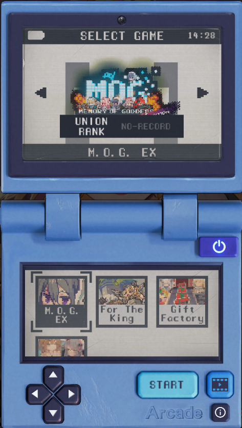
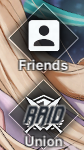
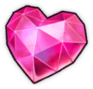

# **The Main Screen**

Or also known as the **main lobby**. All menus, events, and sub menus you can access from the main screen are listed below, with their respective guides or quick explanation.

## **Day by Day**

This is the new player event which is pretty common in all gacha games, complete missions for the day, and receive rewards. Once you finish all you receive a **SSR NIKKE, Privaty**. 

## **Alice Diary**

Alice diary is a limited event that rewards you with **Alice** when you clear chapter 11, and lots more rewards as the days go on.

## **Drake: Road to Villain**

{ width="350" }

Road to Villain event is the best event for resources in the game. It has 99 levels, and rewards are plentfull. It will also give you Drake, then copies of her. However, this event olny opens when you are done with Alice Diary, see it as a step up event for progression. You will miss the rewards this gives you... I miss it too.

## **BlaBla menu**

In the main screen, upper left, you will see the icon above. That's your BlaBla menu, where you can find **field missions requests.** They reward you with gems, but even if the enemies appear in the map, clearing them **won't count for your outpost level.**

**Another feature is to chat with your NIKKES!**

## **Arcade**

Updated mini game menu! You can play M.O.G. (Memory of Goddess), For the King, Gift Factory, BBQ Master, Dessert Rush, In the Mirror and Let's Play Soda! All buttons are interactive, they are pretty fun.

## **Friends and Union**

**Friends** is where you can add… friends! Add up to 30, exchange social points { width="25" } daily. Use social points to pull in the social point recruit banner. Reminder that the social point banner does not have pilgrims on it.

**Union** is a type of guild in NIKKE. I advise you to join one as soon as you unlock it.

Joining an active union is really important, since every month there is a [**Union Raid(UR)**](../raids/raids.md#union-raid) that rewards union coins, the currency used to buy [**cube upgrade materials**](../features/the-ark.md#harmony-cubes)
