# **Your NIKKEs**

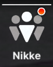

This is the menu in which you can check what NIKKEs you have, also known as the **NIKKE box.**  
The option to filter is really complete, be it by **manufacturer, class, elemental code, weapon type, combat power(CP)… Use the filter to find the NIKKE you want more easily.**  
**Check the image below, use the glossary to find stuff:**  
**Visualiser, Dolls, Bond level, Recycling Room consoles, equip and upgrade gears, increase skill levels, equip cubes.**  

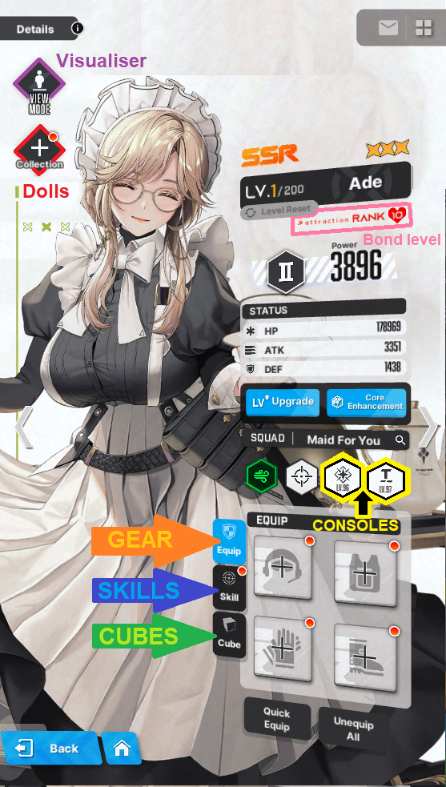

**Visualiser,** one of the best features in the game**,** where you interact with your NIKKE! See if she has **skins, replay her voice lines, check how her shooting position looks in the shooting range,** and my personal favorite**, interactive CHIBI Models!**  

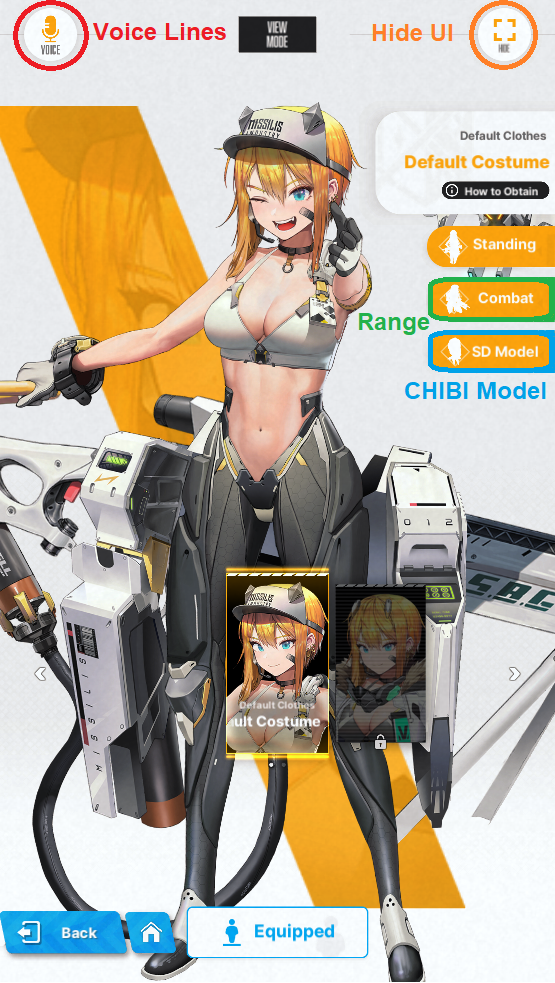

**Also, something important you will use pretty often, are the acronyms for limit break, this is the list for them:**  
**LB0 \= limit break level 0**  
**LB1 \= limit break level 1**  
**LB2 \= limit break level 2**  
**MLB \= max limit break.**  
**CORE \+ \= core enhancement level**  

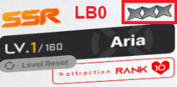{ width="200" } 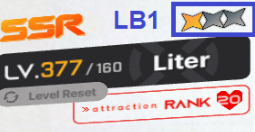{ width="200" } 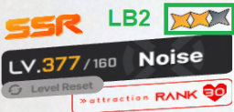{ width="200" } 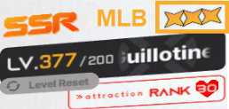{ width="200" } 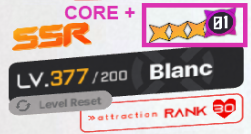{ width="200" }

## **Leveling NIKKEs**

The most straightforward way to increase your squad CP is to upgrade your NIKKEs level.   
**Each level costs Credits 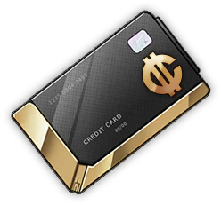{ width="25" } and  Battle Data Sets 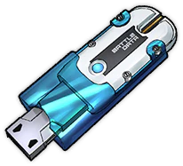{ width="25" }. Level 10 and each level bracket after will cost Core Dust 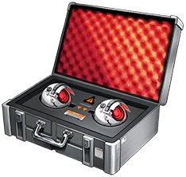{ width="25" }**

**What is a level bracket?** It's a major combat power breakpoint per 20+1 levels upgraded, eg:  
**21 ➡ ️ 41 ➡ ️ 61 ➡ ️ 81…221 ➡ ️ 241 and goes on infinitely.**  
To keep track of your leveling expenses and plan for the future, use the **progression sheet from [useful links](../README.md#useful-links), it is updated regularly!**

That said, leveling is pretty simple, you get the resources and use them. Well, at least until the bane of all new players… the infamous 160 wall.

## **160 Wall**

**This is the most hated "feature" in the game. Not only is time gated, it's also… RNG gated!**  
Simply put, you cannot level NIKKEs past the level 160\.  
**Does that mean 160 is the cap?**  
**SR (purple rarity NIKKES) can't go past level 160, however, SSR (Orange rarity NIKKEs) can be leveled further, only if they are Max Limit Break (or MLB).**

Once you have **a total of 5 MLB NIKKEs level 200**, go to your synchro device and proceed with the tutorial.   
**After you're done, congratulations! You're past the 160 wall!**

## **Level 200 and beyond**

The 5 MLB NIKKEs get permanently locked to your top row in the synchro device, and leveling further becomes only possible through your synchro device. You shouldn't individually level NIKKEs anymore, and put all of them into the synchro device.  

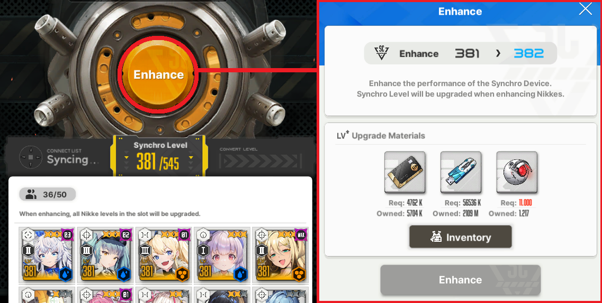

### **Credits issue**

**Now I need to talk about the 301+ synchro, an almost permanent Credits issue.** This is related to the fact that credit cost to level up ramps up way too much compared to daily income of credits. 

**You can just solve that with boxes… right?** Let's take a quick dive into math now.  
The calculus goes like this: You are **synchro 305\~**, chapter 32 all done, middle of hard 16, **outpost level 293**.   
Your daily income, 23\~ hours of afk rewards, is **1.026k\~ credits**. The credits cost to level up to 306 is **3.809k**.   
And so, without opening boxes, not factoring in events/dailies or any other credit income, you need to wait **90 hours, or use 90 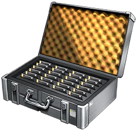{ width="25" } 1 hour credit case, per level.**  
**The thing is, that wouldn't be so bad if you did not need to spend credits on gear.**   
**The solution?** At the moment, there isn't one. Some that are not definitive: Neglect upgrading gears, get more credit boxes with real money… this one really sucks. Have you found a solution? Let us know in our Discord!

**This problem goes away on synchro 381+, when you have built most NIKKEs and do not need to level gear as often as before.**

### **And yet, another core bracket! Apply to 350 and above**

Synchro level 350 and above starts to increase **core** cost per 50 levels. Each upgrade costs 11.000 from 350 onwards until 400, that increases the cost by 1.000 cores once more.  
**synchro 350 to 351: 11.000 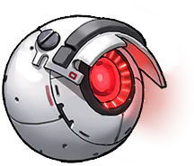{ width="25" } ➡ synchro 400 to 401: 12.000 { width="25" } and so on.** 

## **Gears and Collection items**

Two types of equipment you can give to your NIKKEs, heavily RNG based.   
You obtain random **Gear** from **Interception**, **story rewards** and **missions**. **Alice Diary** rewards you with some gear too.  
**Collection items** come from [**Dispatch**](../features/outpost.md#bulletin-board-dispatch) and [**Solo Raid**](../raids/raids.md#solo-raid). **Alice Diary** also rewards you with Doll materials and a **SR Sniper Doll!**

### **Gear tiers and overload system**

Up until gear tier 9 and "10", there isn't much to say, so let's keep it short.   
You can check the gear tier and class by color and by the top left icon respectively.   
**Gears with tier 4 or higher** might come with **manufacturer bonus**, represented as the  icon on the top left of the gear piece.   
You can check your **NIKKE manufacturer** on the Console icons, if you forgot where that is, they are above your chest gear slot in your NIKKE tab:  

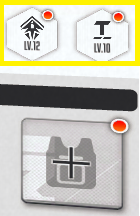
 
**If equipped by a NIKKE of the respective manufacturer, the gear base stats increase by approximately 25%.**

**Gears tiers and maximum level of enhancement:**

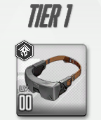 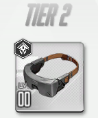**Gear of this tier cannot be upgraded**  

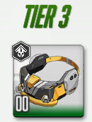 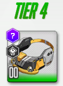Maximum enhancement level of 3, however it is not worth to upgrade any piece**  

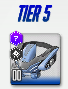 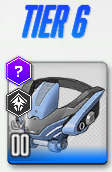Maximum enhancement level of 4, it is only worth to upgrade the helmet piece to level 2**  

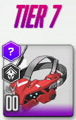 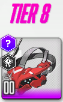Maximum enhancement level of 5, it is only worth to upgrade the helmet piece to level 3**  

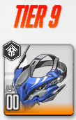 Tier 9 can also go up to level 5**, upgrading the helmet and gloves to 4 is okay, chest to lv 3 only if needed.**  

**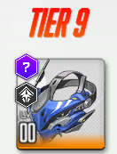 Manufacturer bonus tier 9 is quite different from the other tiers. Commonly known as T9M, short for tier 9 manufacturer gear, the acquisition of this gear is tied to [Interception EX (SI)](../features/the-ark.md#interception-ex-or-special-interception-si), and certain bosses of the [Anomaly Interception (AI)](../progression/lategame.md#anomaly-interception-ai)**

**There are two ways to obtain T9M:**  
1. **Gear pity boxes 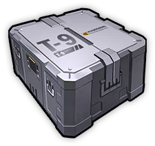{ width="25" } that drop since the first stage of Interception EX to the highest stage of Anomaly Interception. Collect 200 pity boxes and open it to obtain a single random T9M gear.**

2. **Raw gear drop:**  
**Any Interception EX boss cleared to at least stage 7** has a chance to give you a t9m gear. The chance is very slim, and increases a little on stage 8 and stage 9.  
**Anomaly Interception has 5 different bosses, each giving different gear pieces.**  
**AI boss, Kraken, is the only one that does not give any type of t9m gear**, and gives **custom modules** instead.

#### **Overload system, tier 10**

**To unlock the "tier 10" gear, you need a t9m gear, level 5, equipped by a NIKKE that activates the manufacturer bonus and a custom module (aka rock).**   
Keep in mind, the credit cost per piece of **tier 9** gear, from lv 0 to 5 is **1.592k**, and **6.368k** for **all 4 pieces, or to say, per NIKKE**.   
**Tier 10** credit cost per piece, from lv 0 to 5, is **2388k** and **9552k** total.  

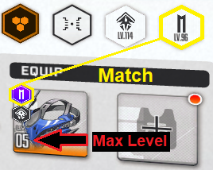

If everything is right, when you select the gear this { width="150" } should appear.  
When you get to this point, you will need **a Custom Module 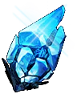{ width="25" }** obtained in Interception EX (**SI) stage 9**, and any **AI stage**.  
I won't make an Overload in depth guide, as others already made them, and **compiled the recommended stats for each character**. Read all of them if possible.  
**NIKKEgg OL guides**: [**Overload Equipment**](https://nikke.gg/overload-equipment/)  [**Overload Priority**](https://nikke.gg/overload-gear-priority/)  
**Prydwen OL guides**: [**Overloading Intro**](https://www.prydwen.gg/nikke/guides/overload-gear-intro/)  [**Rerolling Overload**](https://www.prydwen.gg/nikke/guides/overload-gear-reroll)  [**Overload Recommendations**](https://www.prydwen.gg/nikke/guides/overload-gear-recommendations/) 

### **Collection and Favorite items**

#### Collection / Dolls

The **collection item system**, also referred to as the **Doll system, is a** **RNG fiesta**.   
This amazing [Overload calculator](https://docs.google.com/spreadsheets/d/1KR8D61fYapZeaPIIZhd_2gzGV90XL7nSKw0ZJo5A20o/), made by shorty97 will help you greatly!
**You can check [Prydwen](https://www.prydwen.gg/nikke/guides/collection-intro) and [NIKKEgg](https://nikke.gg/collection-item-guide-and-overview/) guides, both** *should* **be up to date.**  

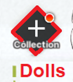

**How do you acquire Dolls and Maintenance Kits?**   
**Collection items / Dolls** come as a drop from [**Solo Raid**](../raids/raids.md#solo-raid), and from the **doll "pity" box** of sorts. You get the box from **special dispatch**. 

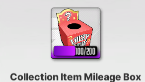

**Maintenance Kits**, used to upgrade **Dolls**, also come from **Solo Raid** and **Special Dispatch**.   
**Overall, I advise to only equip R Dolls and upgrade them to phase 15 with only blue maintenance kits, then changing to a SR Doll.**

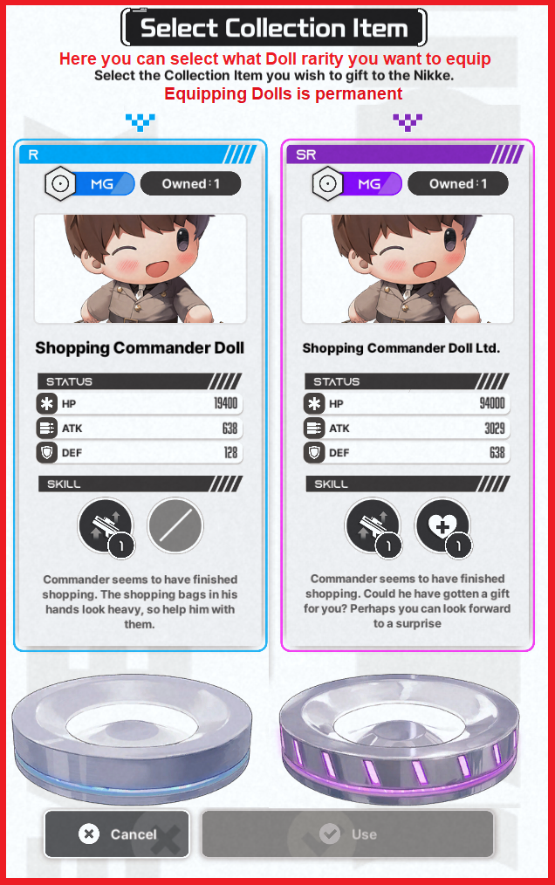

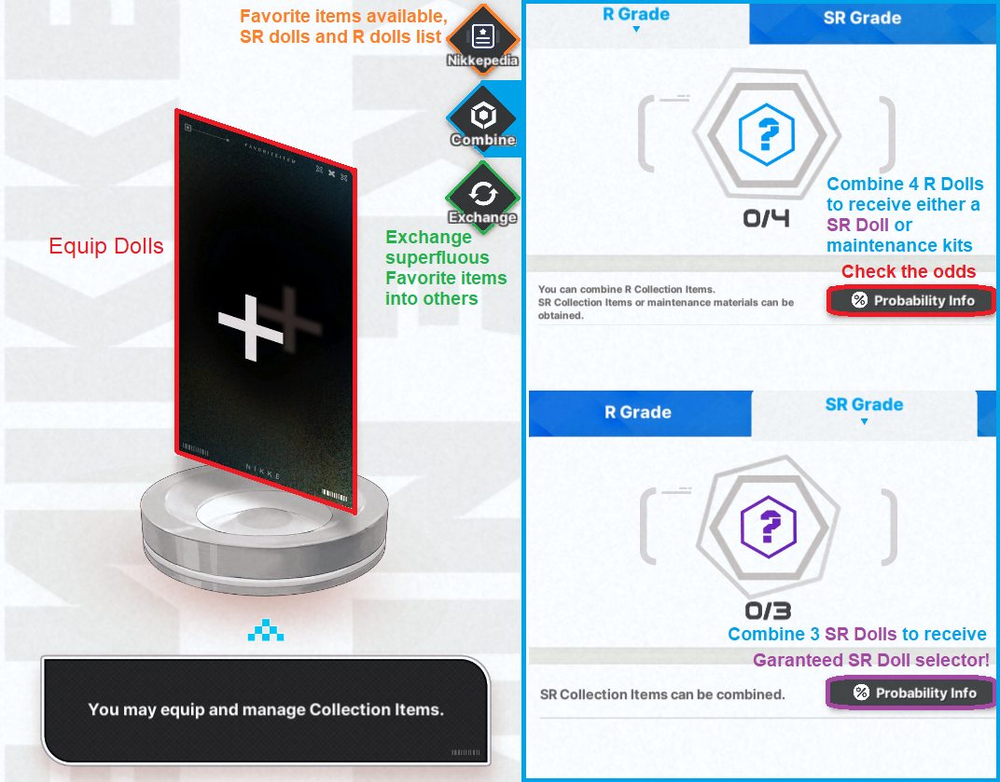

**Beginner Maintenance Kit 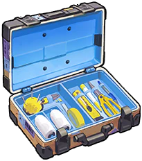{ width="50" } until R15 ➡ change Doll (SR5) ➡  Intermediate Maintenance Kit 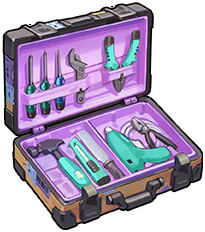{ width="50" } until SR10 ➡  Elite Maintenance Kit 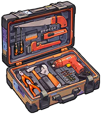{ width="50" } to SR15 (max level).**

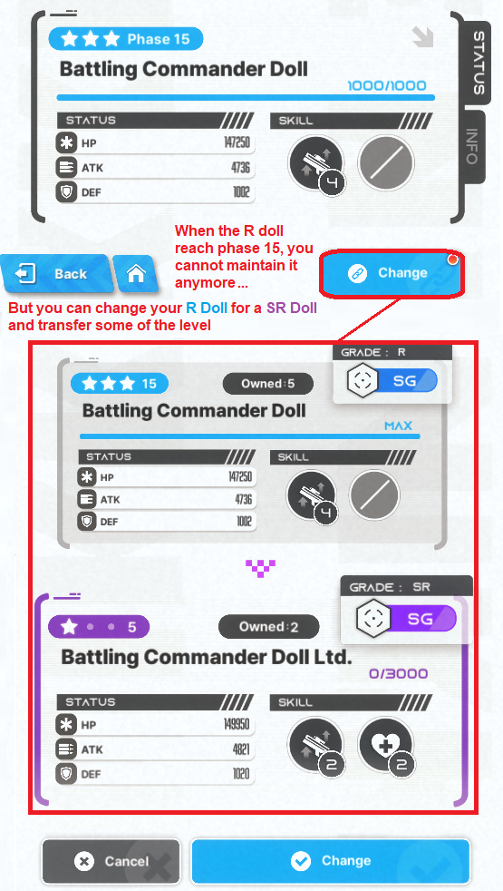

#### **Favorite Items**

Certain NIKKEs have a favorite item, or a possible upgrade after the **SR15 doll**. You will select one target to search for their favorite item on the dispatch system.   
**However! You need to have the favorite item target at Limit Break 2 and affection level 30 to upgrade the SR15 doll into the favorite item. If the conditions are not met, you will not be able to upgrade it, even if you have the maintenance materials.**

When the conditions are met, **you can instantly upgrade the SR15 doll** into the favorite item **phase 1**, but to upgrade to **phase 2**, you need **50** maintenance materials, and lastly to **phase 3, 110** maintenance materials**, total of 160\.**

**Currently, there are 9 favorite items targets, from top to bottom, ranked by usefulness:**   

Helm: The best favorite item target. She is a top priority for Story, Raids and PVP (yes, all contents). Her burst generation and dmg after phase 3 make her a really strong burst 3 dps and off burst option. Build her as soon as you can.  

Drake: Another unit massively improved with her favorite item. Massive buffs for the Shotgun Team, and also for PVP. After Helm is done, build drake also ASAP.  

Laplace:  is actually okay if you like her, no Solo Raid usage, but missilis tower and UR she might be a good choice. If you don't like her design, skip!  

Miranda: Self buffs, coupled with low increase in team buffs. Snow White team has been powercrept for ages, and Miranda's favorite item doesn't change that. Skip.  

-Line to separate usable to unusable units. Above you should build eventually, below is for situational cases or never, at all.  

Viper: Viper is water, an element that greatly lacks DPS. She went down the priority because better water NIKKEs have been released, such as Helm fav item and summer doro. If you own a water funnel account, she goes after helmT in priority. If you don't know what funnel acc means, you should skip.  

Frima: True damage buffer. Problem is, no CDR. She is a solid non-meta option if you like her design and want to work around true dmg meta. The Fav item story is great too! Purely meta-wise, skip.  

Exia: Fell off the meta as time went by. You can skip her as of today's meta.  

Milk: Lackluster CDR, some offensive buffs. All in all, bad favorite item target. Ignore her.  

Diesel: Value is so low it hurts. Missed oportunity...  
