# **Outpost**

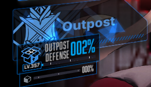

Your own city! Kinda of… This is where you will find most of the content that does not require you to fight. Let's dive into it.

## **Outpost Defense / AFK rewards**

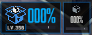

**This is what will make you push the story like a maniac. *Or is it because of the lore? Who knows!*** 

 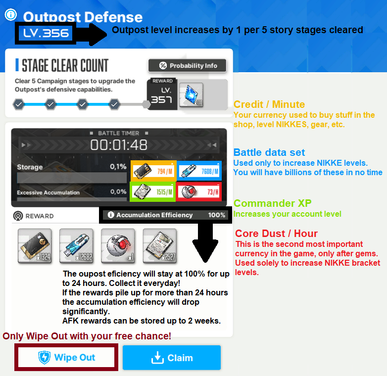

## **The Command Center**

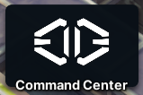

This is the place where you will find stuff related to social interactions, music… and a **steady income of gems!**  

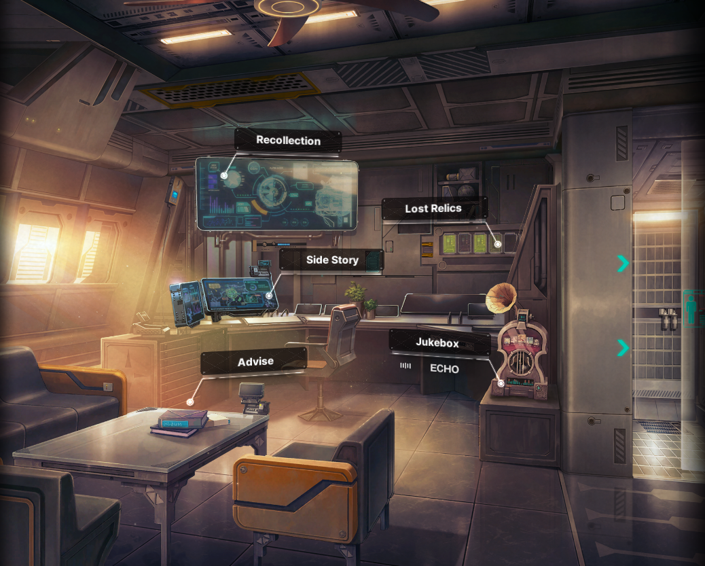 

**Recollection** is the menu where you can access and re-watch all the **story cutscenes** you have unlocked, brief encounters, that are the little stories you can see by interacting with the buildings you have constructed, as well as the:  
**Event Archive:** where you can replay old events, which require you to spend a memory film 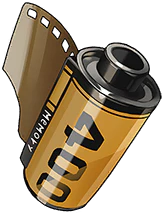{ width="25" } - you receive one memory film from each new event you clear all missions - and collect some of the rewards, such as the **event music** and the **event special lobby**. You can also explore the event map and play minigames!

**Lost Relics** is where you can view the things you've collected from the story maps, once you collect a few of them, you will get gems as a reward. There is also a couple of lore inside each of the relics you grab, so if you like the story so far, be sure to read them!

**Side Story** is the menu of… side stories. At the moment of the making of this guide, there are two available , and the first time you complete them, you get a nice frame and a couple of gems  too.

**Jukebox** is where you can browse the game music collection, make your own ingame playlist! Collecting enough discs in a specific group will also reward you with gems.

**Advise** is where you will bond with your owned nikkes. You can daily advise the Nikkes of your choosing and increase your affection with them. You can also gift Nikkes with presents, increasing their affection more quickly.   
Each level will increase their stats by a tiny bit, and at bond levels 1, 3, 5, 7, and 10 you unlock a special bond story with them! They will also reward you with 50 gems per story you unlock, per nikke! 

The max level of bonding is tied to the numbers of duplicates. Acronym in **bold.**  
Limit break level 0, **LB0,** affection max level= **10**  
Limit break level 1, **LB1,** affection max level= **20**  
Limit break level 2, **LB2,** affection max level= **30**. This is the max level of **non-pilgrim** NIKKEs.  
**Pilgrims only,** max limit break, **MLB**, affection max level= **40**.

**Aside from stat gain, bonding with Nikkes past level 10 won't reward you with gems or bond stories.**

## **Tactics Academy**

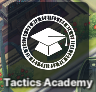

This is the content you **NEED** to upgrade **ASAP**. **This takes priority over everything, even above NIKKEs levels.**  
Each class will cost credits, and you unlock really good stuff, such as:   
**Building slots, outpost defense income increase, synchro device slots, increased rewards from interception, and more importantly, upgrade your bulletin board (dispatch) to include [doll materials and favorite item](../features/nikkes.md#collection-and-favorite-items) special dispatch missions.**  

All tactics academy classes **have a credit cost** and **additional requirement** to be unlocked, this is the list for them  
**Class A-1:** no requirement  
**Class B-2:** Train station, **chapter 3**  
**Class C-3:** Generator, **chapter 4**  
**Class D-4:** Hospital, **chapter 5**  
**Class E-5:** Seed Club, **chapter 6**  
**Class F-6:** Church, **chapter 7**  
**Class G-7:** Shopping mall, **chapter 8**  
**Class H-8:** Goddess of Victory statue, **chapter 9**  
**Class I-9:** Fitness Club, **chapter 10**  
**Class J-10: 11-27 BOSS**  
**Class K-11:** Lesson 1 **13-1** , Lesson 2 **13-24 BOSS** , Lesson 3 **14-30 BOSS**  
**Class L-12:** Lesson 1 **15-15** , Lesson 2 **16-7**   
**Class M-13:** Lesson 1 **17-12** , Lesson 2 **17-33 BOSS** , Lesson 3 **18-33 BOSS**  
Class M is the last one. **Congratulations, you're done with tactics academy!**

## **Synchro Device**

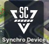

The synchro device is available when you clear 4-15, but you will only need it when you unlock the manufacturer towers in 7-13.  
**Do not buy slots with gems**, the tactics academy will give you enough.

Now, once you access the towers, you can do a little trick until you pass all tactics academy lessons. 

## **Recycling Room**

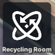 

Time gated content. You receive console coins from events and/or AFK rewards.  
Increase certain NIKKEs stats based on the console upgrade level and type. You can buy consoles from the [body label shop](shops.md#body-label-shop).  
Don't be fooled though, the increase is negligible.  

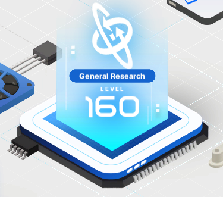

**General research RE-Energy** { width="25" } come from the outpost defense AFK rewards and event shops. **Increase all your NIKKEs base health points.**

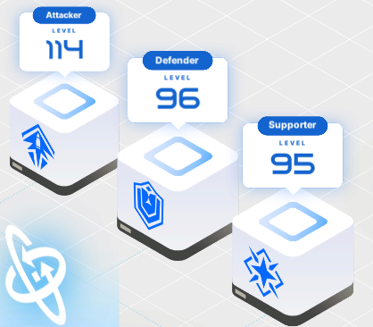

**Attacker/Defender/Supporter Research consoles { width="25" } 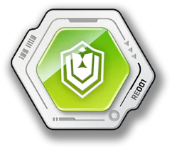{ width="25" } 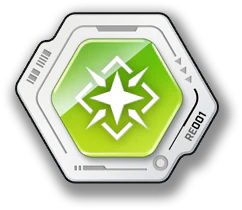{ width="25" } are obtained from events. They increase the respective class NIKKE's base health and defense points.**

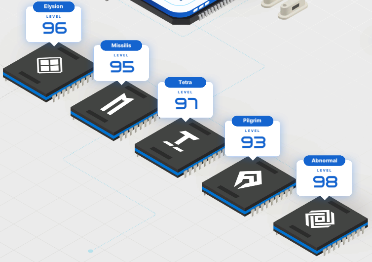

**Manufacturer Research** consoles 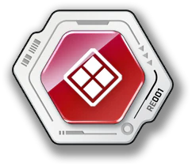{ width="25" } 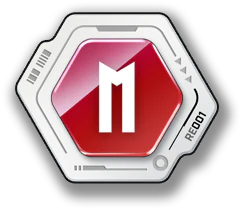{ width="25" } 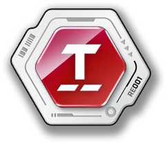{ width="25" } 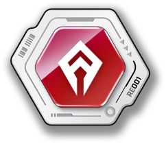{ width="25" } 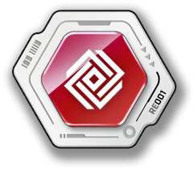{ width="25" } are obtained from events. **They increase the respectives manufacturer's NIKKE base Attack and Defense.**

## **Infrastructure Core**

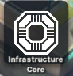

This is a forgotten feature of NIKKE. You unlock new things such as more arena entries, dispatch list cap, advice chances, auto dispatch, stamina \+3 (Used on brief encounters in the **Outpost**. You can check on the top left of your screen for this.

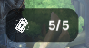

Each battery = 1 Stamina

**The only thing you need to remember from here is the free daily shop reset,** but after an update they made the reset button glow when you can reset it for free, you probably won't miss it.  
Again, sadly it's a forgotten feature. Unlock the free daily shop reset and you can also forget about this.

## **Elevator / Liberation** 

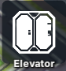

More free SSR NIKKES! But they are not that strong 😢 *peak designs wasted!*  
The NIKKEs available in the **Rehab Center** are **Guilty,** **Sin** and **Quency.** It takes **exactly 60 days** to "liberate" the NIKKE of your choosing.  
**Pick based on looks!**  
Or if you want the "*stronger*"  
**Guilty** **\>** **Quency** **\>** **Sin**  

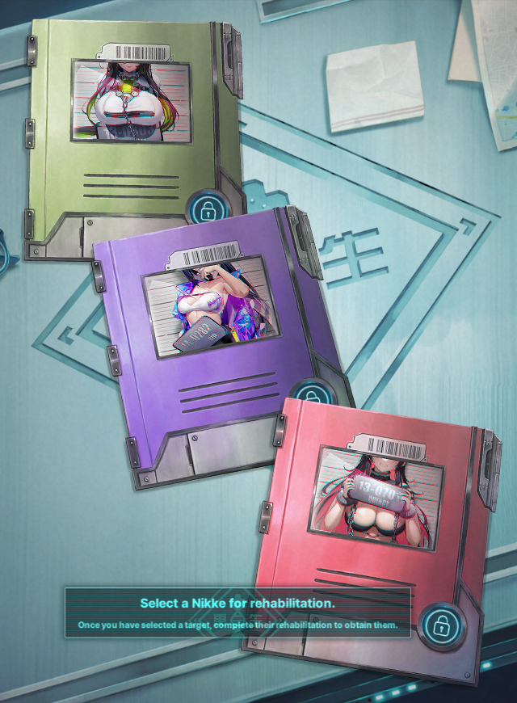

After you clear chapter 20-31 BOSS stage, a new liberation target, **Nihilister** \-*Dragon mommy to some*\- will be available. **She won't appear in the Rehab Center, unlike the other 3**.

The GIF below shows how to access the "Upper World".  

## **Bulletin Board / Dispatch**

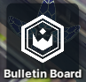

Dispatch missions, send your NIKKEs on a daily basis to earn rewards. Couldn't be more simple right?  
Well, It was until the addition of the collection items. *And of course RNG based!* 🎉*Thanks devs!*

I hate this gem hellhole, so follow the dispatch guides of [Prydwen](https://www.prydwen.gg/nikke/guides/collection-dispatch) or [NIKKEGG](https://nikke.gg/collection-item-guide-and-overview/#Where_to_get_Collection_Items) until someone makes a guide for this here.
