# **Shopping Guides**

Check out [NIKKEGG shop guide](https://nikke.gg/shop-guide/), and [Prydwen spender guide](https://www.prydwen.gg/nikke/guides/spender-guide)

## **Cash Shop**

**Cash shop** is the place where you can **spend real money.**   

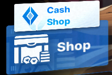

### **What are the best deals?**

**Supply Packs**  
The best deal, for any player, is the **30 day upgrade supply pack, costing $14.99**. It's the best value for resources in the game.  
The **$4.99 supply pack** is also a good addition if you can buy it.

**Before opening your supply chest**, I advise you to just stack them in your inventory for as long as you can. The best choice is to pick either skill 3 book (middle right) or burst 3 (bottom right) to upgrade NIKKEs skill levels. Sometimes burst 1 (bottom left) is also a good choice if you already have 300+ burst 3 books.  
*Note that this pack is just for game progression, if you want cosmetic goodies, you will want to buy the next pack*  
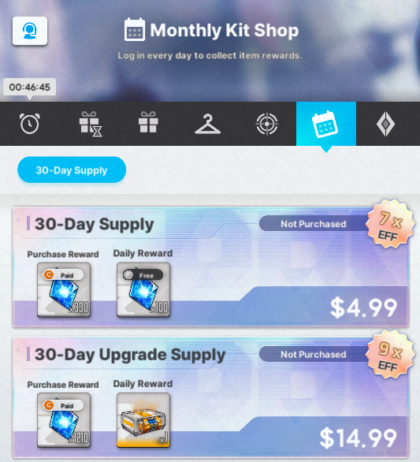 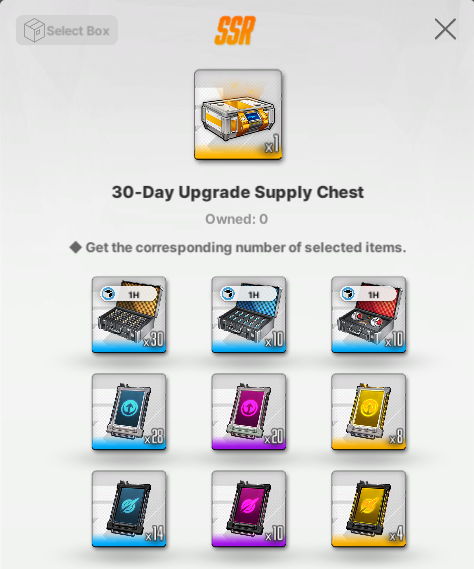

**Seasonal and Special Skin Pass**

Normal events do not have special skin passes with them, however bigger events that last at least 3 weeks always have a **Special Skin Pass**. 

If there is one available, **buy the event special pass over the normal pass**, since they give **Rainbow Vouchers** instead of **Standard Vouchers.** Buying both is nice, but keep your IRL savings in check, they cost **$19.99 each.**   

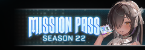

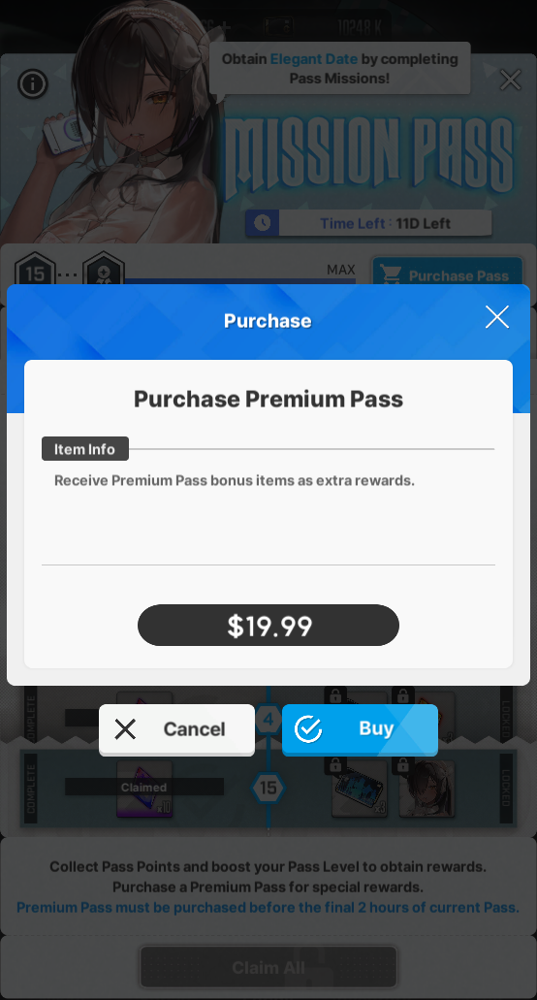

## **Shop**  

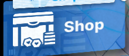

### **General Shop**   
**Buy the free goodie, and dust core boxes { width="25" } sold for CREDITS**

The profile custom pack x5 is not that good value, but ask your credit's balance: Style points? Style points!

**Resets daily**  
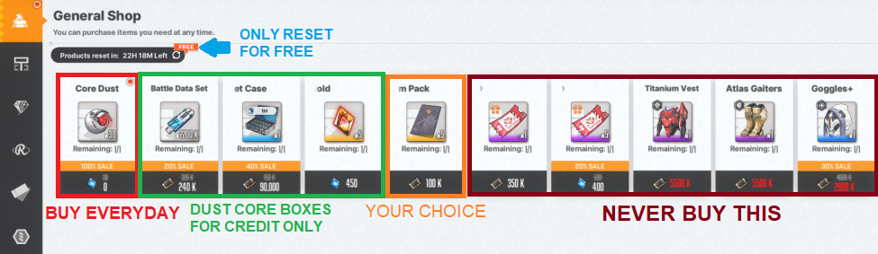

### **Union Shop** 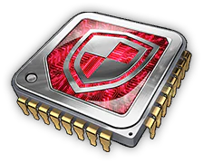{ width="25" }

Here you use Union Chips. You get this currency from the [Union Raid](../raids/raids.md#union-raid). You can buy duplicates of the [Liberation NIKKEs](../features/outpost.md#elevator-liberation), but what you should really buy are **cube materials**. 

**Check the [cube guide](../features/the-ark.md#harmony-cubes) for upgrade priority.**

**Resets daily**

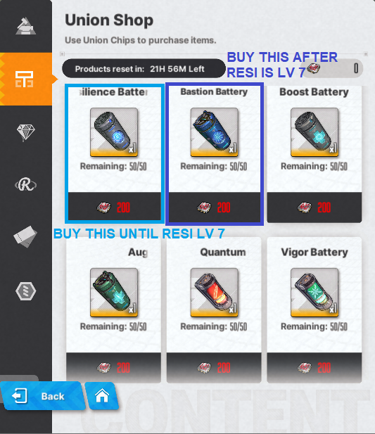

### **Body Label Shop** { width="25" }
This is the SSR mold shop for almost every player.

**Resets daily**  
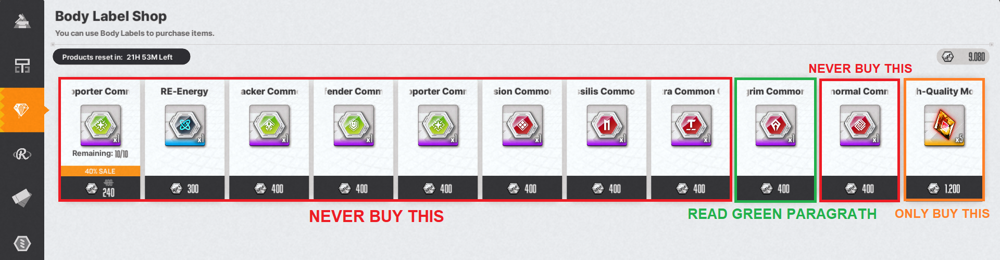
**The only reason why pilgrim consoles could be worth buying would be that you already have all useful units core \+7, and molds are useless to you. If you don't have all NIKKEs, buy MOLDS!**

### **Arena Shop** 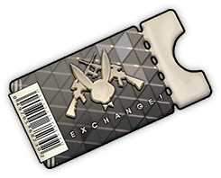{ width="25" }
Use arena exchange vouchers, from the [Rookie Arena](../features/the-ark.md#rookie-arena) and [SP arena](../features/the-ark.md#sp-arena) here. 

**Resets daily**  
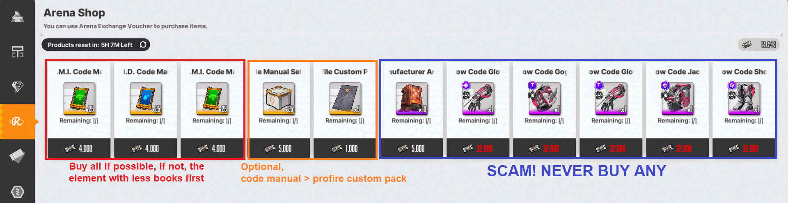

### **Mileage Shop** 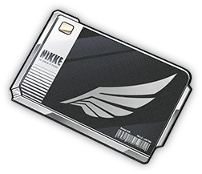{ width="25" } 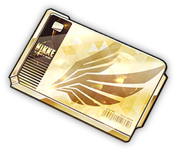{ width="25" }
The "Pity" shop. 

**Resets daily**  
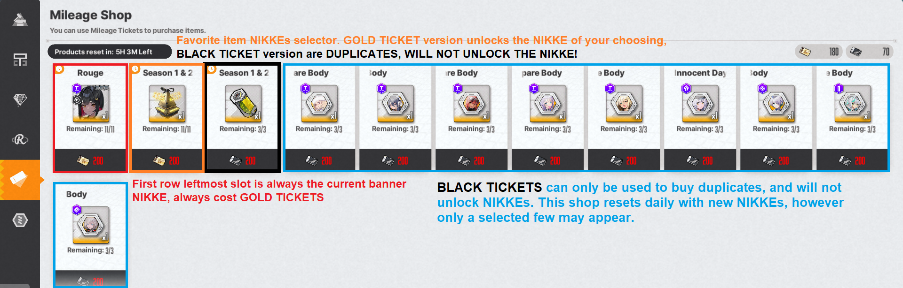

### **Recycling Shop** 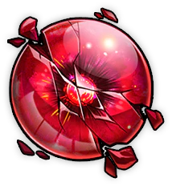{ width="25" } 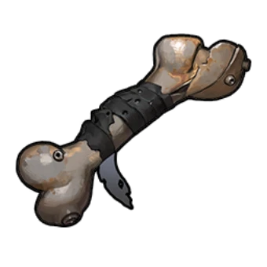{ width="25" }
Once you do [COOP](../raids/raids.md#coop), you will receive **broken cores** and **rusted bones**, the currencies used here.

**Resets weekly**  
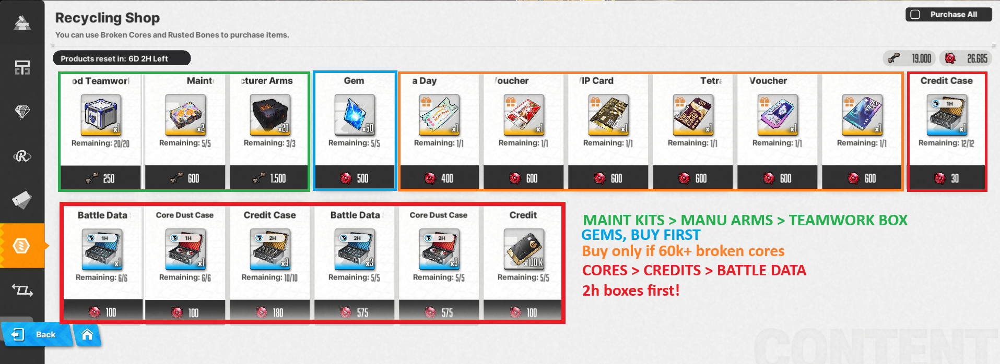

### **Exchange Shop**

**New shop introduced after Cinderella patch, unlocked with the completion of Chapter 21**

**You can trade 3550k Battle Data Sets { width="25" } for 100 Core Dust { width="25" } and 30 RE-Energy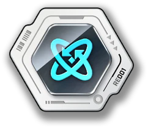{ width="25" } for a Random Console Pack that rewards any type of console.**  
**Always trade Battle Data Sets for core dust, but not all, save some Battle Data to level afterwards.**

**RE-Energy is random, but for sure worth it, however only exchange if you reached the [General research](../features/outpost.md#recycling-room) cap, and have spare RE-Energy. After you do this once, wait until you reach the next synchro bracket and General research cap to exchange again.**

**Battle Data for Credits is not worth it.**

**Does not reset**

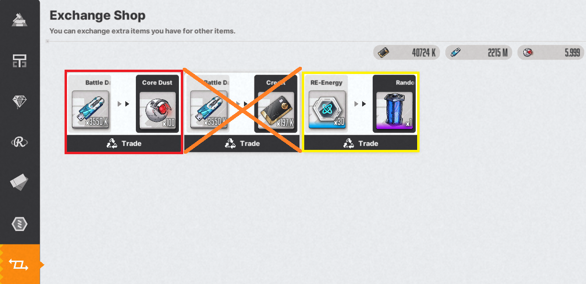
