# **The Ark**

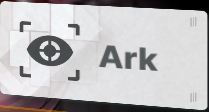

**This is where you find all combat vertical content and do your dailies.**  
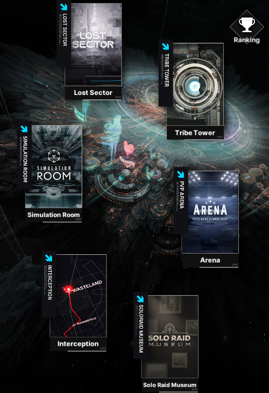

## **Lost Sector**

This is where you will acquire a new type of gear to your NIKKEs, **CUBES**. There are quite a few cubes to collect, each of them providing a new effect.  
You unlock new Lost Sector areas by progressing in story mode and clearing boss stages.

### **Harmony Cubes**

Check [**Prydwen**](https://www.prydwen.gg/nikke/guides/harmony-cubes-information) and [**NIKKEgg**](https://nikke.gg/harmony-cube-guide/) guides if you want.  
The two main cubes you need to focus on are  the **Resilience Cube { width="25" }** and **Bastion Cube { width="25" }**.  
You can get the **Resilience Cube** on **Lost Sector 04,** which unlocks when you clear chapter 9\.  
The **Bastion Cube** can be found on **Lost Sector 07**, unlocked once you clear chapter 13\.  

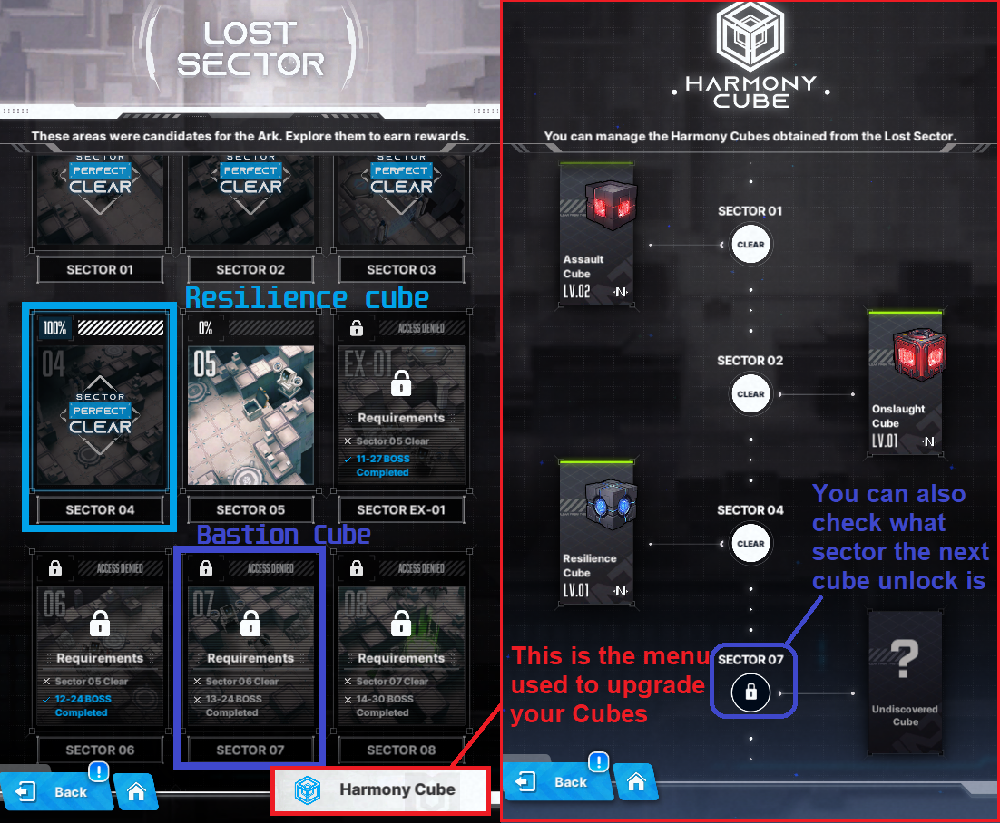

**Does that mean all other cubes are bad?** Short answer: **Yes, all other cubes suck, with some exceptions**

**Get Resilience to level 7 then Bastion to level 7\. Once you are done you can level resilience to 11 first, and eventually to level 13+ both.**   
**You can check the stats of each cube with this sheet**  

[cubessheet.png](../media/cubessheet.png)  

*credits to the KR NIKKE community*

#### **PVP only cubes**  
If you want to be competitive in [SP Arena](#sp-arena), you can upgrade **Quantum Cube** 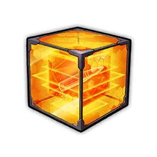{ width="25" } and **Tempering Cube** 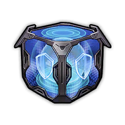{ width="25" } to level 7, but only after upgrading **Resilience** and **Bastion** to at least 11.

#### **Quantum** enhances the burst generation of Rocket Launcher NIKKEs (It works on all gun types, but aside from RLs, the burst generation is negligible) **It makes your team burst faster, which is key in pvp. This will not increase burst generation from skill! HelmT and rosanna skills for example, will not benefit from using it.**

#### **Tempering** is good if you need a NIKKE to survive, and she doesn't have copies or leveled gear. You want to put it on the p1, or on everyone on the team depending on the situation.

#### Tempering Cube can also be useful for certain units like Liter, Crown, shelm, srosa against any boss that might target lowest hp or in general when they might be dying early. A common cheese is to give a Purple doll, at level 0, and equip tempering. That combo should be enough to make them stay alive, and is really cheap.

## **Ranking**

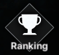

This is your Server Ranking. Not your main server, as Global, SEA, NA, etc. **But account creation time server.**  
If you open your profile, you can find your account server right beside your name.  

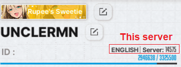

Here you can check your server ranking in various contents, the ranking of others in the same server, and earn **Frames** based on your ranking in various contents.  
Check your **Frames** progress on  ,inside the Ranking menu, at the bottom right of the screen.

## **Towers**

**The "almost" infinite tower™ mode that all gacha games are legally bound to include.** Jokes aside, this is pretty simple. Each tower has floors/stages that are very similar to story mode. Clear one and go up one floor, rinse and repeat. 

There are some rules regarding the manufacturer tower, this is the comparison:

**The Tribe Tower is always open regardless of what week day it is, and you can clear as many floors as you can.**

**However, the Manufacturer Towers open only on certain weekdays, and you can only clear up to 3 floors per day on each. Another rule is that only NIKKEs of the same manufacturer as the tower can be used on them.**  

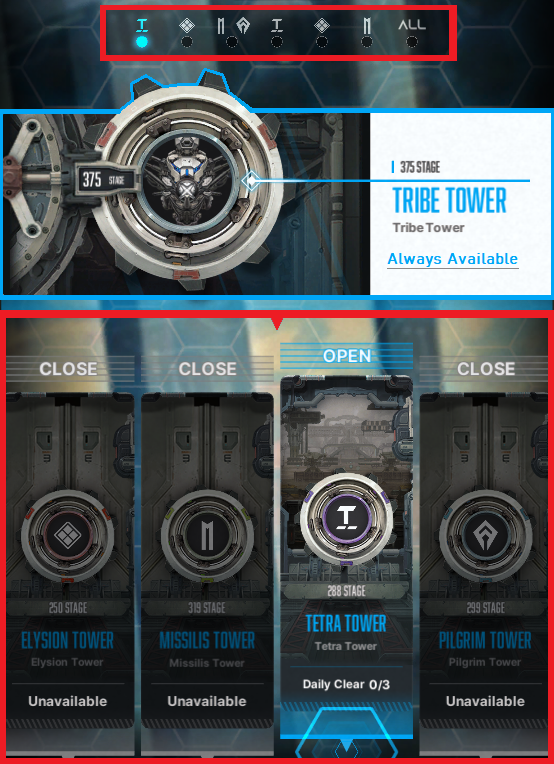
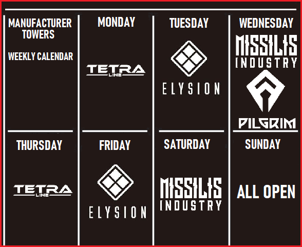

## **PVP Arenas**

This is the ranked player vs player mode. Here, you can earn the Arena Exchange Vouchers { width="50" } used to buy your **elemental code manuals in the arena shop. They are needed to upgrade your NIKKEs skills past level 4\.**

We would like to recommend [Prydwen](https://www.prydwen.gg/nikke/guides/pvp-intro) and [Nikke.gg](https://nikke.gg/arena/) PVP guides. If you don't feel like immersing yourself too deeply in PVP, you can ask for team building help on any of the following Discord: [Official-NIKKE Discord](https://discord.gg/nikke-en), [NIKKE-Community Discord](https://discord.gg/nikke), [Prydwen Discord](https://discord.gg/prydwen), [NIKKEgg Discord](https://discord.gg/nikkegg).   
Other players will gladly help you with pvp teams.

If you want a really useful tool to estimate the burst of your team, the [BAS7IAL NIKKE DECK](https://nikke-deck.web.app/) is perfect for it! Currently it supports English, French, Korean and Japanese.

The PVP modes are: **Rookie Arena**, **Special Arena(SP Arena)** and **Champion Arena.**

### **Rookie arena**

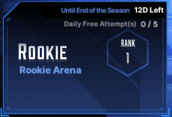

Rookie arena consists of 1 team with 5 Nikkes. You need to build an attack team and defensive team. Ranking is pretty simple, you earn stars each time you win against an opponent, more stars, better your ranking. If your defense loses, your star count goes down, and so your rank.   
You can battle 3 times for free without Infrastructure Core Stage 6 and 5 times with the upgrade at level 6\. 

Any attack past the daily free entries, you need to pay 100 gems per entry. We don't recommend doing that in the rookie arena, as you do not earn gems for ranking positions.   
The rookie arena season lasts for 2 weeks, and 1 waiting day in between season end and start. 

Every day you will be getting a mail of daily rewards from the arena, and at the end of the season you will get an amount of arena vouchers for your ranking.   
Thanks to Keripo you can use his [pvp sheet](https://docs.google.com/spreadsheets/d/15aPYfbMCB3JSYYgygwMvSLvyPUd_AQ0EhKawRXMsQgQ/edit?gid=1514064848#gid=1514064848) to see what teams are used and what winrate they have against different team comps.

### **SP arena**

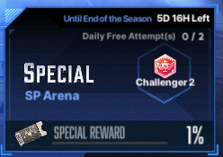

The first thing you need to take note is, it includes **AFK farm** of your arena exchange vouchers { width="25" } and also 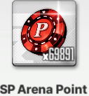 currency that dictates one of your rankings. **The AFK rewards will reach 100% in less than 24 hours, after that it will no longer stack more, unless you collect.**

**You receive 2 free attacks every day** and more attempts cost gems.   
**This mode has 2 different ranks**, one based on your **battle rank**, which you can only increase by actively winning attacks, and the other from how many SP arena points you have.   
The main feature of this pvp mode is that you need **3 teams in defense, but 2 for attack.** You can "ignore" the strongest enemy team and only attack 2, as you only need to win twice…**The best defense is a massive gap in combat power!**  
The main problem is: **you need to have a lot of Nikkes, properly invested, in order to be able to compete here**. The best escapism that many chose is to outright ignore the existence of the SP arena.   
Each season of the SP Arena **lasts for 2 weeks** and has 1 day of waiting period until next season, same as Rookie Arena. 

**At the end of each season there is also a gem reward based on your ranking**

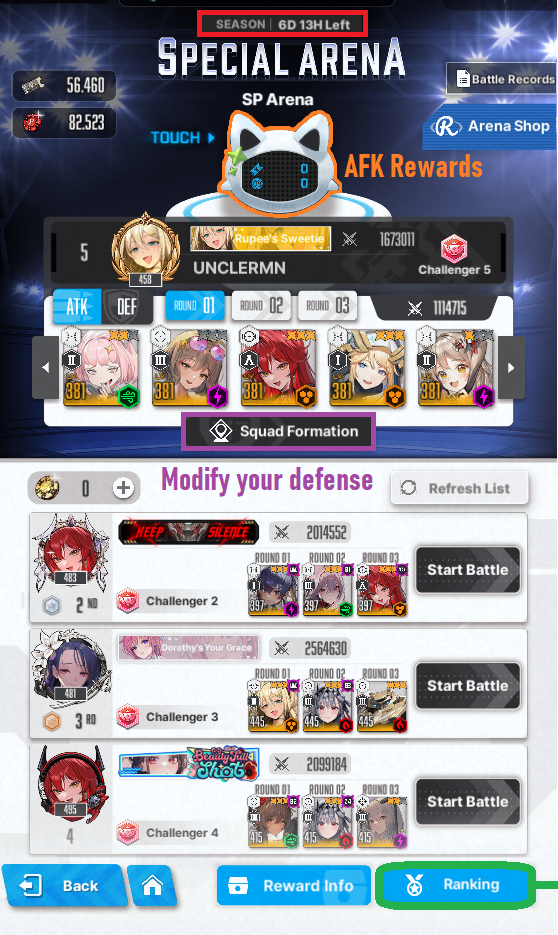

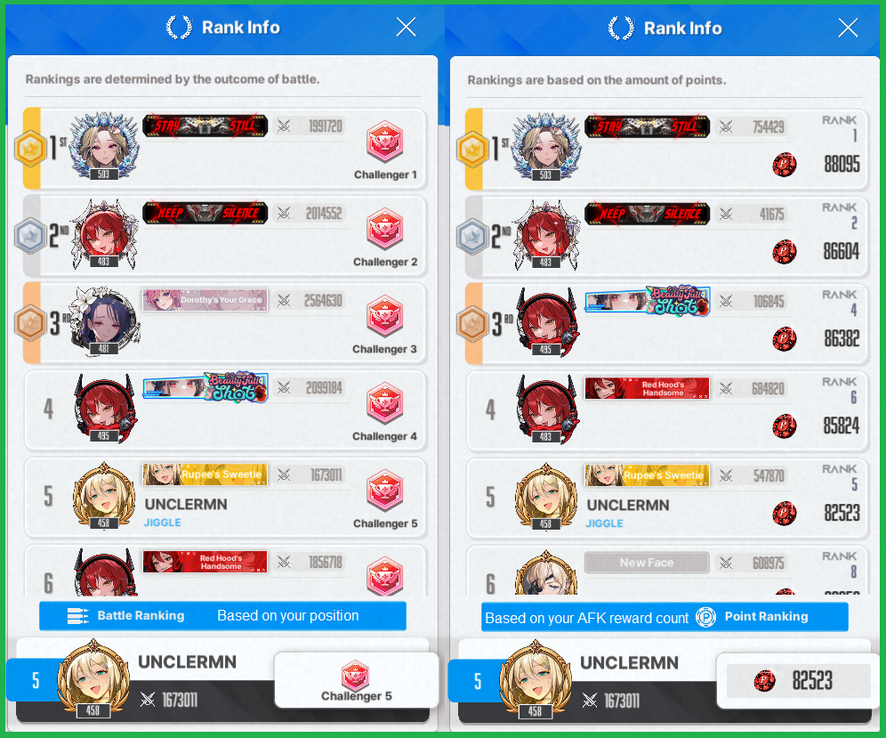

### Champion Arena
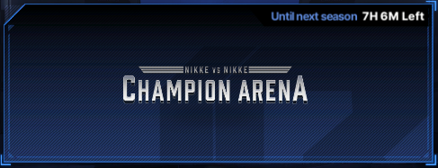

This Arena is very difficult to enter. It is a Whale Showdown. Every 2 weeks, only the top 4 challengers in SP arena qualify. It has 3 phases, leagues (group) -> Promotion Tournament (top 64 to 16) -> Champion's Duel (top 8 to Champion)  
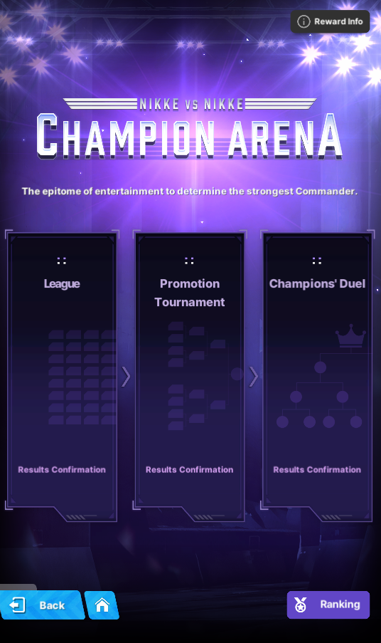

This mode is in BETA! season for almost 5 months. The guide for this is: Copy the previous champion lineup and tweak it to fit with your investments. But unless you are a full c7 account, chances are, you will lose somewhere along the way to simply investment diff, rng, bugs, bad matchups. If you win, congratz! **You win a frame**. Yeah, that's it.  

For everyone that didn't qualify (the vast majority) you can "cheer" on who do you think will win in prederminated matchups the game will pick for you. If you succeed on your cheer, you win an amazing 6x 1h credits boxes. If you lose, you get nothing. **If you lose, or win all cheers in a single season, you will get a frame, one for losing all, one for winning all.**  

This mode is probably one of the worst additions to the game, ever.  

## **Simulation Room**

[Prydwen](https://www.prydwen.gg/nikke/guides/game-modes-simulation) and [NIKKEgg](https://nikke.gg/simulation-room/) guides

This is where you will get skill upgrade materials. Each difficulty comes with **recommended combat power**, that is more or less the CP you need to **quick battle**. You can only quick battle if your squad CP is above the requirement, and the stage is not "hard" or "hard" Boss stage.  

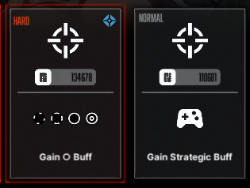 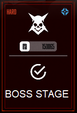

**Difficulty 2 unlocks after campaign Stage 5-1, gives Skill manuals 1 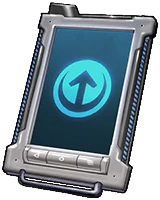{ width="25" } and Burst manuals 1 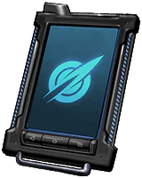{ width="25" }**  
**Difficulty 3 unlocks at chapter 8-6, Difficulty 4 unlocks at chapter 11-7, both give Skill manuals 2 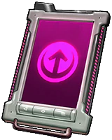{ width="25" } and Burst manuals 2 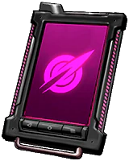{ width="25" }**  
**Difficulty 5 unlocks after campaign Stage 14-3, gives you Skill manuals 3 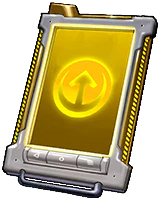{ width="25" } and Burst manuals 3 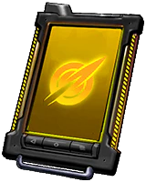{ width="25" }**

**1-A is really easy.**  
**5-C can be cleared at the 160 wall and 3 to 5 good legacy buffs.**  

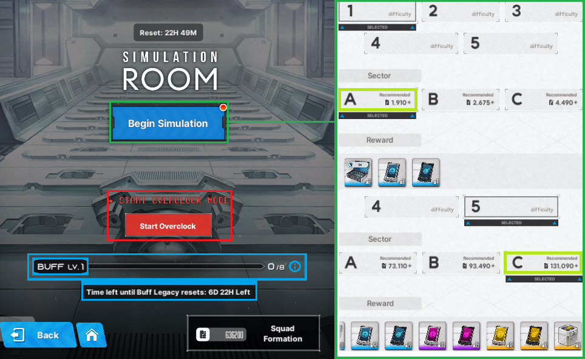

**BUFF Levels and legacy buffs nodes**  
**Pick buffs based on this chart, top to bottom in priority**  

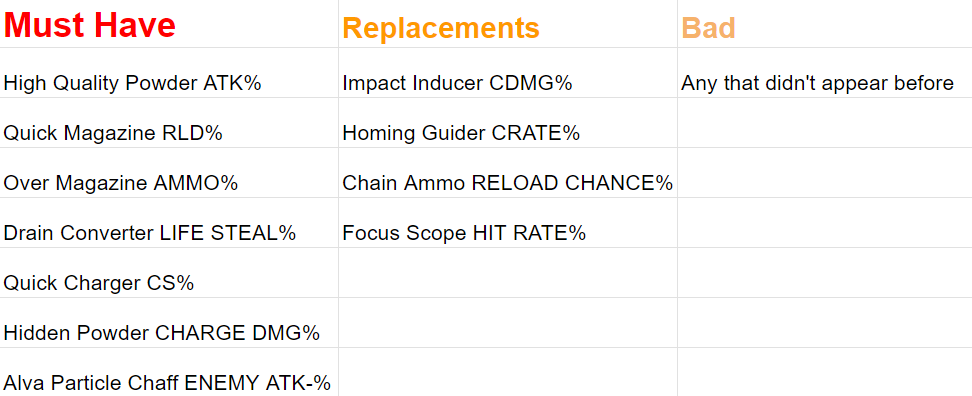

**Even if they are not the same node type (triangle, square, circle or lozenge) chances are, Super Spec up appearance is pretty high.**

### **Simulation Room Overclock**

[NIKKEgg](https://nikke.gg/simulation-room-overlock-overview-and-guide/) guide

Overclock is seasonal content, that resets every 2 weeks, and last for aproximately 3 months per cycle. In short, it is a more difficult simulation room. 

**It will be permanently available once you clear simulation room 5-C.**

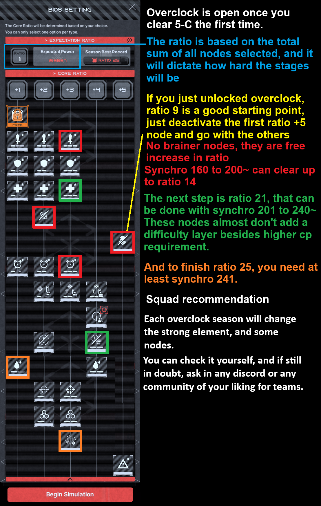

Here, you can choose nodes that will modify how the enemies and the stage behave. Each node increase the core ratio from 1 to 5 each, up to 50 with all selected. When you finish ratio 50 for the first time in the current cycle you are, you will unlock infinite ratio, that if you complete, you gain a title.

However, all skill books are granted when you clear ratio 25. Ratio 25 can be cleared with synchro 241+ and 8/8 legacy buffs that you can acquire through simulation room runs, piece of cake.

### **Overclock Ratio 50 and how to unlock infinite mode**

Overclock ratio 50 can be done when you pick all nodes at max level. The lower nodes change from cycle to cycle, and also what strong element it is. To unlock infinite mode for that cycle, you need to clear ratio 50, not an easy task, but manageable.
Infinite however, adds even more to the challenge. It will lock certain nikkes out and force you to use only strong element nikkes to clear it. This is it will look when infinite is available:

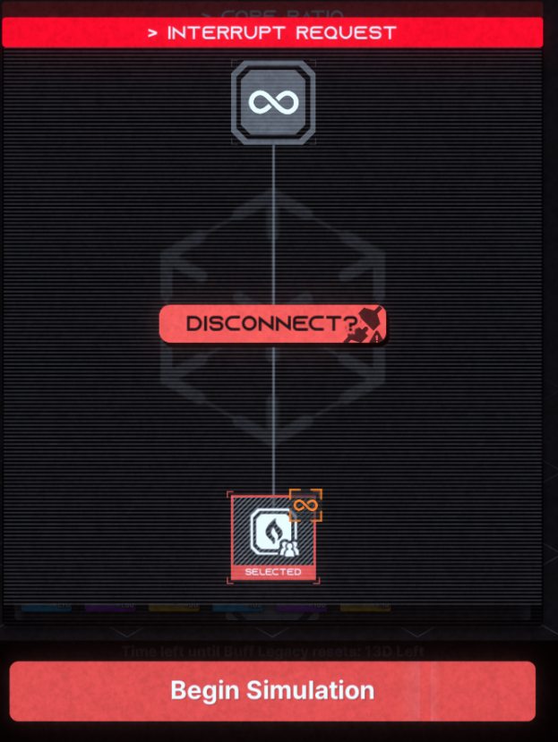

## **Interception up until late game**

**Fight bosses daily for gear and upgrade materials. With the addition of temporary participation NIKKEs, Interception level D and Level S will not probably not be fought more than 10 times, as you will unlock Interception EX(SI) too quickly.** 

### **Interception level D Alteisen**

**interception level D boss, Alteisen or Train** is the first boss you will have to face in interception. It is a pretty simple boss, destroying the parts and cover. You will probably only do this boss twice or thrice.

### **Interception level S Gravedigger** 

9-15 unlocks level interception level S  

### **Interception EX or Special Interception (SI)**

**Bosses rotates in this order:** **Alteisen MkVI { width="25" } ➡ Grave Digger { width="25" } ➡ Blacksmith { width="25" } ➡ Chatterbox { width="25" } ➡ Modernia { width="25" } ➡ Repeat**

**Each with the color of their respective weak element code. Videos for each boss have yet to be made, stay tuned!**  
**All of them drop manufacturer arms { width="25" } or gear "pity" box.**  
**Drops are the same to all bosses, rewards only differ based on the stage cleared.**  
**Stage 1 to 4: Gear up to Tier 8**   
**Stage 5 to 6: Tier Gear up to Tier 9**  
**Stage 7 to 9: Tier 9 \+ chance of Tier 9 Manufacturer**  
**Stage 9 also has a chance to drop custom modules { width="25" }**

**Until you clear chapter 22-36 the [Anomaly Interception](../progression/lategame.md#anomaly-interception-ai) will be locked, however, you have officially graduated from the early game!**

### **Solo Raid Museum**  
Previous Solo Raids, now with buffs and better rewards! The bosses are:  
- Mother Whale { width="25" }  
- Blacksmith { width="25" }  
- Ultra { width="25" }  

But differently from the usual Solo Raid, we have 2 twists. Permanent boss buffs, **Weekly buffs and "No Limit Mode".** Permanent buffs are tied to each boss. When attacking Mother Whale, your teams will receive 15% distributed damage, Blacksmith 30% core damage, Ultra 15% pierce damage. Weekly buffs change, you guessed it, on a weekly basis for one of the 3 bosses, increasing your chances of doing more damage and reaching higher phases.  

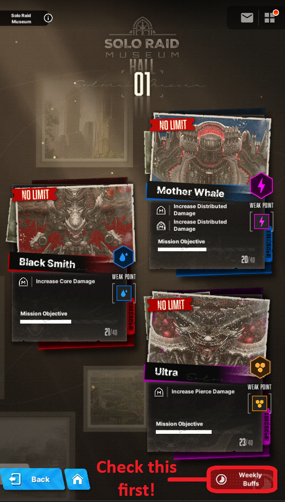  

But there is a little problem... You need to beat the real top 1 score to unlock the No Limit mode. Well not that big of a problem, since Mother Whale and Blacksmith were the very first and second Solo Raid ever, means only your first team should suffice to beat it. As for Ultra, the top 1 score should be above 10 billion, which might prove to be difficult if you are still not in the late game.

What teams you should use? Well that depends a LOT on who you have, and which weekly buffs is running. Ask in any discord you may like for advice.
