# **Game contents and guides**

All contents available in NIKKE will be covered from this point on. You can browse all by the simplified table of contents below.

* [Main Screen](#the-main-screen)
* [Event Guide](#events)
* [Shop Guides](#shopping-guides)
* [The Outpost](#outpost)
* [Leveling NIKKEs](#leveling-nikkes)
* [Gear and Collection Items](#gears-and-collection-items)
* [Inventory, hoarding 101](#inventory-hoarding-101)
* [The ARK](#the-ark)
* [Lost Sector](#lost-sector)
* [Tribe Towers](#towers)
* [PVP](#pvp-arenas)
* [Simulation Room](#simulation-room)
* [Interception](#interception-up-until-late-game)
* [Raids](raids.md#raids)
* [Hard Stages](endgame.md#hard-stages-to-the-moon)

## **The Main Screen**

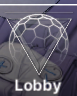

Or also known as the **main lobby**. All menus, events, and sub menus you can access from the main screen are listed below, with their respective guides or quick explanation.

### **Day by Day**

This is the new player event which is pretty common in all gacha games, complete missions for the day, and receive rewards. Once you finish all you receive a **SSR NIKKE, Privaty**. 

### **Alice Diary**

Alice diary is a limited event that rewards you with **Alice** when you clear chapter 11, and lots more rewards as the days go on.   
**It is a time limited event and unfortunately, ends on november 31, 2024\.**

### **BlaBla menu**

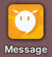

In the main screen, upper left, you will see the icon above. That’s your BlaBla menu, where you can find **field missions requests.** They reward you with gems, but even if the enemies appear in the map, clearing them **won’t count for your outpost level.**

**Another feature is to chat with your NIKKES!**

### **Arcade**

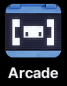

Updated mini game menu! You can play M.O.G. (Memory of Goddess), For the King, Gift Factory and BBQ Master! All buttons are interactive.

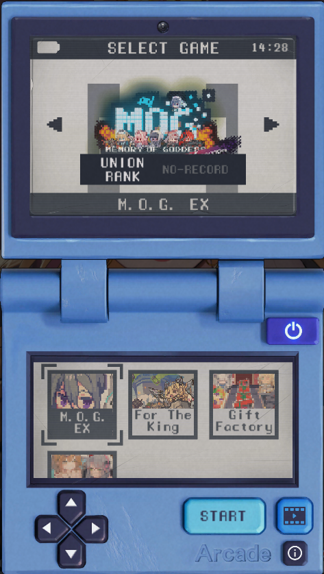

### **Friends and Union**

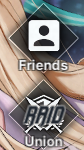

**Friends** is where you can add… friends! Add up to 30, exchange social points  daily. Use social points to pull in the social point recruit banner. Reminder that the social point banner does not have pilgrims on it.

**Union** is a type of guild in NIKKE. I advise you to join one as soon as you unlock it.

Joining an active union is really important, since every month there is a [**Union Raid(UR)**](raids.md#union-raid) that rewards union coins, the currency used to buy [**cube upgrade materials**](#harmony-cubes)

## **Events**

If there is an event ongoing, it will always appear below the Campaign button.

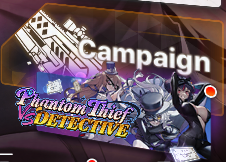

**Event is a limited time story featuring the NIKKE of the current banner.** There are 3 types of events, and you can differentiate them by length:

**Regular/Filler events last for 14 days, and do not feature a special skin pass or map.**  
**Special events last for 21 days, feature a special skin pass, sometimes feature a gacha skin, mini game(s) and a map.**  
**Collab events last for 28 days, feature a special skin, always feature a gacha skin, mini game(s) and a map.**

**Regardless of what length the event is, all events have:**

**5 event stage entries, that refresh daily**  
**Boss challenge, one entry per day. Pretty simple: You fight a boss in different difficulties, and receive rewards. Borrowed NIKKEs can be used here with no restrictions.**  
**Mission tab, missions completion tied to event stages clears. Rewards include: Event lobby, a battery used in the event archive, and event currency.**  
**Shop, with really good goodies**  
**Record repository, to replay the event story and/or cutscenes**   
**Reward boost. When using NIKKEs that have the reward boost, you can win up to 100% increased event currency when clearing an event stage.**

**Example of a 14 days event UI**

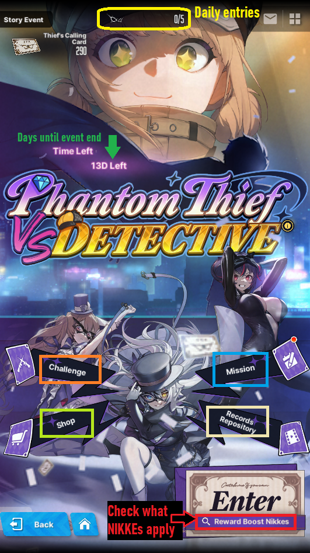

**The maximum reward boost chance you can get is 100%, minimum is 60% if you only own SR NIKKEs.**   
**That means, when you clear a stage, you have at least 60% to a 100% chance of receiving double the amount of event currency. The bonus doesn't apply to cases or first time rewards.**

Just like the campaign, the events are also divided in **Normal and Hard stages.** Total of 12 stages per difficulty.   
**Clear all stages, and after that you will quick battle the stage 1-11, 2-11, or H2-11, depending on the highest hard difficulty available.**   
**Stage x-11 gives the most core boxes,** while the other repeatable stages give less core boxes, credit or battle data.  

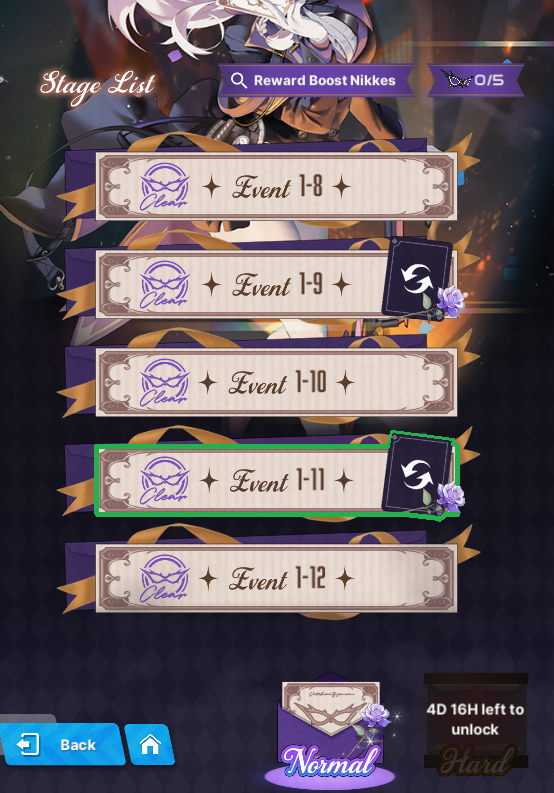

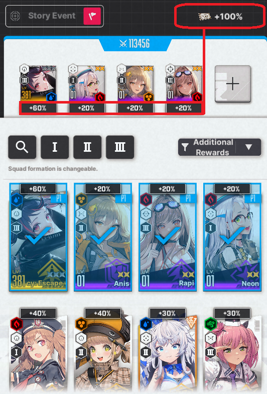

### **Event shop**

**First and foremost, don’t buy entries for gems until the highest difficulty is available, you will notice that there will be more entries available for purchase. Only then, buy all entries, and use them on the highest x-11 stage, that rewards 4  core dust crates per clear.**

**You will always be able to buy all the goodies in the shop after you use the extra entries bought with gems, so don’t worry and buy everything in blue.**

**With the addition of Exchange Shop, Battle Data Sets and RE-Energy are a must buy. You can trade Battle data for dust cores and RE-Energy for random consoles**

**x30 core dust is what you will buy after everything is sold out**

**On the last day, after you bought core dust and still have event currency, you can buy the 2.000 credits. Even if you don’t, after the event’s end the currency is converted into credits and sent to your mail.**

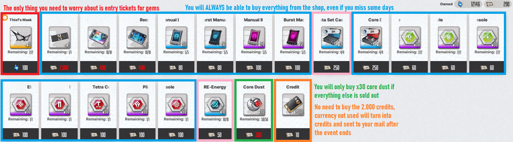

## **Shopping guides**

Check out [NIKKEGG shop guide](https://nikke.gg/shop-guide/), and [Prydwen spender guide](https://www.prydwen.gg/nikke/guides/spender-guide)

**Cash shop** is the place where you can **spend real money.**   

**What are the best deals?**

**Supply Packs**  
The best deal, for any player, is the **30 day upgrade supply pack, costing $14.99**. It’s the best value for resources in the game.  
The **$4.99 supply pack** is also a good addition if you can buy it.

**Before opening your supply chest**, I advise you to just stack them in your inventory for as long as you can. The best choice is to pick either skill 3 book (middle right) or burst 3 (bottom right) to upgrade NIKKEs skill levels. Sometimes burst 1 (bottom left) is also a good choice if you already have 300+ burst 3 books.  
*Note that this pack is just for game progression, if you want cosmetic goodies, you will want to buy the next pack*  
 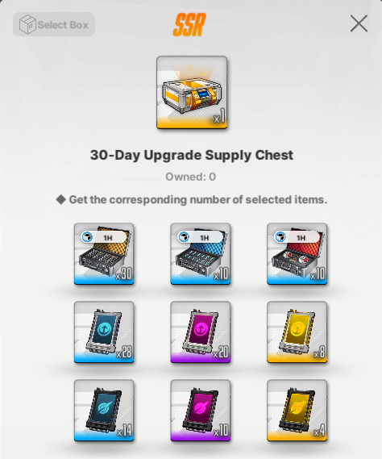

**Seasonal and Special Skin Pass**

Normal events do not have special skin passes with them, however bigger events that last at least 3 weeks always have a **Special Skin Pass**. 

If there is one available, **buy the event special pass over the normal pass**, since they give **Rainbow Vouchers** instead of **Standard Vouchers.** Buying both is nice, but keep your IRL savings in check, they cost **$19.99 each.**   

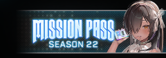

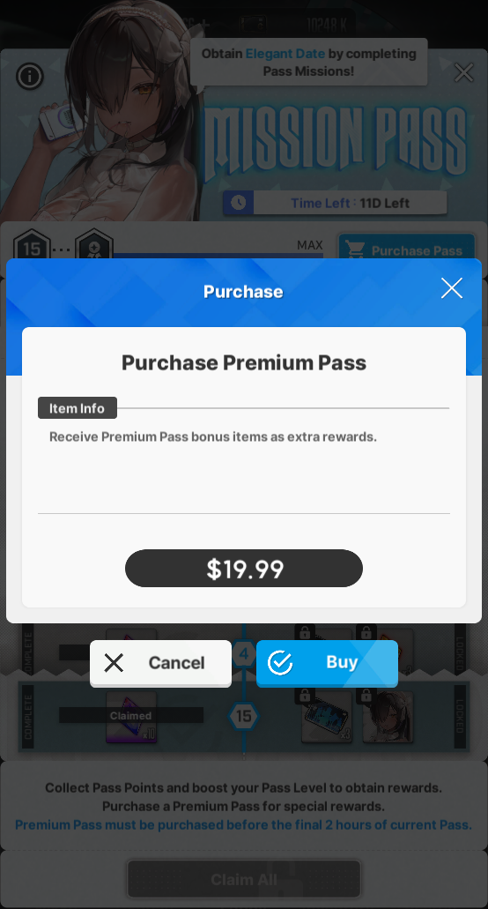

**Shop**  
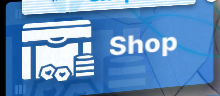

**General Shop**   
**Buy the free goodie, and dust core boxes  sold for CREDITS**

The profile custom pack x5 is not that good value, but ask your credit’s balance: Style points? Style points!

**Resets daily**  
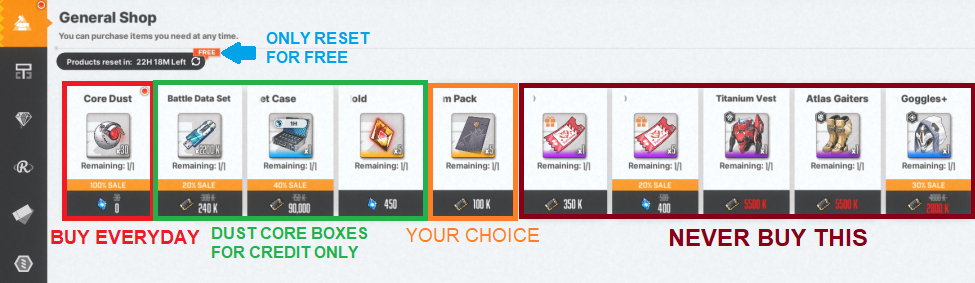

**Union Shop** 

Here you use Union Chips . You get this currency from the [Union Raid](raids.md#union-raid). You can buy duplicates of the [Liberation NIKKEs](#elevator-liberation), but what you should really buy are **cube materials**. 

**Check the [cube guide](#harmony-cubes) for upgrade priority.**

**Resets daily**

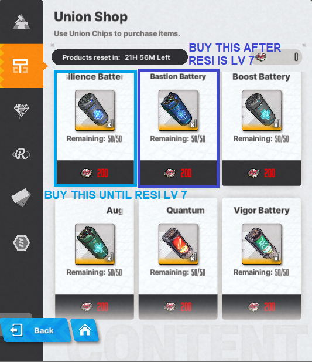

**Body Label Shop **  
This is the SSR mold shop for almost every player.

**Resets daily**  
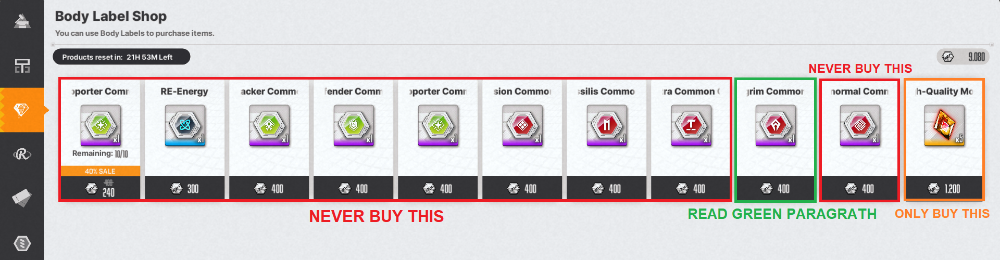
**The only reason why pilgrim consoles could be worth buying would be that you already have all useful units core \+7, and molds are useless to you. If you don’t have all NIKKEs, buy MOLDS!**

**Arena Shop **  
Use arena exchange vouchers, from the [Rookie Arena](#rookie-arena) and [SP arena](#sp-arena) here. 

**Resets daily**  
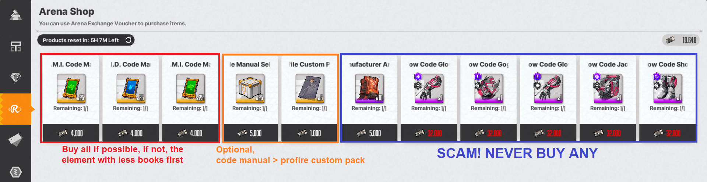

**Mileage Shop  **  
The “Pity” shop. 

**Resets daily**  
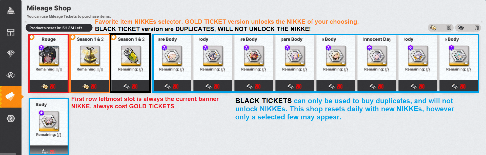

**Recycling Shop **  
Once you do [COOP](raids.md#coop), you will receive **broken cores**, the currency used here. 

**Resets weekly**  
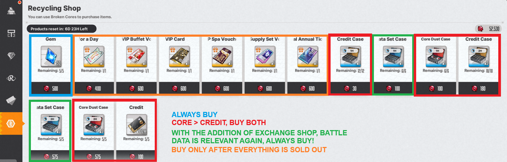

**Exchange Shop**

**New shop introduced after Cinderella Patch.**

**Unlocked with the completion of Chapter 21**

**You can trade 3550k Battle Data Sets  for 100 Core Dust  and 30 RE-Energy for a Random Console Pack that rewards any type of console.**  
**Always trade Battle Data Sets for core dust, but not all, save some Battle Data to level afterwards.**

**RE-Energy is random, but for sure worth it, however only exchange if you reached the [General research](#recycling-room) cap, and have spare RE-Energy. After you do this once, wait until you reach the next synchro bracket and General research cap to exchange again.**

**Battle Data for Credits is not worth it.**

**Does not reset**

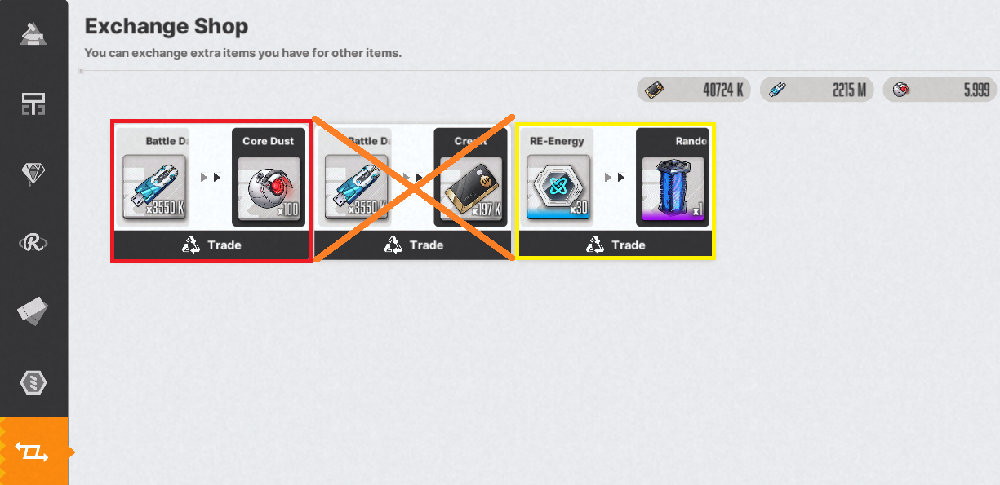

# **Outpost**

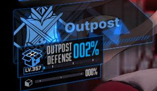

Your own city! Kinda of… This is where you will find most of the content that does not require you to fight. Let’s dive into it.

## **Outpost Defense / AFK rewards**

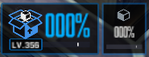

**This is what will make you push the story like a maniac. *Or is it because of the lore? Who knows!*** 

 

## **The Command Center**

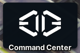

This is the place where you will find stuff related to social interactions, music… and a **steady income of gems!**  

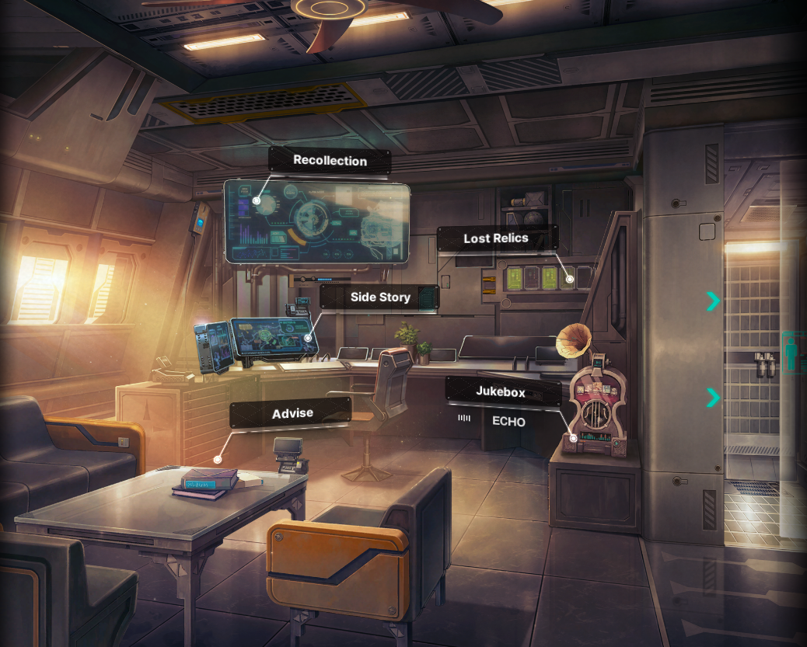 

**Recollection** is the menu where you can access and re-watch all the **story cutscenes** you have unlocked, brief encounters, that are the little stories you can see by interacting with the buildings you have constructed, as well as the:  
**Event Archive:** where you can replay old events, which require you to spend a memory film  - you receive one memory film from each new event you clear all missions - and collect some of the rewards, such as the **event music** and the **event special lobby**. You can also explore the event map and play minigames!

**Lost Relics** is where you can view the things you’ve collected from the story maps, once you collect a few of them, you will get gems as a reward. There is also a couple of lore inside each of the relics you grab, so if you like the story so far, be sure to read them!

**Side Story** is the menu of… side stories. At the moment of the making of this guide, there are two available , and the first time you complete them, you get a nice frame and a couple of gems  too.

**Jukebox** is where you can browse the game music collection, make your own ingame playlist! Collecting enough discs in a specific group will also reward you with gems.

**Advise** is where you will bond with your owned nikkes. You can daily advise the Nikkes of your choosing and increase your affection with them. You can also gift Nikkes with presents, increasing their affection more quickly.   
Each level will increase their stats by a tiny bit, and at bond levels 1, 3, 5, 7, and 10 you unlock a special bond story with them! They will also reward you with 50 gems per story you unlock, per nikke! 

The max level of bonding is tied to the numbers of duplicates. Acronym in **bold.**  
Limit break level 0, **LB0,** affection max level= **10**  
Limit break level 1, **LB1,** affection max level= **20**  
Limit break level 2, **LB2,** affection max level= **30**. This is the max level of **non-pilgrim** NIKKEs.  
**Pilgrims only,** max limit break, **MLB**, affection max level= **40**.

**Aside from stat gain, bonding with Nikkes past level 10 won’t reward you with gems or bond stories.**

## **Tactics Academy**

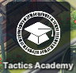

This is the content you **NEED** to upgrade **ASAP**. **This takes priority over everything, even above NIKKEs levels.**  
Each class will cost credits, and you unlock really good stuff, such as:   
**Building slots, outpost defense income increase, synchro device slots, increased rewards from interception, and more importantly, upgrade your bulletin board (dispatch) to include [doll materials and favorite item](#collection-and-favorite-items) special dispatch missions.**  

All tactics academy classes **have a credit cost** and **additional requirement** to be unlocked, this is the list for them  
**Class A-1:** no requirement  
**Class B-2:** Train station, **chapter 3**  
**Class C-3:** Generator, **chapter 4**  
**Class D-4:** Hospital, **chapter 5**  
**Class E-5:** Seed Club, **chapter 6**  
**Class F-6:** Church, **chapter 7**  
**Class G-7:** Shopping mall, **chapter 8**  
**Class H-8:** Goddess of Victory statue, **chapter 9**  
**Class I-9:** Fitness Club, **chapter 10**  
**Class J-10: 11-27 BOSS**  
**Class K-11:** Lesson 1 **13-1** , Lesson 2 **13-24 BOSS** , Lesson 3 **14-30 BOSS**  
**Class L-12:** Lesson 1 **15-15** , Lesson 2 **16-7**   
**Class M-13:** Lesson 1 **17-12** , Lesson 2 **17-33 BOSS** , Lesson 3 **18-33 BOSS**  
Class M is the last one. **Congratulations, you’re done with tactics academy!**

## **Synchro Device**

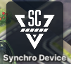

The synchro device is available when you clear 4-15, but you will only need it when you unlock the manufacturer towers in 7-13.  
**Do not buy slots with gems**, the tactics academy will give you enough.

Now, once you access the towers, you can do a little trick until you pass all tactics academy lessons. 

## **Recycling Room**

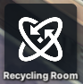 

Time gated content. You receive console coins from events and/or AFK rewards.  
Increase certain NIKKEs stats based on the console upgrade level and type. You can buy consoles from the [body label shop](#shopping-guides).  
Don’t be fooled though, the increase is negligible.  

**General research RE-Energy**  come from the outpost defense AFK rewards and event shops. **Increase all your NIKKEs base health points.**

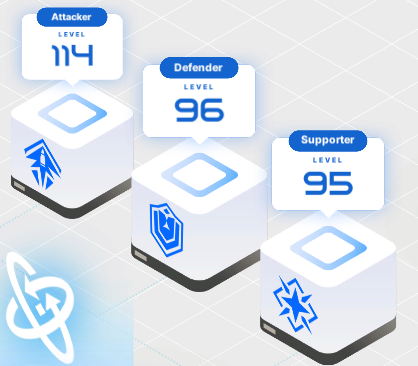

**Attacker/Defender/Supporter Research consoles    are obtained from events. They increase the respective class NIKKE's base health and defense points.**

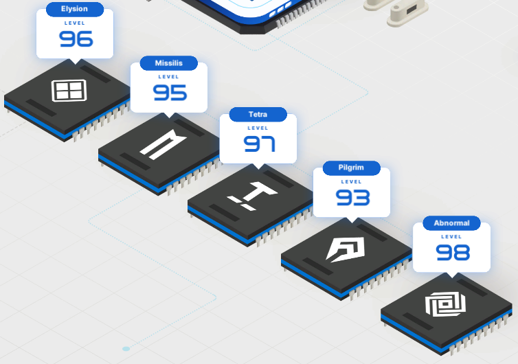

**Manufacturer Research** consoles      are obtained from events. **They increase the respectives manufacturer's NIKKE base Attack and Defense.**

## **Infrastructure Core**

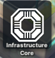

This is a forgotten feature of NIKKE. You unlock new things such as more arena entries, dispatch list cap, advice chances, auto dispatch, stamina \+3 (Used on brief encounters in the **Outpost**. You can check on the top left of your screen for this.

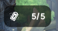

Each battery = 1 Stamina

**The only thing you need to remember from here is the free daily shop reset,** but after an update they made the reset button glow when you can reset it for free, you probably won’t miss it.  
Again, sadly it's a forgotten feature. Unlock the free daily shop reset and you can also forget about this.

## **Elevator / Liberation** 

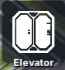

More free SSR NIKKES! But they are not that strong 😢 *peak designs wasted!*  
The NIKKEs available in the **Rehab Center** are **Guilty,** **Sin** and **Quency.** It takes **exactly 60 days** to “liberate” the NIKKE of your choosing.  
**Pick based on looks!**  
Or if you want the “*stronger*”  
**Guilty** **\>** **Quency** **\>** **Sin**  

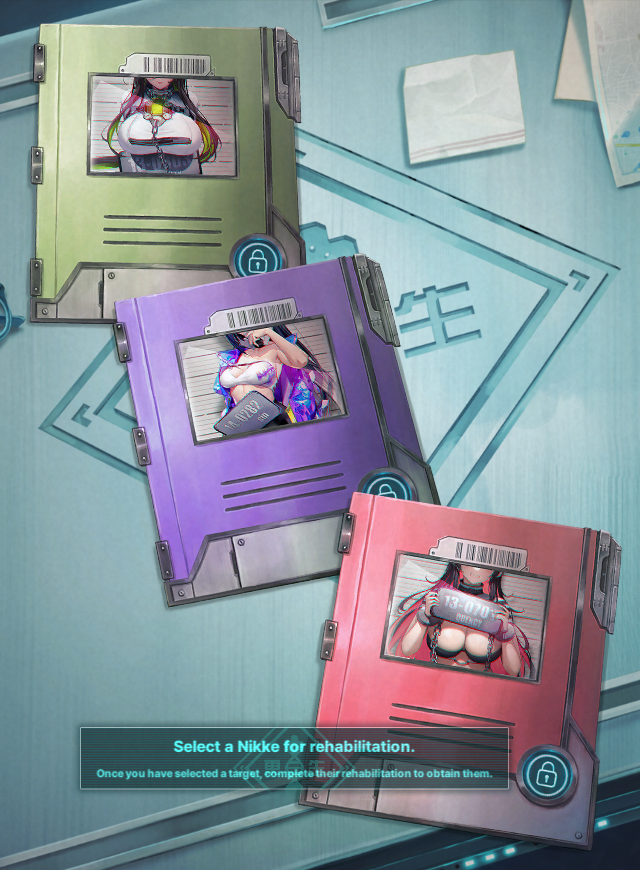

After you clear chapter 20-31 BOSS stage, a new liberation target, **Nihilister** \-*Dragon mommy to some*\- will be available. **She won’t appear in the Rehab Center, unlike the other 3**.

The GIF below shows how to access the “Upper World”.  

## **Bulletin Board / Dispatch**

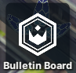

Dispatch missions, send your NIKKEs on a daily basis to earn rewards. Couldn’t be more simple right?  
Well, It was until the addition of the collection items. *And of course RNG based!* 🎉*Thanks devs!*

I hate this gem hellhole, so follow the dispatch guides of [Prydwen](https://www.prydwen.gg/nikke/guides/collection-dispatch) or [NIKKEGG](https://nikke.gg/collection-item-guide-and-overview/#Where_to_get_Collection_Items) until someone makes a guide for this here.

# **Your NIKKEs**

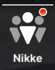

This is the menu in which you can check what NIKKEs you have, also known as the **NIKKE box.**  
The option to filter is really complete, be it by **manufacturer, class, elemental code, weapon type, combat power(CP)… Use the filter to find the NIKKE you want more easily.**  
**Check the image below, use the glossary to find stuff:**  
**Visualiser, Dolls, Bond level, Recycling Room consoles, equip and upgrade gears, increase skill levels, equip cubes.**  

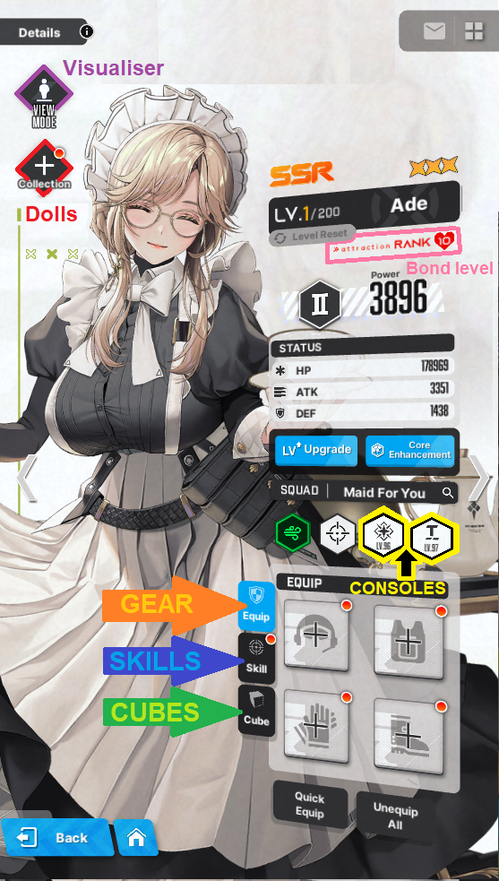

**Visualiser,** one of the best features in the game**,** where you interact with your NIKKE! See if she has **skins, replay her voice lines, check how her shooting position looks in the shooting range,** and my personal favorite**, interactive CHIBI Models!**  

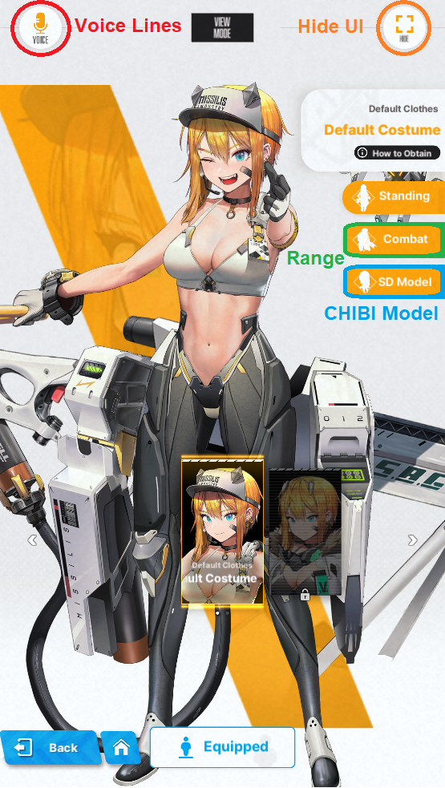

**Also, something important you will use pretty often, are the acronyms for limit break, this is the list for them:**  
**LB0 \= limit break level 0**  
**LB1 \= limit break level 1**  
**LB2 \= limit break level 2**  
**MLB \= max limit break.**  
**CORE \+ \= core enhancement level**  

    

## **Leveling NIKKEs**

The most straightforward way to increase your squad CP is to upgrade your NIKKEs level.   
**Each level costs Credits  and  Battle Data Sets . Level 10 and each level bracket after will cost Core Dust **

**What is a level bracket?** It’s a major combat power breakpoint per 20+1 levels upgraded, eg:  
**21 ➡ ️ 41 ➡ ️ 61 ➡ ️ 81…221 ➡ ️ 241 and goes on infinitely.**  
To keep track of your leveling expenses and plan for the future, use the **progression sheet from [useful links](readme.md#useful-links), it is updated regularly!**

That said, leveling is pretty simple, you get the resources and use them. Well, at least until the bane of all new players… the infamous 160 wall.

## **160 Wall**

**This is the most hated “feature” in the game. Not only is time gated, it’s also… RNG gated!**  
Simply put, you cannot level NIKKEs past the level 160\.  
**Does that mean 160 is the cap?**  
**SR (purple rarity NIKKES) can’t go past level 160, however, SSR (Orange rarity NIKKEs) can be leveled further, only if they are Max Limit Break (or MLB).**

Once you have **a total of 5 MLB NIKKEs level 200**, go to your synchro device and proceed with the tutorial.   
**After you’re done, congratulations! You’re past the 160 wall!**

## **Level 200 and beyond**

The 5 MLB NIKKEs get permanently locked to your top row in the synchro device, and leveling further becomes only possible through your synchro device. You shouldn’t individually level NIKKEs anymore, and put all of them into the synchro device.  

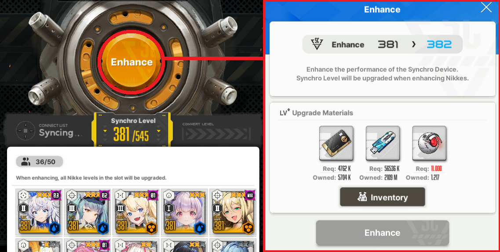

### **Credits issue**

**Now I need to talk about the 301+ synchro, an almost permanent Credits issue.** This is related to the fact that credit cost to level up ramps up way too much compared to daily income of credits. 

**You can just solve that with boxes… right?** Let’s take a quick dive into math now.  
The calculus goes like this: You are **synchro 305\~**, chapter 32 all done, middle of hard 16, **outpost level 293**.   
Your daily income, 23\~ hours of afk rewards, is **1.026k\~ credits**. The credits cost to level up to 306 is **3.809k**.   
And so, without opening boxes, not factoring in events/dailies or any other credit income, you need to wait **90 hours, or use 90  1 hour credit case, per level.**  
**The thing is, that wouldn’t be so bad if you did not need to spend credits on gear.**   
**The solution?** At the moment, there isn’t one. Some that are not definitive: Neglect upgrading gears, get more credit boxes with real money… this one really sucks. Have you found a solution? Let us know in our Discord!

**This problem goes away on synchro 381+, when you have built most NIKKEs and do not need to level gear as often as before.**

### **And yet, another core bracket! Apply to 350 and above**

Synchro level 350 and above starts to increase **core** cost per 50 levels. Each upgrade costs 11.000 from 350 onwards until 400, that increases the cost by 1.000 cores once more.  
**synchro 350 to 351: 11.000  ➡ synchro 400 to 401: 12.000  and so on.** 

## **Gears and Collection items**

Two types of equipment you can give to your NIKKEs, heavily RNG based.   
You obtain random **Gear** from **Interception**, **story rewards** and **missions**. **Alice Diary** rewards you with some gear too.  
**Collection items** come from [**Dispatch**](#bulletin-board-dispatch) and [**Solo Raid**](raids.md#solo-raid). **Alice Diary** also rewards you with Doll materials and a **SR Sniper Doll!**

### **Gear tiers and overload system**

Up until gear tier 9 and “10”, there isn’t much to say, so let’s keep it short.   
You can check the gear tier and class by color and by the top left icon respectively.   
**Gears with tier 4 or higher** might come with **manufacturer bonus**, represented as the  icon on the top left of the gear piece.   
You can check your **NIKKE manufacturer** on the Console icons, if you forgot where that is, they are above your chest gear slot in your NIKKE tab:  

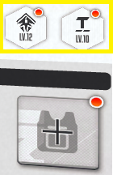
 
**If equipped by a NIKKE of the respective manufacturer, the gear base stats increase by approximately 25%.**

**Gears tiers and maximum level of enhancement:**

 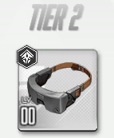**Gear of this tier cannot be upgraded**  

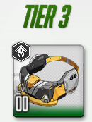 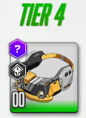Maximum enhancement level of 3, however it is not worth to upgrade any piece**  

 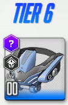Maximum enhancement level of 4, it is only worth to upgrade the helmet piece to level 2**  

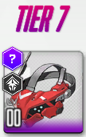 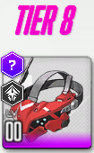Maximum enhancement level of 5, it is only worth to upgrade the helmet piece to level 3**  

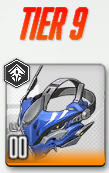 Tier 9 can also go up to level 5**, upgrading the helmet and gloves to 4 is okay, chest to lv 3 only if needed.**  

**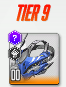 Manufacturer bonus tier 9 is quite different from the other tiers. Commonly known as T9M, short for tier 9 manufacturer gear, the acquisition of this gear is tied to [Interception EX (SI)](#interception-ex-or-special-interception-si), and certain bosses of the [Anomaly Interception (AI)](lategame.md#anomaly-interception-ai)**

**There are two ways to obtain T9M:**  
1. **Gear pity boxes  that drop since the first stage of Interception EX to the highest stage of Anomaly Interception. Collect 200 pity boxes and open it to obtain a single random T9M gear.**

2. **Raw gear drop:**  
**Any Interception EX boss cleared to at least stage 7** has a chance to give you a t9m gear. The chance is very slim, and increases a little on stage 8 and stage 9.  
**Anomaly Interception has 5 different bosses, each giving different gear pieces.**  
**AI boss, Kraken, is the only one that does not give any type of t9m gear**, and gives **custom modules** instead.

#### **Overload system, tier 10**

**To unlock the “tier 10” gear, you need a t9m gear, level 5, equipped by a NIKKE that activates the manufacturer bonus and a custom module (aka rock).**   
Keep in mind, the credit cost per piece of **tier 9** gear, from lv 0 to 5 is **1.592k**, and **6.368k** for **all 4 pieces, or to say, per NIKKE**.   
**Tier 10** credit cost per piece, from lv 0 to 5, is **2388k** and **9552k** total.  

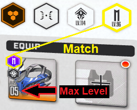

If everything is right, when you select the gear this  should appear.  
When you get to this point, you will need **a Custom Module ** obtained in Interception EX (**SI) stage 9**, and any **AI stage**.  
I won’t make an Overload in depth guide, as others already made them, and **compiled the recommended stats for each character**. Read all of them if possible.  
**NIKKEgg OL guides**: [**Overload Equipment**](https://nikke.gg/overload-equipment/)  [**Overload Priority**](https://nikke.gg/overload-gear-priority/)  
**Prydwen OL guides**: [**Overloading Intro**](https://www.prydwen.gg/nikke/guides/overload-gear-intro/)  [**Rerolling Overload**](https://www.prydwen.gg/nikke/guides/overload-gear-reroll)  [**Overload Recommendations**](https://www.prydwen.gg/nikke/guides/overload-gear-recommendations/) 

### **Collection and Favorite items**

#### Collection / Dolls

The **collection item system**, also referred to as the **Doll system, is a** **RNG fiesta**.   
**You can check [Prydwen](https://www.prydwen.gg/nikke/guides/collection-intro) and [NIKKEgg](https://nikke.gg/collection-item-guide-and-overview/) guides, both** *should* **be up to date.**  

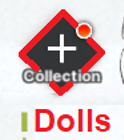

**How do you acquire Dolls and Maintenance Kits?**   
**Collection items / Dolls** come as a drop from [**Solo Raid**](#solo-raid), and from the **doll “pity” box** of sorts. You get the box from **special dispatch**. 

**Maintenance Kits**, used to upgrade **Dolls**, also come from **Solo Raid** and **Special Dispatch**.   
**Overall, I advise to only equip R Dolls and upgrade them to phase 15 with only blue maintenance kits, then changing to a SR Doll.**

**Beginner Maintenance Kit  until R15 ➡ change Doll (SR5) ➡  Intermediate Maintenance Kit  until SR10 ➡  Elite Maintenance Kit  to SR15 (max level).**

#### **Favorite Items**

Certain NIKKEs have a favorite item, or a possible upgrade after the **SR15 doll**. You will select one target to search for their favorite item on the dispatch system.   
**However! You need to have the favorite item target at Limit Break 2 and affection level 30 to upgrade the SR15 doll into the favorite item. If the conditions are not met, you will not be able to upgrade it, even if you have the maintenance materials.**

When the conditions are met, **you can instantly upgrade the SR15 doll** into the favorite item **phase 1**, but to upgrade to **phase 2**, you need **50** maintenance materials, and lastly to **phase 3, 110** maintenance materials**, total of 160\.**

**Currently, there are 5 favorite items targets, from top to bottom, ranked by usefulness:**   

 

**Exia is the best favorite item unit so far. After you are done with most of the priority targets for SR15 dolls, she is the get to go for Raids.**  

 

**Viper might be short lived in the meta. She is water, an element that greatly lacks DPS. She will go down the priority if good water NIKKEs are released, but at this moment, she has uses in Raids that are water weak. If you can spare the resources to build her go for it, if not skip.**  

 

**Laplace is actually okay, no Raid usage, but on missilis tower she is a good choice. Pick based on her appearance, if not skip!**  

 

**Frima also needs time to become useful. She buffs true damage, but we still don’t have “true” true damage dealers yet. She does not have any usage at this moment.**  

 

**Diesel if you want to push Elysion tower, you can invest her favorite item unit, as she never dies when full burst. She can be useful against certain bosses that need taunt such as Mother Whale.**

# **Inventory, hoarding 101**

**Rule of thumb for all players at any point in time: Always pick Core Dust  over Credits  or Battle Data Sets **

**For skill manuals, pick the one you miss the most, but never skill 2  or burst 2  as you get a lot of them from event shops, you will have thousands of them in no time.**  
**Most of the time, you will pick skill 1  or skill 3  and burst 3 **   
**Burst 1 manuals  can also be an option, only when you have at least 350 burst 3 manuals stored.** 

**When should you open supply crates?** When you can reach the next 20 level bracket. You can keep track of that with this [**progression calculator**](https://docs.google.com/spreadsheets/d/1I5X8FkBDPCTyrLNrgE-09sS91xSrMDMcAO9Y0vwXotU/edit?usp=sharing)

# **The Ark**

**This is where you find all combat vertical content. This is also where you do your combat dailies.**  

## **Lost Sector**

This is where you will acquire a new type of gear to your NIKKEs, **CUBES**. There are quite a few cubes to collect, each of them providing a new effect.  
You unlock new Lost Sector areas by progressing in story mode and clearing boss stages.

### **Harmony Cubes**

Check [**Prydwen**](https://www.prydwen.gg/nikke/guides/harmony-cubes-information) and [**NIKKEgg**](https://nikke.gg/harmony-cube-guide/) guides if you want.  
The two main cubes you need to focus on are  the **Resilience Cube ** and **Bastion Cube **.  
You can get the **Resilience Cube** on **Lost Sector 04,** which unlocks when you clear chapter 9\.  
The **Bastion Cube** can be found on **Lost Sector 07**, unlocked once you clear chapter 13\.  

**Does that mean all other cubes are bad?** Short answer: **Yes, all other cubes suck, with some exceptions**

**Get Resilience to level 7 then Bastion to level 7\. Once you are done you can choose which you want level to 10 first, and eventually to level 13+ both.**   
**You can check the stats of each cube with this** [**sheet**](https://imgur.com/gallery/nikke-harmony-cubes-sheet-wHJ1dq9), credits to the KR NIKKE community

#### **PVP only cubes** If you want to be competitive in  [SP Arena](#sp-arena), you can upgrade **Quantum Cube**  and **Tempering Cube**  to level 7, but only after upgrading **Resilience** and **Bastion** to 10+.

#### **Quantum** enhances the burst generation of Rocket Launcher NIKKEs (It works on all gun types, but aside from RLs, the burst generation is negligible) **It makes your team burst faster, which is key in pvp.**

#### **Tempering** is good if you need one NIKKE to survive, usually the P1. You want to put it on taunters like Noah and Noise.

#### Tempering Cube can be useful for certain units like Liter and Crown against Indivilia in Abnormal Interception since she deals more damage against Iron units.

## **Ranking**

This is your Server Ranking. Not your main server, as Global, SEA, NA, etc. **But account creation time server.**  
If you open your profile, you can find your account server right beside your name.  

Here you can check your server ranking in various contents, the ranking of others in the same server, and earn **Frames** based on your ranking in various contents.  
Check your **Frames** progress on 

## **Towers**

**The “almost” infinite tower™ mode that all gacha games are legally bound to include.** Jokes aside, this is pretty simple. Each tower has floors/stages that are very similar to story mode. Clear one and go up one floor, rinse and repeat. 

There are some rules regarding the manufacturer tower, this is the comparison:

**The Tribe Tower is always open regardless of what week day it is, and you can clear as many floors as you can.**

**However, the Manufacturer Towers open only on certain weekdays, and you can only clear up to 3 floors per day on each. Another rule is that only NIKKEs of the same manufacturer as the tower can be used on them.**  

## **PVP Arenas**

This is the ranked player vs player mode. Here, you can earn the Arena Exchange Vouchers  used to buy your **elemental code manuals in the arena shop. They are needed to upgrade your NIKKEs skills past level 4\.**

We would like to recommend [Prydwen](https://www.prydwen.gg/nikke/guides/pvp-intro) and [Nikke.gg](https://nikke.gg/arena/) PVP guides. If you don’t feel like immersing yourself too deeply in PVP, you can ask for team building help on any of the following Discord: [Official-NIKKE Discord](https://discord.gg/nikke-en), [NIKKE-Community Discord](https://discord.gg/nikke), [Prydwen Discord](https://discord.gg/prydwen), [NIKKEgg Discord](https://discord.gg/nikkegg).   
Other players will gladly help you with pvp teams

This mode has a division on **Rookie Arena** and **Special Arena(SP Arena)** with Champion Arena coming somewhere in the future, which we’re going to talk about next.

### **Rookie arena**

Rookie arena consists of 1 team with 5 nikkes. You need to build an attack team and defensive team. Ranking is pretty simple, you earn stars each time you win against an opponent, more stars, better your ranking. If your defense loses, your star count goes down, and so your rank.   
You can battle 3 times for free without Infrastructure Core Stage 6 and 5 times with the upgrade at level 6\. 

Any attack past the daily free entries, you need to pay 100 gems per entry. We don’t recommend doing that in the rookie arena, as you do not earn gems for ranking positions.   
The rookie arena season lasts for 2 weeks, and 1 waiting day in between season end and start. 

Everyday you will be getting a mail of daily rewards from the arena, and at the end of the season you will get an amount of arena vouchers for your ranking.   
Thanks to Keripo you can use his [pvp sheet](https://docs.google.com/spreadsheets/d/15aPYfbMCB3JSYYgygwMvSLvyPUd_AQ0EhKawRXMsQgQ/edit?gid=1514064848#gid=1514064848) to see what teams are used and what winrate they have against different team comps.

### **SP arena**

The first thing you need to take note is, it includes **AFK farm** of your arena exchange vouchers  and also  currency that dictates one of your rankings. **The AFK rewards will reach 100% in less than 24 hours, after that it will no longer stack more, unless you collect.**

**You receive 2 free attacks every day** and more attempts cost gems.   
**This mode has 2 different ranks**, one based on your **battle rank**, which you can only increase by actively winning attacks, and the other from how many SP arena points you have.   
The main feature of this pvp mode is that you need **3 teams in defense, but 2 for attack.** You can “ignore” the strongest enemy team and only attack 2, as you only need to win twice…**The best defense is a massive gap in synchro levels!**  
The main problem is: **you need to have a lot of nikkes, properly invested, in order to be able to compete here**. The best escapism that many chose is to outright ignore the existence of the SP arena.   
Each season of the SP Arena **lasts for 2 weeks** and has 1 day of waiting period until next season, same as Rookie Arena. 

**At the end of each season there is also a gem reward based on your ranking**

### Champion Arena

This Arena is still unavailable, devs said to be released in September 2023\. It's almost November 2024 and nothing but promises.

## **Simulation Room**

[Prydwen](https://www.prydwen.gg/nikke/guides/game-modes-simulation) and [NIKKEgg](https://nikke.gg/simulation-room/) guides

This is where you will get skill upgrade materials. Each difficulty comes with **recommended combat power**, that is more or less the CP you need to **quick battle**. You can only quick battle if your squad CP is above the requirement, and the stage is not “hard” or “hard” Boss stage.  

 

**Difficulty 2 unlocks after campaign Stage 5-1, gives Skill manuals 1  and Burst manuals 1 **  
**Difficulty 3 unlocks at chapter 8-6, Difficulty 4 unlocks at chapter 11-7, both give Skill manuals 2  and Burst manuals 2 **  
**Difficulty 5 unlocks after campaign Stage 14-3, gives you Skill manuals 3  and Burst manuals 3 **

**1-A is really easy.**  
**5-C can be cleared at the 160 wall and 3 to 5 good legacy buffs.**  

**BUFF Levels and legacy buffs nodes**  
**Pick buffs based on this chart, top to bottom in priority**  

**Even if they are not the same node type (triangle, square, circle or lozenge) chances are, Super Spec up appearance is pretty high.**

### **Simulation Room Overclock**

[NIKKEgg](https://nikke.gg/simulation-room-overlock-overview-and-guide/) guide

**Overclock** is sim room, but much more difficult. **You can choose what nodes you want, and each will increase the difficulty ratio, up to 50\. All rewards are granted when you clear ratio 25, meaning ratio 26+ won’t reward you with nothing.** 

## **Interception up until late game**

**Fight bosses daily for gear and upgrade materials. With the addition of temporary participation NIKKEs, Interception level D and Level S will not probably not be fought more than 10 times, as you will unlock Interception EX(SI) too quickly.** 

### **Interception level D Alteisen**

**interception level D boss, Alteisen or Train** is the first boss you will have to face in interception. It is a pretty simple boss, destroying the parts and cover. You will probably only do this boss twice or thrice.

### **Interception level S Gravedigger** 

9-15 unlocks level interception level S

### **Interception EX or Special Interception (SI)**

**Bosses rotates in this order:** **Alteisen MkVI  ➡ Grave Digger  ➡ Blacksmith  ':size=25 :no-zoom' ➡ Chatterbox  ➡ Modernia  ➡ Repeat**

**Each with the color of their respective weak element code. Videos for each boss have yet to be made, stay tuned!**  
**All of them drop manufacturer arms  or gear “pity” box.**  
**Drops are the same to all bosses, rewards only differ based on the stage cleared.**  
**Stage 1 to 4: Gear up to Tier 8**   
**Stage 5 to 6: Tier Gear up to Tier 9**  
**Stage 7 to 9: Tier 9 \+ chance of Tier 9 Manufacturer**  
**Stage 9 also has a chance to drop custom modules **

**Until you clear chapter 22-36 the [Anomaly Interception](lategame.md#anomaly-interception-ai) will be locked, however, you have officially graduated from the early game!**
