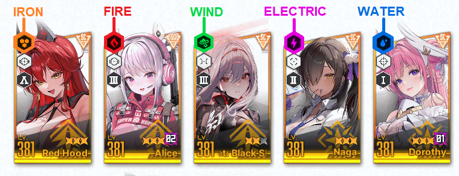
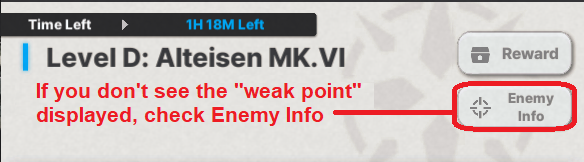
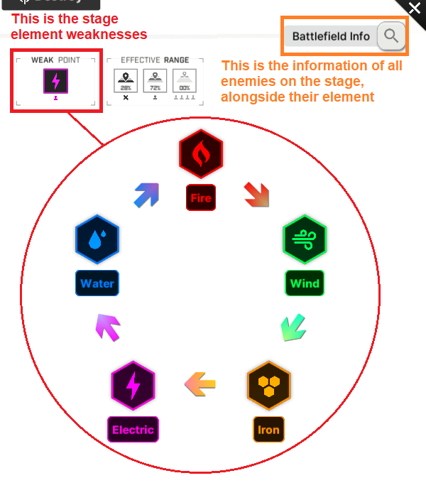

# **Team Building**

I will briefly explain how a basic team composition \-**squad**\- works. This will apply to almost all content to some degree, however, **this is extremely subjective and individual**, as each player should have completely different NIKKEs on the start.

## **Element Codes**

As almost all gacha games, NIKKE also has an element system. **The premise is pretty simple: if a stronger element NIKKE attacks, she will do more damage. Aside from a very specific case in [Anomaly interception](../progression/lategame.md#anomaly-interception-ai)), there isn't any sort of penalty for being a "weaker" element, so don't worry about it when building a team.**

**All NIKKEs and enemies in the game have an element code**.  
To verify what element your NIKKE is, **check the icon on the top left of the NIKKE portrait.**  

You can check what element will have advantage in the **Enemy info** and / or **"weak point"**, displayed in all combat contents UI.  
**Battlefield Info** will display all enemies that will appear on the stage, alongside their element.  

**Burst phase 1 NIKKES { width="20" }**

You may use **N102.** She is a purple (SR) rarity Nikke that buffs your whole team attack, and you will probably acquire her when you do your tutorial pull.

Only use SSR burst 1 Nikkes that have burst reduction skills over her, in order:
Rapi: Red Hood \> Liter \> D: Killer Wife \> Rouge \> Dorothy \> Volume

Tia is a special case, as she **needs** to be paired with Naga, a burst 2 nikke, as most of her skills need naga to be activated, along with another **burst 1 nikke,** because her burst skill re-enters burst phase 1\. If you use Tia as the only burst 1 in your team, you will not be able to do a full burst. **The same applies to Alice: wonderland bunny and Rupee: Winter Shopper;** they cannot be used as the only burst 1 either.

**Burst phase 2 NIKKES { width="20" }**

**Anis** is the standard pick. Very few burst 2 Nikkes are as good as her in the early game. Only swap her for Nikkes of tier A or higher, with a 20 second cooldown burst skill.
With the exception of **Blanc,** which **needs** to be paired with **Noir or Rouge,** if not paired, she will have a 60 second cooldown, making her rather unusable**.**

**Burst phase 3 NIKKEs and Full Burst { width="20" }**

Your burst 3 Nikkes will be **Rapi and Mihara,** later being replaced by **Privaty** and **Alice** or any other burst 3 you may get from pulls**.**  
Ideally, you want to use a team with **one Burst 1 { width="20" }, one Burst 2 { width="20" } and three Burst 3 { width="20" },** short for **1-1-3.** Most of the early game is skippable without a healer, but it's a good addition if you happen to get it nonetheless.

**Burst cooldown and rotations**

Your squad **must have** a cooldown of 20 seconds, or to say, a burst rotation of 20 seconds. Burst 1 and burst 2 NIKKEs on your team must have a 20 second cooldown.

**Another thing to notice: When in auto-burst, the burst order starts from the <u>leftmost</u> burst 1 NIKKE, then goes to the right in order, leftmost burst 2 NIKKE then leftmost burst 3 NIKKE, which then your team enters full burst state for 10 seconds, increasing you damage output by 50%.**

Some NIKKEs skills reduce or increase the full burst time, examples being: **Mihara** that decreases the full burst time by 5 seconds and **Modernia,** that increases full burst time by 5 seconds.

**Full Burst**

**The acronyms used for squad positioning:**  
**P1 \= position 1, the leftmost slot**  
**P5 \= position 5, the rightmost slot**  
If you have 2 burst 2 NIKKEs in your squad, for example, **Anis(P1) and Centi(P2)**, **Anis will always burst before Centi** in auto-burst, unless she is on cooldown.
What you want to do, is make the burst order of your squad at least auto proof:
**burst 1 in p1, burst 2 in p2, main dps burst 3 in p3, sub dps in p4, p5 can be anything.**
**N102 \- Anis \- Rapi \- Mihara \- Ether** is the non SSR squad I will use in the walkthrough.

**We advise you to seek help from the [discord servers](../README.md#useful-links) for a better composition based on the NIKKEs you currently own. This is just the tip of the iceberg about team building.**
