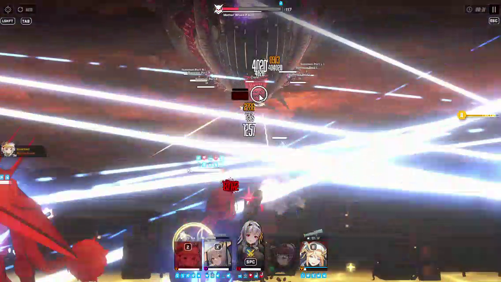
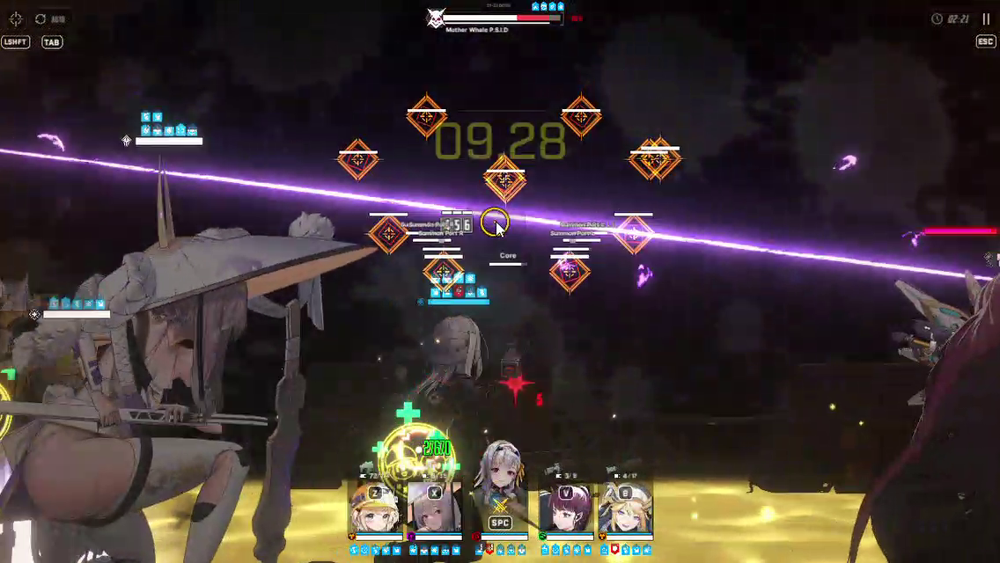
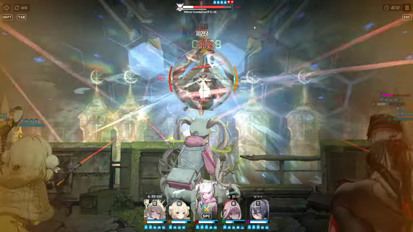
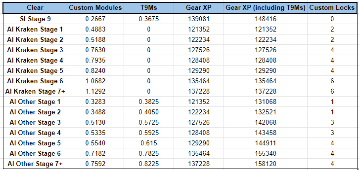
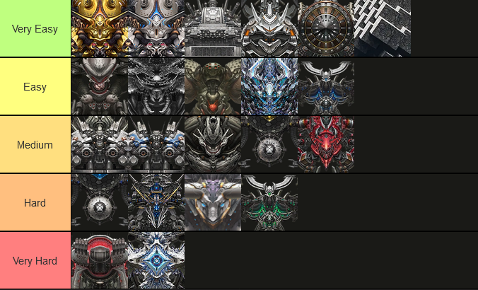

# **Late Game**  

**This will be a pretty quick section,** **as the Late Game stage happens between the time you reach synchro level 241+ and when you clear the Chapter 22-36 Boss Nihilister,** **a second time**. **This then unlocks the new Interception, the [Anomaly](#anomaly-interception-ai) difficulty.**

### **Mother Whale, Chapter 21 Boss** 

You probably didn’t feel any real challenge, at least not up until now. Synchro levels or combat power won't solve this one. Meet the **Mother Whale**, the second hardest boss in the game. This boss **needs** you to play manually.  

Profile  
Class: Tyrant  
Element: P.S.I.D (water), weak against electric  
Range: Far

**Attack Patterns:**

1. **Spams bombs from port parts that debuff your DEF**  
   Throws massive projectiles at your Nikke which deals damage and hits your DEF.. You can destroy the projectiles and also destroy the port parts.

2. **Calling mobs**  
   When the core is still active, she roars, emitting Ultrasonic Wave that buffs all mobs to be **hitcount HP which needs to be hit a certain number of times in order to kill it.** This attack occurs in 3 waves of mobs (1 land based, 2 airborne). The mobs buff Mother Whale’s ATK so be mindful of the damage you take. 

   For the first wave, she generates an **Elemental Shield** that protects her, but it can be destroyed by killing all first wave mobs on the ground. You have to kill them fast, otherwise she calls the second wave of mobs and it becomes increasingly more difficult.

   

   *The Mob only receives 1 damage per shot (courtesy: kampretlordz gameplay)*

   Destroying Mother Whale’s core (a bit below her belly in the middle) prevents her from roaring and buffing all of her mobs. Just keep in mind that the core is tanky if your Nikkes aren’t invested enough. If you want to play by the rules, just delete the mobs as fast as you can.

3. **Hurtle**  
   This is just a basic attack where she rushes forward and deals damage to your Nikkes. Make sure to cover or generate shields to try and negate as much damage as you can.

4. **Calling out Master-class mobs that can wipe all your Nikkes**   
   This is by far the most annoying attack. She calls Master-class raptures which are tanky and hard to kill. They also do barrage attacks that deal damage to all your Nikkes. This cannot be avoided or prevented, even if you try to kill them before they can attack. Fortunately, this attack can be taunted to one Nikke, so you can avoid being completely wiped out.

   

   *Master mobs are barragging a random Nikke (courtesy: kampretlordz gameplay)*

5. **Second cycle**  
   After doing the patterns above, she then goes near the regen ports and goes back to its first pattern of attack. Then it calls mobs similar to the second pattern, but no elemental shield in this cycle. She can shoot Laser Showers that deal damage to all your Nikkes.   
     
   

   *Laser Showers (courtesy: kampretlordz gameplay)*

**What you need:**

1. **AoE and/or Distribute Damage Nikkes**  
   Distributed damage is great because it ignores defense even when buffed as the mechanic of this attack states that the damage dealt will be distributed evenly no matter what. Mobs have very low HP so distributing damage can kill them fast.

   
    
   *Scarlet kills all mobs with her burst skill (Courtesy: kampretlordz gameplay)*

   If you bring Distributed Damage Nikkes, keep in mind that she can’t wipe mobs when there is an elemental shield active (except Electric code). This is because Distribute Damage works when it hits ONE enemy (Mother Whale herself) then distributes it evenly to the remaining mobs. If you hit the Elemental Shield, the damage will be zero and will be distributed as zero damage. So, you have to kill them one by one or wipe them out using an AoE burst first. 

   If you bring an AoE burst, you have to wipe it quickly before the mobs get buffed because AoE attacks are counted as 1 hit.  
     
   Dorothy is the best choice here as she deals fast distributed damage  with her skill 2, then after 10 seconds when her burst ends, the accumulated damage will be released to the enemy through distributed damage. You can try using Scarlet Black Shadow’s burst on the 2nd cycle when she calls the mobs (after you clear the 1st wave mobs). For AoE Nikkes, there are a lot of options like Scarlet, Ein, Mari, Privaty Unkind Maid to name a few.   
     
   Ein’s burst specifically will hit 10 enemies on screen, Mother Whale calls 10 mobs first, so you can try her out.  
     
2. **Taunter**  
   Taunters tank the Master-class raptures attack (and to some extent, tanking spam balls), as their attack is unavoidable and can wipe out all your Nikkes. Luckily, this can be taunted to target 1 Nikke. Though, this usually means that you will be sacrificing the taunter so you’ll be left with 4 Nikkes for the rest of the fight.  
     
   Options for taunters include Crown with manual play, Tia, or Diesel. If you bring Crown, you have to use her manually after the Hurtle attack so you can have 20 stacks when the Master mobs appear. As for survival, if you can stack at the right time, she can avoid  being killed because of her immunity skill. Diesel (with her treasure) can heal herself, so you don’t have to worry about her dying.  

   You can skip this if your CP is high enough, usually you will survive with the cover being destroyed.  
     
3. **Healer**  
   Most of her attacks are unavoidable, so a healer/form of healing is necessary for survival. You can’t wipe all the bombs that come to you, as you have to shoot the main body to deal damage.   
     
   Blanc, Naga, Rapunzel are the best choices here. Blanc will give immunity to a low HP Nikke. Rapunzel can revive 1 Nikke and you can use it to revive the taunter after the barrage of the Elite-class rapture. Naga, paired with a shielder (Tia), can help make it easier for you to destroy the core. 

## **Elemental Shield and Elemental Damage**

Elemental shield is a mechanic of Raptures that protects themselves from Nikkes outside of their weaker element. Raptures that are elemental protected are immune from any attack other than their elemental weakness, so the damage will be zero and their HP is not depleted, either from basic attacks or skills/burst attacks. For example, a Rapture of P.S.I.D (Water) element will not receive any damage from Water, Fire, Wind, and Iron Nikkes until their Elemental Shield is broken or over. Only Electric Nikkes (Water weakness) can penetrate their respective elemental shield. 

As introduced by Mother Whale, elemental shields will be commonly found on later stages in the game, mainly in Raids. Unlike Mother Whale's elemental shield, which can be removed by killing the mobs she summons. Elemental shields can also be destroyed by breaking the QTE with their respective elemental weakness. This makes elemental weakness very important for teambuilding in Raids when you are bringing specific Nikkes. Furthermore, elemental damage is a crucial stat for later stages and in Raids to deal even more damage. 

Elemental Damage is important because this stat is one of the most valuable in OL (Overload) gears. You can improve your damage by up to 116% just from the OL stats (29% per gear) alone. Pairing that with cubes that can improve your Elemental Damage by 8.48% (level 5 cube) to 19% (level 15 cube) respectively. The game has a lot of calculations for Elemental Damage that it even has its own separate damage calculation/formula.

As per default, your Nikke will receive 10% Elemental Damage bonus stat, which then can be improved by equipping cubes and getting OL (Overload) stats, which on paper shows that you can receive up to 145% of Elemental Damage. These stats exclude the skills of the Nikke. This is why Elemental Damage is a big help when you’re trying to push as far as you can in campaign stages (normal/hard) with deficits.

### **Mirror Container, Chapter 32 Boss**

The hardest boss to date (as of 11/04/2024). Has **defense buff mechanics** and parts that you must destroy with only **1 strong shot**. If you ignore this, your damage will be as soft as a wet noodle or worse, only dealing 1 damage per shot. This rapture shows us how **important** elemental damage is.  

Profile  
Class: Tyrant  
Element: P.S.I.D (water), weak against electric  
Range: Far

**Attack Pattern:**

1. **Glass Slippers (replica)**  
   It throws projectiles that targets random Nikkes. Can be intercepted or i-framed. It shoots a MG and aims for the Nikke with the highest attack. After that, it summons Glass Slippers that must be destroyed by **1 strong shot**. You can ignore them and heal back or try to shoot it. This happens 3 times. After that, it will call all Glass Slippers and do AoE attacks. Break the QTE circles to cancel it. Then it does the special interruption QTE. This attack usually takes 1 minute but can be faster if you are able to destroy the slippers.

2. **Glass Slippers: Defense Mode**

   

   *Spawns Glass Slippers to buff his DEF (Courtesy: Kontossis on youtube)*

   It comes back and **buffs itself with 360% DEF from the slippers**. This defense buff makes you hit like a wet noodle. First, it shoots a crystal that deals AoE damage, then it will spawn the slippers and go into attack mode. You can tell when the slippers are going to attack when they start glowing blue. They have to be destroyed by **a single strong shot.** Repeat this 4 times until all the slippers are destroyed. Each shot removes 1 layer (90%) of the DEF buff.

   If you can’t destroy slippers, just shoot to stun it because slippers attack mode deals huge damage to your Nikke (not recommended if your Nikke is CP high diff).   
     
3. **Glass Slippers: Destroy Mode**  
   Going all out. Restore Slippers to **Buff DEF again by 360% with an Elemental Shield**. Spinning and charging attacks that can kill all your Nikkes. This can be canceled by destroying the QTE. 

   While shooting the QTE can cancel the attack, you’re only going to be **dealing 1 damage per sho**t. Remember that he just buffed his DEF again, so your damage goes back to being like a wet noodle. Supporter Nikkes like Naga are heavily affected by this because of her low base ATK and low % buff. Even Attacker Nikkes find it difficult to clear the circles. It’s advisable to time your Full burst mode with as many buffs on your party to clear the QTE or if you have Electric type Nikkes that have a lot of attack buffs, it’s possible to destroy it.

   After you succeed in clearing the QTE circles, it just does the  \#2 attack pattern again. You have to keep destroying the slippers until the fight ends.

**What Nikkes to bring:**

1. **Electric type DPS**  
   Obviously for optimal damage and to cancel the Elemental Shield. Note that you have to pick DPS because of his \#3 attack pattern mechanic. You can try Naga with a lot of buffs but it’s not recommended for higher diff CP.

   Anis: Sparkling Summer is the best choice here, you can pair her with any Electric DPS Nikke to support her.

2. **Snipers / RL’s**  
   Remember that you have to destroy Glass Slippers in one shot, so non charged weapons are not recommended. Slippers will input 1 pellet from any weapon as damage, then it will be immune. Snipers, when charged, can deal huge damage in one shot.

   You can imagine that Slipper's HP is 4 million, SG’s per shot deals 4 million damage, but it’s divided into 10 as SG’s fire 10 pellets per shot. Snipers could do 4 million damage just from one shot.

3. **Healers (optional)**   
   If you want to tank Phase 1 slippers or AoE crystal, you should consider bringing a semi/healer as a companion. The best choice is Naga as she is Electric, too. 

The best Nikkes against Mirror Container are Ein and Cinderella. They are designed to fight this boss. They fulfill the \#1 and \#2 requirements which are Electric type and Snipers. Ein’s skill deals true damage so she ignores Mirror Container’s DEF buff.

**How to destroy Glass Slippers:**

When it summons the Slippers, wait when it enters Attack Mode. Slippers will start to glow blue and will start going backwards. You can see in the image below.

*Glass slipper: Attack mode (Courtesy: Kontossis at youtube)*

If you shoot it when you are off burst, you can just charge your sniper/RL and aim it on the slipper. But this attack only works if your damage isn’t 1 damage, as off burst damage will be low. The AI will shoot Mirror Container core when off burst so it’s safe to keep manualing

If you shoot it when you’re full burst, you have to command all Nikkes to take cover, then you manually use the Sniper Nikke to aim and shoot. This is because when you’re in full burst, all Nikkes will follow your crosshair to shoot the target. You don’t want the other Nikkes to shoot Slipper making them immune to damage. 

## **Anomaly Interception (AI)** 

**Unlocked after Chapter 22 is completed, or stage 22-36 Nihilister pt2**. This is the current non seasonal endgame content. 

**Each boss comes from the previous Solo Raids with increased difficulty for non level 301+ players. This is because even if the level cap is 400, it’s not fixed like the normal Solo Raids.**   
**This might sound like a bad thing but,** **at the same time** **even the first stage of AI, Stage 1, gives better rewards than Special Interception**.   
Another really cool thing is the  **Custom Lock that you get when you clear AI**. You can get these from any stage. **They allow you to lock OL lines, 20 custom locks for 1 line locked, 30 for another one at the same time. Even if it’s just once and you have to lock again each time, it’s still better than just locking with custom modules(rocks).**

**There are 5 bosses in total, each with the same set of rewards and also  Boss-specific rewards linked to them depending on what you need.**   
**All of them are guaranteed to drop from Stage 1:**   
**Tier 9 fodder gear, custom locks  and gear pity boxes  with the exception of Kraken, as it does not drop gear pity boxes.**  
**They also have the chance to drop 1 to 3 custom modules  (rocks) per clear depending on  the Stage you can reach.**

**However, the main benefit in doing Anomaly Interception is that you can choose what boss you want to fight (which gives you respective drops depending on what you need).** 

**Kraken  custom modules and custom module pity boxes but does NOT drop t9m gear**  
**Ultra  drops t9m helmet and helmet pity boxes**  
**Indivillia  drops t9m chest and chest pity boxes**  
**Mirror Container  drops t9m gauntlets and gauntlet pity boxes**  
**Harvester  drops t9m boot and boot pit boxes**  

**Sheet credits to akusetsu**

**Guides for the boss:**

**Kraken**

The easiest boss that you encounter in AI. His main body is in the middle. His tentacle is the core. Punching bag boss at it’s finest.

1. **First phase**  
   Destroy the front tentacle as fast as you can. If you ignore this, he slaps all your Nikkes. The tentacles are tanky, but fortunately his front tentacle is a core, so you can deal bonus damage to it. The attack pattern will be:  
   \- **Tentacle slaps, twice**  
   \- **Throwing rocks**  
   You can time Crown’s burst to block this attack, or if you don’t bring a shielder, just take cover.  
   \- **Elemental QTE**  
   This attack sequence happens twice, after that, it will expose the core on his main body and dive. When he dives, special interruption.  
     
   In this phase, I suggest you aim for the front tentacle when they appear, core damage is your advantage to deal great damage.   
2. **Second phase**  
   Same as the first phase, but its front tentacle will be a lot squisher, but still needs full burst to destroy fast. Its back tentacle will shoot your Nikke so you have to destroy it too.   
     
   What you do is aim on the core of the main body while destroying the front tentacle when he’s wiggling his tentacle. Destroy the back tentacle when off burst to prevent him shooting your Nikke. Back tentacle targets random Nikke so he may shoot your support or your main DPS, the problem is if you bring an Electric Nikke (usually Naga) then he decides to shoot down that Electric Nikke.

**Team Building**  
Burst 1 and 2 will be Liter and Crown, then you can choose Wind Burst 3 Nikke as main damage. 

1. Sweaty: Scarlet Black Shadow with her assistant, Alice. Flex is Naga. If you bring Naga, you have to destroy all the parts.  
2. Boomer Finger: Scarlet Black Shadow with Sakura: Bloom in Summer. Flex will be Naga. you can try Noir as an alternative Naga and make the run less sweaty.  
3. SG team with Noir and Guilty works against this squid, with Blanc as healer. They can deals decent damage because of the big target of the main body.

**Ultra** 

This Ultra has a destructible core unlike campaign counterparts, so his core isn’t permanent (because dev knows this boss is too biased as Red Hood’s punching bag). He never moves so basically acts like a punching bag for Pierce-type Nikkes. 

**Attack Pattern**:

**Phase 1:**

- MG attacks, targets highest ATK Nikke  
- QTE (Elemental Shield)  
- AoE stun, can be blocked by shield  
- Spits poison (DoT)

This attack occurs twice, then he sheds his skin and enters Special Interruption

**Phase 2:**

- Flings poison if the parts aren’t destroyed (DoT)  
- AoE stun  
- Spits poison (DoT)

It will restore his core at phase 3, 5, 7 (need reference), so be prepared to manage your full burst for this. 

You can put all Iron Nikkes in your team. For example, a team consists of Liter and Crown as burst 1 and 2, for burst 3 DPS, you pick Red Hood, then choose between Snow White or Maxwell (which have higher Elemental Damage OL line). For flex you can pick Helm: Aquamarine to amplify your team damage. If you need survival, you can take out one of the Iron-type Nikkes, for example Naga is a good choice for extra core damage.

**Mirror Container**

Basically it's the Mirror Container in Chapter 32 (read above), but easier. Core is permanent, so you can deal more damage. Glass Slippers only show up in 2 cycles. The most important difference is that **it will not restore Slippers that buff DEF by 360% when going into its Destruction Mode.** 

Team Building gameplay will be the same as the Mirror Container Chapter 32 Boss. Ein with Anis: Sparkling Summer is your best choice against it. Example comp would be Burst 1 and 2 Rouge with Crown and if you want to optimize Anis’s damage, you can put Liter. Flex will be Exia with her Favorite Item or Naga.

**Harvester**

This spider likes to call mobs during the fight. These mobs distract your Nikke and the attacks are the kamikaze type so if you ignore them you’re likely to lose a Nikke or two. The difference from campaign mode Harvester is that this spider has a core on his head and you need to destroy it first to access the core.

**Indivillia**

Hardest boss that you can encounter in AI. Has an attack that is unavoidable, so your iron supporters (Liter and Crown) have a high chance of dying. Has the highest base Defense stats and moves around a lot so hitting the core can be difficult.

**Tyrant-class Boss Tier List**

- Very Easy: Generic attack (laser, projectiles, interceptable AoE attack), Usually no need healer to do good run. Canceling their gimmicks usually disables them completely. Basically punching bag Rapture. Auto friendly, you need manual aim to shoot QTE circles. Can run with generic team (all weapons) with 1 element strongest included.  
- Easy: Generic attack, boss is punching bag but has 1 gimmick that can’t be disabled, but can be dodged. Suggested to bring healer against this boss, but it’s okay if not especially if the attack is cover dependent. Auto friendly, you need manual aim to shoot QTE circles. Can run with generic team (all weapons) with element strongest included.  
- Medium: Generic attack, Has gimmicks that could be annoying but manageable. Bring healer or cover repair to solve the gimmick. Not auto friendly. Can run with generic team (all weapons) with element strongest included.  
- Hard: has 1-2 annoying gimmick skills that need some treatment. Healer is necessary to deal with their gimmicks. Do unavoidable attacks that hurt your Nikke. Not Auto friendly. Can run a generic team, but suggested bringing certain Nikke to deal with their gimmick for easier run.  
- Very Hard: has many gimmick attacks that you have to run a certain Nikke to deal with. Even if your Nikke level is higher, they can kill you if you don’t know how to deal with it. Not auto friendly (obviously). Certain Nikke is needed to deal with this kind of Rapture.
