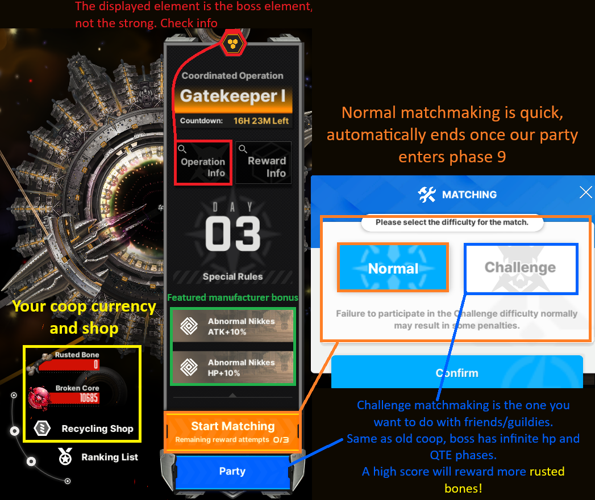

# **Raids**

NIKKE’s Major Server Ranking Content 

**Solo Raid (SR)** follows an individual ranking system.The rewards vary from **gems, dolls and cube materials.** Depending on your rank, you can also receive a corresponding **frame**.

**Union Raid (UR)**, is for  unions to participate in and be ranked based on the clear time. **Rewards are only going to be union chips ** which are used in the Union Shop.

**Coop** is a cooperative raid with 4 other random players or a mix of your friends and guildies.The  **rewards are broken cores ** and ** ** which are used in the Recycling Shop.

## **Solo Raid** 

If you do not see this icon on your main screen, it means there isn’t a Solo Raid ongoing.**

This is a monthly “event”, which will feature a special BOSS (Tyrant-class) Rapture. Solo Raid has a total of 7 difficulties, and a challenge mode, each with increased difficulty and rewards.

**You receive 3 entries every day.** Each entry allows you to utilize up to 5 separate teams to beat the boss. If you can clear all difficulties up to 7, you can then just proceed to clearing difficulty 5 next reset as the rewards will be the same had you done difficulty 7 \- and then use quick battle to finish the rest of the runs.

**First difficulty should be easy with synchro 41, and each subsequent difficulty requires 20 synchro levels more than the previous stage. Synchro 160 with one or two level 200 NIKKEs should be enough for difficulty 7 clear.**

The event usually starts from **Thursday, the first week of the month at 12:00 PM UTC+9** (Seoul, Korea time) and lasts for a week, finishing on the next **Thursday at 05:00 AM UTC+9**. The challenge mode opens on the third day, because you can only attempt it three times a day.

**Solo Raid Team Building**

As mentioned in the **Elemental Damage and Elemental Shield section of the guide**, you have to build a team that includes at least 1 Nikke which is the elemental weakness of the boss. This is because you will encounter an elemental shield during the fight and if you ignore the elemental shield, the boss will wipe out all your Nikkes. 

Building teams that favor elemental damage is necessary because elemental damage is a big contributing factor in gaining higher scores.

Keep in mind that you might need to learn some of the boss’ mechanics before building teams. You might encounter an easy mode boss that doesn’t need a healer in the team, or you might come across a difficult boss that needs you to bring certain Nikke weapon/skill types to beat it with.

**Challenge Mode**

The goal is to deal as much damage you can to the boss with 5 separate teams. The level of Nikkes are fixed to level 400 regardless of your current level. The more invested your Nikkes are the higher the score that you can potentially get (skills/cores/dolls and so on). 

After you finish attacking with five teams in Challenge Mode, the total score will is the same to the damage dealt by each team combined. It will be put on the leaderboard of each major server, and show your rank percentage and its respective position in the leaderboard. The higher score you get, the more gems you’ll receive and the possibility to get a better frame.

This is the **REAL** Endgame content that Nikke provides for now. Basically, your invested Nikkes are going to be used in Solo Raid Challenge Mode or SP Arena PvP. Pushing hard stages is basically time gated by synchro levels.

## **Union Raid** 

Same as Solo Raid, Union Raid is a monthly event. Your Union will encounter 5 types of Raptures (3 Lord-class and 2 Tyrant-class). There will be levels, which once the 5 bosses of each level are defeated, the next level opens, and you need to repeat the process until level 10. With the December 2024 update, Union Raid HARD mode was added, changing a couple of things.

It consists of brackets based on what day your Union was able to full clear all bosses to level 10. The day you clear is very important, altho there is no haste on the first 24 hours, the whole Union should aim to clear it before the next reset if possible. If you succeed in doing so, on the next reset, the hard mode will be open, with the same bosses, with increased HP DEF and ATK this time only up to level 3.

Because of another update, and needed QoL for UR, **the bosses on the current hard mode level will be open at all times unless they are dead**. 

Up to 3 attacks per guild member. It’s best to coordinate with your Union to see who attacks what boss so you can min max the damage spread and get optimum clear times. There are a total of 3 levels, with the last boss of the third level having infinite HP, just like Solo Raid bosses.

It starts every **Friday, on the third/fourth week of the month at 5:00 AM UTC+9** (Server daily reset) until **Thursday, a week later at 05:00 AM UTC+9.** This can change so it’s best to keep an eye out for announcements from your guild.

You can check the best teams for each Union Raid [here](https://docs.google.com/spreadsheets/d/1LXHNQI93rWhk_2YmepnDfx4x8FAxHnQ4w9_vunhWryE/edit?rm=minimal&gid=2142581624#gid=2142581624).

## **Coop** 

A time limited event that you can do with friends or random people. Unfortunately, the UI for coop is pretty outdated so in order for you to access it, you have to find the Coop tab as shown below. 

It’s usually below your commander icon and/or can be accessed on the  tab.

COOP was a meaningless mode until Stellar Blade collab. The update added a "new" difficulty, new currency (rusted bones), new shop goodies (refer to img below), and separated the casuals from tryhards. 

Normal match is for those that want to do their dailies as fast as possible. Once your party reach phase 9, the boss will wipe everyone, ending the run quickly.

Challenge mode is the old coop, with a twist. **Now your ranking actually matter**. Boss has infinite HP, once phase 9 a QTE wall will appear. 

Gather a party of friends or guildies and do your best! **Aim for at least top 10%**, its a massive 36% increase in rusted bones, if compared to top 30% reward.

