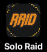
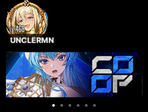
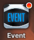
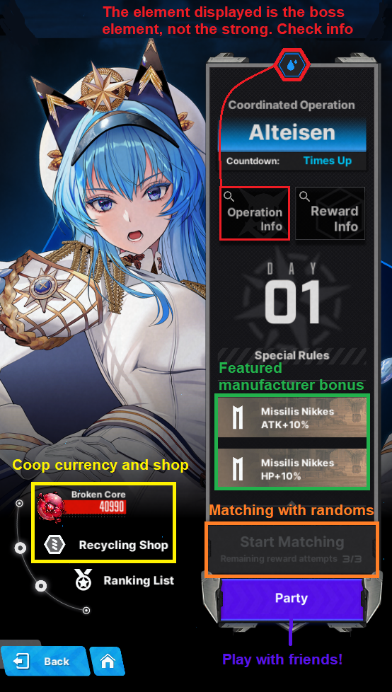

# **Raids**

NIKKE’s Major Server ranking content

**Solo Raid (SR)** follows an individual ranking system.The rewards vary from **gems, dolls and cube materials.** Depending on your rank, you can also receive a corresponding **frame**.

**Union Raid (UR)**, is for  unions to participate in and be ranked based on the clear time. **Rewards are only going to be union chips ** which are used in the Union Shop.

**Coop** is a cooperative raid with 4 other random players or a mix of your friends and guildies.The  **rewards are broken cores ** which are used in the Recycling Shop.

## **Solo Raid** 

If you do not see this icon on your main screen, it means there isn’t a Solo Raid ongoing.**

This is a monthly “event”, which will feature a special BOSS (Tyrant-class) Rapture. Solo Raid has a total of 7 difficulties, and a challenge mode, each with increased difficulty and rewards.

**You receive 3 entries every day.** Each entry allows you to utilize up to 5 separate teams to beat the boss. If you can clear all difficulties up to 7, you can then just proceed to clearing difficulty 5 next reset as the rewards will be the same had you done difficulty 7 \- and then use quick battle to finish the rest of the runs.

**First difficulty should be easy with synchro 41, and each subsequent difficulty requires 20 synchro levels more than the previous Synchro 160 with one or two level 200 NIKKEs should be enough for difficulty 7 clear.**

The event usually starts from **Thursday, the first week of the month at 12:00 PM UTC+9** (Seoul, Korea time) and lasts for a week, finishing on the next **Thursday at 05:00 AM UTC+9**. The challenge mode opens on the third day, because you only attempt it three times a day.

**Solo Raid Team Building**

As mentioned in the **Elemental Damage and Elemental Shield section of the guide**, you have to build a team that includes at least 1 Nikke which is the elemental weakness of the boss. This is because you will encounter an elemental shield during the fight and if you ignore the elemental shield, the boss will wipe out all your Nikkes. 

Building teams that favor elemental damage is necessary because elemental damage is a big contributing factor in gaining higher scores.

Keep in mind that you might need to learn some of the boss’ mechanics before building teams. You might encounter an easy mode boss that does need healer in the team, or you might come across a difficult boss that needs you to bring certain Nikke weapon/skill types to beat it with.

**Challenge Mode**

The goal is to deal as much damage you can to the boss with 5 separate teams. The level of Nikkes are fixed to level 400 regardless of your current level. The more invested your Nikkes are the higher the score that you can potentially get (skills/cores/dolls and so on). 

After you finish attacking with five teams in Challenge Mode, the total score will be the total damage dealt by each team combined. It will be put on the leaderboard of each server, and show your rank percentage and its respective position in the leaderboard. The higher score you get, the more gems you’ll receive and the possibility to get a better frame.

This is the **REAL** Endgame content that Nikke provides for now. Basically, your invested Nikkes are going to be used in Solo Raid Challenge Mode or SP Arena PvP. Pushing hard stages is basically time gated by synchro levels.

## **Union Raid** 

Same as Solo Raid, Union Raid is a monthly event. Your Union will encounter 5 types of Raptures (3 Lord-class and 2 Tyrant-class). These bosses need to be killed 10 times each with all your Union members.

Each member receives 3 attempts per day. It’s best to coordinate with your Union to see who attacks what boss so you can min max the damage spread and get optimum clear times. .

It starts every **Friday, the third/fourth week of the month at 12:00 PM UTC+9** (Korean Time) until **Thursday, a week later at 05:00 AM UTC+9. This can change so it’s best to keep an eye out for announcements from your guild.**

This mode is just a speedrun competition for top ranking. If you aim for higher ranks, piloting accounts will be necessary for some Unions, especially competitive ones.

## **Coop** 

Time limited operation, with friends or randoms. Unfortunately, the UI for coop is pretty outdated, and you won’t even see it if you don’t look for it.  

It will appear on the cards below your commander icon and on the 

Pretty simple mode, and negligible ranking rewards. Most of the time, you will go AFK and just wait for the battle timer to run out. Simply participating is enough to receive all rewards needed to buy everything on the Recycling Shop.  

